# Why you should pin your Python depnendencies (at least for development)

## Summary

This README contains a examples of how the dependencies of Python libraries change over time. 

The examples here are of: `fastapi`, `pandas`, `streamlit` `sphinx`, `requests`, and `poetry`.

> ⚠️ If you are a data scientist, *please* document your Python dependencies as well as your Python version when you run experiments.
> There are non-python dependencies to document, too, but this analysis does not cover that. Dockerfile's
> are very helpful for that, though.

## Background

Serious stress happens if you come back to some code you wrote months ago only to find you can't get it to run.

The biggest reason for this in the Python world is that the dependencies you were using back when you authored
your code have probably changed since that time.

I do *not* believe you should force consumers of your Python code/packages to install exact versions.

But you can give yourself the *option* to do so by committing a "lock file" to your repo and updating it
every once and a while.

You can generate a lock file a few different ways:

- pip: `pip freeze > requirements.txt`
- pip-tools: `pip-compile --output-file requirements.txt requirements.in`
- poetry
- pipenv

## How to reproduce(ish) these results

```bash
# install the python and non-python dependencies
pip install -r requirements.txt
brew install graphviz

# generate the dependency graphs for a library by downloading many versions of it
python generate_dependency_graph.py fastapi

# generate this README.md
python generate_readme.py
```

This works by fetching a list of all published versions of a given python package from the PyPI API.

For example, try visiting this link: https://pypi.org/pypi/fastapi/json

Then the script downloads a subset of the discovered versions and plots their dependency graphs.
## fastapi
## 0.1.0
```text
fastapi==0.1.0
  - pydantic [required: >=0.16, installed: 1.10.7]
    - typing-extensions [required: >=4.2.0, installed: 4.5.0]
  - starlette [required: >=0.9.7, installed: 0.27.0]
    - anyio [required: >=3.4.0,<5, installed: 3.6.2]
      - idna [required: >=2.8, installed: 3.4]
      - sniffio [required: >=1.1, installed: 1.3.0]
    - typing-extensions [required: >=3.10.0, installed: 4.5.0]
graphviz==0.20.1
pip==22.0.4
pipdeptree==2.7.1
setuptools==56.0.0
```
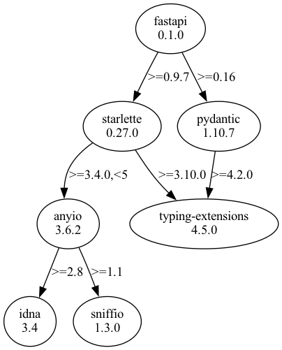
## 0.1.19
```text
fastapi==0.1.19
  - pydantic [required: >=0.17,<=0.18.2, installed: 0.18.2]
  - starlette [required: >=0.9.11,<=0.10.1, installed: 0.10.1]
graphviz==0.20.1
pip==22.0.4
pipdeptree==2.7.1
setuptools==56.0.0
```
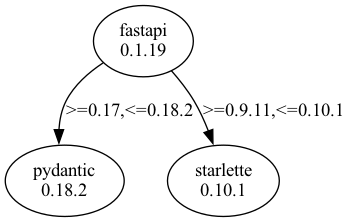
## 0.10.1
```text
fastapi==0.10.1
  - pydantic [required: >=0.17,<=0.21.0, installed: 0.21]
  - starlette [required: ==0.11.1, installed: 0.11.1]
graphviz==0.20.1
pip==22.0.4
pipdeptree==2.7.1
setuptools==56.0.0
```

## 0.18.0
```text
fastapi==0.18.0
  - pydantic [required: >=0.17,<=0.23.0, installed: 0.23]
  - starlette [required: ==0.11.1, installed: 0.11.1]
graphviz==0.20.1
pip==22.0.4
pipdeptree==2.7.1
setuptools==56.0.0
```
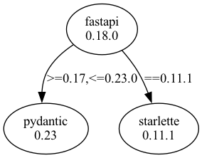
## 0.25.0
```text
fastapi==0.25.0
  - pydantic [required: >=0.17,<=0.26.0, installed: 0.26]
  - starlette [required: >=0.11.1,<=0.12.0, installed: 0.12.0]
graphviz==0.20.1
pip==22.0.4
pipdeptree==2.7.1
setuptools==56.0.0
```
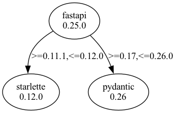
## 0.30.1
```text
fastapi==0.30.1
  - pydantic [required: >=0.28,<=0.28.0, installed: 0.28]
  - starlette [required: >=0.11.1,<=0.12.0, installed: 0.12.0]
graphviz==0.20.1
pip==22.0.4
pipdeptree==2.7.1
setuptools==56.0.0
```
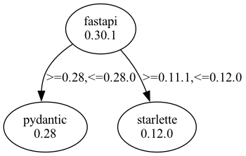
## 0.39.0
```text
fastapi==0.39.0
  - pydantic [required: >=0.32.2,<=0.32.2, installed: 0.32.2]
  - starlette [required: >=0.11.1,<=0.12.8, installed: 0.12.8]
graphviz==0.20.1
pip==22.0.4
pipdeptree==2.7.1
setuptools==56.0.0
```
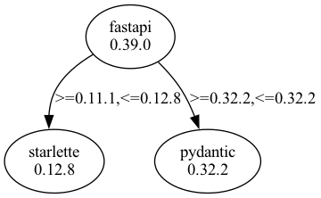
## 0.47.0
```text
fastapi==0.47.0
  - pydantic [required: >=0.32.2,<2.0.0, installed: 1.10.7]
    - typing-extensions [required: >=4.2.0, installed: 4.5.0]
  - starlette [required: >=0.12.9,<=0.12.9, installed: 0.12.9]
graphviz==0.20.1
pip==22.0.4
pipdeptree==2.7.1
setuptools==56.0.0
```
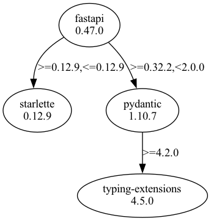
## 0.52.0
```text
fastapi==0.52.0
  - pydantic [required: >=0.32.2,<2.0.0, installed: 1.10.7]
    - typing-extensions [required: >=4.2.0, installed: 4.5.0]
  - starlette [required: ==0.13.2, installed: 0.13.2]
graphviz==0.20.1
pip==22.0.4
pipdeptree==2.7.1
setuptools==56.0.0
```
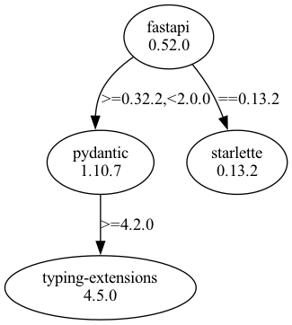
## 0.56.1
```text
fastapi==0.56.1
  - pydantic [required: >=0.32.2,<2.0.0, installed: 1.10.7]
    - typing-extensions [required: >=4.2.0, installed: 4.5.0]
  - starlette [required: ==0.13.2, installed: 0.13.2]
graphviz==0.20.1
pip==22.0.4
pipdeptree==2.7.1
setuptools==56.0.0
```
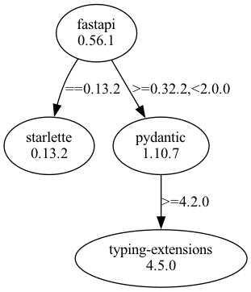
## 0.60.0
```text
fastapi==0.60.0
  - pydantic [required: >=0.32.2,<2.0.0, installed: 1.10.7]
    - typing-extensions [required: >=4.2.0, installed: 4.5.0]
  - starlette [required: ==0.13.4, installed: 0.13.4]
graphviz==0.20.1
pip==22.0.4
pipdeptree==2.7.1
setuptools==56.0.0
```
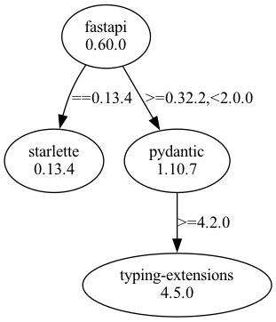
## 0.65.1
```text
fastapi==0.65.1
  - pydantic [required: >=1.6.2,<2.0.0,!=1.8.1,!=1.8,!=1.7.3,!=1.7.2,!=1.7.1,!=1.7, installed: 1.10.7]
    - typing-extensions [required: >=4.2.0, installed: 4.5.0]
  - starlette [required: ==0.14.2, installed: 0.14.2]
graphviz==0.20.1
pip==22.0.4
pipdeptree==2.7.1
setuptools==56.0.0
```
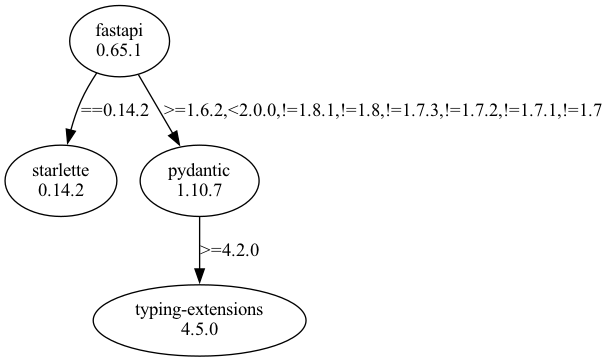
## 0.7.0
```text
fastapi==0.7.0
  - pydantic [required: >=0.17,<=0.18.2, installed: 0.18.2]
  - starlette [required: ==0.11.1, installed: 0.11.1]
graphviz==0.20.1
pip==22.0.4
pipdeptree==2.7.1
setuptools==56.0.0
```
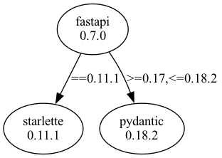
## 0.75.1
```text
fastapi==0.75.1
  - pydantic [required: >=1.6.2,<2.0.0,!=1.8.1,!=1.8,!=1.7.3,!=1.7.2,!=1.7.1,!=1.7, installed: 1.10.7]
    - typing-extensions [required: >=4.2.0, installed: 4.5.0]
  - starlette [required: ==0.17.1, installed: 0.17.1]
    - anyio [required: >=3.0.0,<4, installed: 3.6.2]
      - idna [required: >=2.8, installed: 3.4]
      - sniffio [required: >=1.1, installed: 1.3.0]
graphviz==0.20.1
pip==22.0.4
pipdeptree==2.7.1
setuptools==56.0.0
```
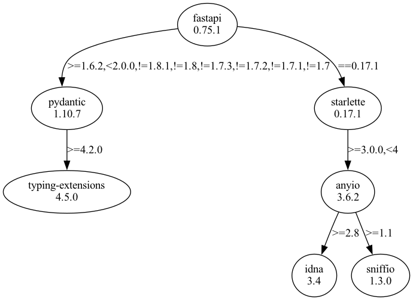
## 0.81.0
```text
fastapi==0.81.0
  - pydantic [required: >=1.6.2,<2.0.0,!=1.8.1,!=1.8,!=1.7.3,!=1.7.2,!=1.7.1,!=1.7, installed: 1.10.7]
    - typing-extensions [required: >=4.2.0, installed: 4.5.0]
  - starlette [required: ==0.19.1, installed: 0.19.1]
    - anyio [required: >=3.4.0,<5, installed: 3.6.2]
      - idna [required: >=2.8, installed: 3.4]
      - sniffio [required: >=1.1, installed: 1.3.0]
    - typing-extensions [required: >=3.10.0, installed: 4.5.0]
graphviz==0.20.1
pip==22.0.4
pipdeptree==2.7.1
setuptools==56.0.0
```
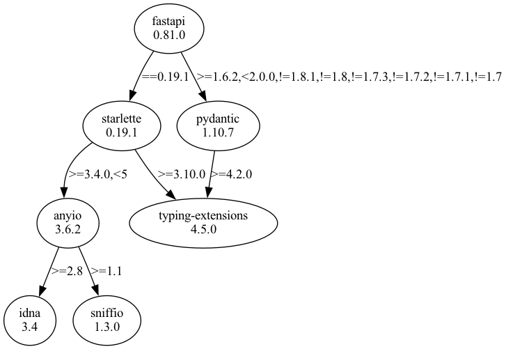
## 0.89.0
```text
fastapi==0.89.0
  - pydantic [required: >=1.6.2,<2.0.0,!=1.8.1,!=1.8,!=1.7.3,!=1.7.2,!=1.7.1,!=1.7, installed: 1.10.7]
    - typing-extensions [required: >=4.2.0, installed: 4.5.0]
  - starlette [required: ==0.22.0, installed: 0.22.0]
    - anyio [required: >=3.4.0,<5, installed: 3.6.2]
      - idna [required: >=2.8, installed: 3.4]
      - sniffio [required: >=1.1, installed: 1.3.0]
    - typing-extensions [required: >=3.10.0, installed: 4.5.0]
graphviz==0.20.1
pip==22.0.4
pipdeptree==2.7.1
setuptools==56.0.0
```
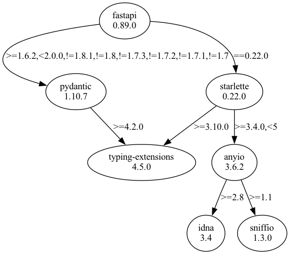
## 0.94.1
```text
fastapi==0.94.1
  - pydantic [required: >=1.6.2,<2.0.0,!=1.8.1,!=1.8,!=1.7.3,!=1.7.2,!=1.7.1,!=1.7, installed: 1.10.7]
    - typing-extensions [required: >=4.2.0, installed: 4.5.0]
  - starlette [required: >=0.26.1,<0.27.0, installed: 0.26.1]
    - anyio [required: >=3.4.0,<5, installed: 3.6.2]
      - idna [required: >=2.8, installed: 3.4]
      - sniffio [required: >=1.1, installed: 1.3.0]
    - typing-extensions [required: >=3.10.0, installed: 4.5.0]
graphviz==0.20.1
pip==22.0.4
pipdeptree==2.7.1
setuptools==56.0.0
```
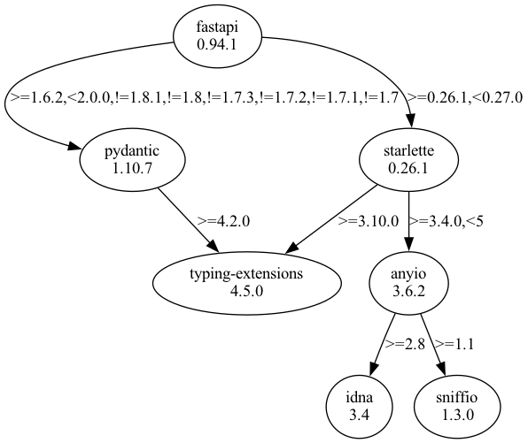
## pandas
## 1.3.4
```text
graphviz==0.20.1
pandas==1.3.4
  - numpy [required: >=1.20.0, installed: 1.24.3]
  - python-dateutil [required: >=2.7.3, installed: 2.8.2]
    - six [required: >=1.5, installed: 1.16.0]
  - pytz [required: >=2017.3, installed: 2023.3]
pip==22.0.4
pipdeptree==2.7.1
setuptools==56.0.0
```
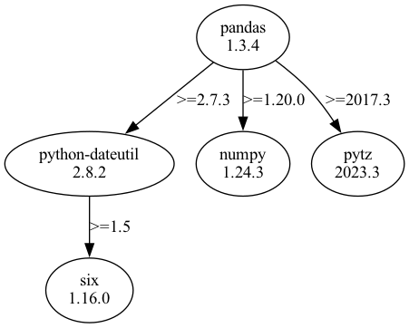
## 1.4.2
```text
graphviz==0.20.1
pandas==1.4.2
  - numpy [required: >=1.20.0, installed: 1.24.3]
  - python-dateutil [required: >=2.8.1, installed: 2.8.2]
    - six [required: >=1.5, installed: 1.16.0]
  - pytz [required: >=2020.1, installed: 2023.3]
pip==22.0.4
pipdeptree==2.7.1
setuptools==56.0.0
```
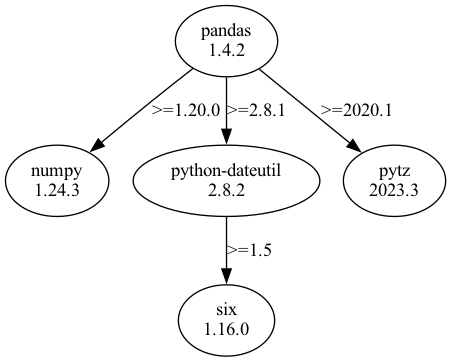
## 1.5.1
```text
graphviz==0.20.1
pandas==1.5.1
  - numpy [required: >=1.20.3, installed: 1.24.3]
  - python-dateutil [required: >=2.8.1, installed: 2.8.2]
    - six [required: >=1.5, installed: 1.16.0]
  - pytz [required: >=2020.1, installed: 2023.3]
pip==22.0.4
pipdeptree==2.7.1
setuptools==56.0.0
```
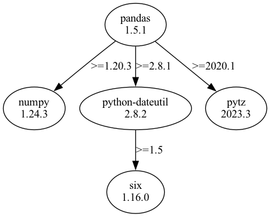
## 2.0.0
```text
graphviz==0.20.1
pandas==2.0.0rc1
  - numpy [required: >=1.20.3, installed: 1.24.3]
  - python-dateutil [required: >=2.8.2, installed: 2.8.2]
    - six [required: >=1.5, installed: 1.16.0]
  - pytz [required: >=2020.1, installed: 2023.3]
pip==22.0.4
pipdeptree==2.7.1
setuptools==56.0.0
```
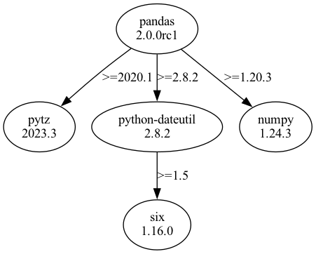
## poetry
## 0.1.0
```text
graphviz==0.20.1
pip==22.0.4
pipdeptree==2.7.1
poetry==0.1.0
  - cachy [required: >=0.1.0,<0.2.0, installed: 0.1.1]
  - cleo [required: >=0.6.1,<0.7.0, installed: 0.6.8]
    - pastel [required: >=0.1.0,<0.2.0, installed: 0.1.1]
    - pylev [required: >=1.3,<2.0, installed: 1.4.0]
  - requests [required: >=2.18.0,<3.0.0, installed: 2.30.0]
    - certifi [required: >=2017.4.17, installed: 2023.5.7]
    - charset-normalizer [required: >=2,<4, installed: 3.1.0]
    - idna [required: >=2.5,<4, installed: 3.4]
    - urllib3 [required: >=1.21.1,<3, installed: 2.0.2]
  - toml [required: >=0.9.4,<0.10.0, installed: 0.9.6]
setuptools==56.0.0
```
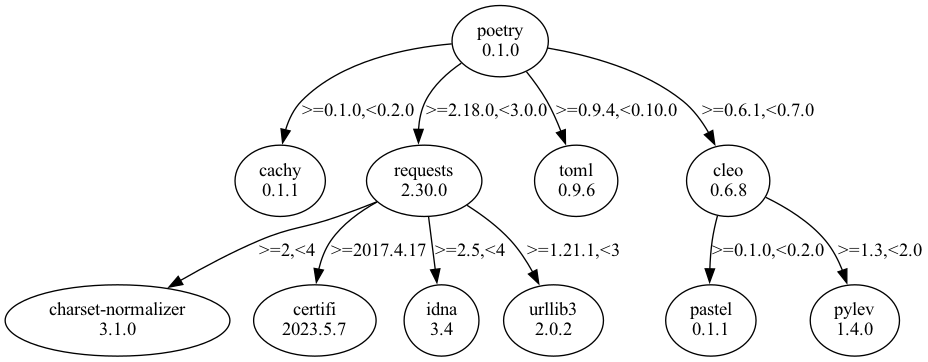
## 0.10.0
```text
graphviz==0.20.1
lockfile==0.12.2
pip==22.0.4
pipdeptree==2.7.1
poetry==0.10.0a3
  - cachecontrol [required: >=0.12.4,<0.13.0, installed: 0.12.11]
    - msgpack [required: >=0.5.2, installed: 1.0.5]
    - requests [required: Any, installed: 2.30.0]
      - certifi [required: >=2017.4.17, installed: 2023.5.7]
      - charset-normalizer [required: >=2,<4, installed: 3.1.0]
      - idna [required: >=2.5,<4, installed: 3.4]
      - urllib3 [required: >=1.21.1,<3, installed: 2.0.2]
  - cachy [required: >=0.2,<0.3, installed: 0.2.0]
  - cleo [required: >=0.6.6,<0.7.0, installed: 0.6.8]
    - pastel [required: >=0.1.0,<0.2.0, installed: 0.1.1]
    - pylev [required: >=1.3,<2.0, installed: 1.4.0]
  - html5lib [required: >=1.0,<2.0, installed: 1.1]
    - six [required: >=1.9, installed: 1.16.0]
    - webencodings [required: Any, installed: 0.5.1]
  - jsonschema [required: >=2.6,<3.0, installed: 2.6.0]
  - pkginfo [required: >=1.4,<2.0, installed: 1.9.6]
  - pyparsing [required: >=2.2,<3.0, installed: 2.4.7]
  - pyrsistent [required: >=0.14.2,<0.15.0, installed: 0.14.11]
    - six [required: Any, installed: 1.16.0]
  - requests [required: >=2.18,<3.0, installed: 2.30.0]
    - certifi [required: >=2017.4.17, installed: 2023.5.7]
    - charset-normalizer [required: >=2,<4, installed: 3.1.0]
    - idna [required: >=2.5,<4, installed: 3.4]
    - urllib3 [required: >=1.21.1,<3, installed: 2.0.2]
  - requests-toolbelt [required: >=0.8.0,<0.9.0, installed: 0.8.0]
    - requests [required: >=2.0.1,<3.0.0, installed: 2.30.0]
      - certifi [required: >=2017.4.17, installed: 2023.5.7]
      - charset-normalizer [required: >=2,<4, installed: 3.1.0]
      - idna [required: >=2.5,<4, installed: 3.4]
      - urllib3 [required: >=1.21.1,<3, installed: 2.0.2]
  - toml [required: >=0.9,<0.10, installed: 0.9.6]
setuptools==56.0.0
```
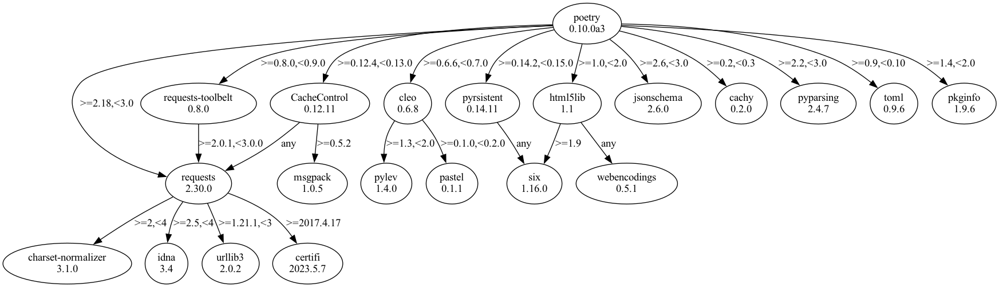
## 0.11.0
```text
graphviz==0.20.1
lockfile==0.12.2
pip==22.0.4
pipdeptree==2.7.1
poetry==0.11.0a0
  - cachecontrol [required: >=0.12.4,<0.13.0, installed: 0.12.11]
    - msgpack [required: >=0.5.2, installed: 1.0.5]
    - requests [required: Any, installed: 2.30.0]
      - certifi [required: >=2017.4.17, installed: 2023.5.7]
      - charset-normalizer [required: >=2,<4, installed: 3.1.0]
      - idna [required: >=2.5,<4, installed: 3.4]
      - urllib3 [required: >=1.21.1,<3, installed: 2.0.2]
  - cachy [required: >=0.2,<0.3, installed: 0.2.0]
  - cleo [required: >=0.6.6,<0.7.0, installed: 0.6.8]
    - pastel [required: >=0.1.0,<0.2.0, installed: 0.1.1]
    - pylev [required: >=1.3,<2.0, installed: 1.4.0]
  - html5lib [required: >=1.0,<2.0, installed: 1.1]
    - six [required: >=1.9, installed: 1.16.0]
    - webencodings [required: Any, installed: 0.5.1]
  - jsonschema [required: >=2.6,<3.0, installed: 2.6.0]
  - pkginfo [required: >=1.4,<2.0, installed: 1.9.6]
  - pyparsing [required: >=2.2,<3.0, installed: 2.4.7]
  - pyrsistent [required: >=0.14.2,<0.15.0, installed: 0.14.11]
    - six [required: Any, installed: 1.16.0]
  - requests [required: >=2.18,<3.0, installed: 2.30.0]
    - certifi [required: >=2017.4.17, installed: 2023.5.7]
    - charset-normalizer [required: >=2,<4, installed: 3.1.0]
    - idna [required: >=2.5,<4, installed: 3.4]
    - urllib3 [required: >=1.21.1,<3, installed: 2.0.2]
  - requests-toolbelt [required: >=0.8.0,<0.9.0, installed: 0.8.0]
    - requests [required: >=2.0.1,<3.0.0, installed: 2.30.0]
      - certifi [required: >=2017.4.17, installed: 2023.5.7]
      - charset-normalizer [required: >=2,<4, installed: 3.1.0]
      - idna [required: >=2.5,<4, installed: 3.4]
      - urllib3 [required: >=1.21.1,<3, installed: 2.0.2]
  - toml [required: >=0.9,<0.10, installed: 0.9.6]
setuptools==56.0.0
```
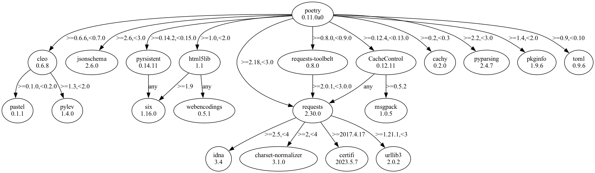
## 0.11.1
```text
graphviz==0.20.1
lockfile==0.12.2
pip==22.0.4
pipdeptree==2.7.1
poetry==0.11.1
  - cachecontrol [required: >=0.12.4,<0.13.0, installed: 0.12.11]
    - msgpack [required: >=0.5.2, installed: 1.0.5]
    - requests [required: Any, installed: 2.30.0]
      - certifi [required: >=2017.4.17, installed: 2023.5.7]
      - charset-normalizer [required: >=2,<4, installed: 3.1.0]
      - idna [required: >=2.5,<4, installed: 3.4]
      - urllib3 [required: >=1.21.1,<3, installed: 2.0.2]
  - cachy [required: >=0.2,<0.3, installed: 0.2.0]
  - cleo [required: >=0.6.7,<0.7.0, installed: 0.6.8]
    - pastel [required: >=0.1.0,<0.2.0, installed: 0.1.1]
    - pylev [required: >=1.3,<2.0, installed: 1.4.0]
  - html5lib [required: >=1.0,<2.0, installed: 1.1]
    - six [required: >=1.9, installed: 1.16.0]
    - webencodings [required: Any, installed: 0.5.1]
  - jsonschema [required: >=2.6,<3.0, installed: 2.6.0]
  - pkginfo [required: >=1.4,<2.0, installed: 1.9.6]
  - pyparsing [required: >=2.2,<3.0, installed: 2.4.7]
  - pyrsistent [required: >=0.14.2,<0.15.0, installed: 0.14.11]
    - six [required: Any, installed: 1.16.0]
  - pytoml [required: >=0.1.16,<0.2.0, installed: 0.1.21]
  - requests [required: >=2.18,<3.0, installed: 2.30.0]
    - certifi [required: >=2017.4.17, installed: 2023.5.7]
    - charset-normalizer [required: >=2,<4, installed: 3.1.0]
    - idna [required: >=2.5,<4, installed: 3.4]
    - urllib3 [required: >=1.21.1,<3, installed: 2.0.2]
  - requests-toolbelt [required: >=0.8.0,<0.9.0, installed: 0.8.0]
    - requests [required: >=2.0.1,<3.0.0, installed: 2.30.0]
      - certifi [required: >=2017.4.17, installed: 2023.5.7]
      - charset-normalizer [required: >=2,<4, installed: 3.1.0]
      - idna [required: >=2.5,<4, installed: 3.4]
      - urllib3 [required: >=1.21.1,<3, installed: 2.0.2]
  - shellingham [required: >=1.1,<2.0, installed: 1.5.0.post1]
setuptools==56.0.0
```
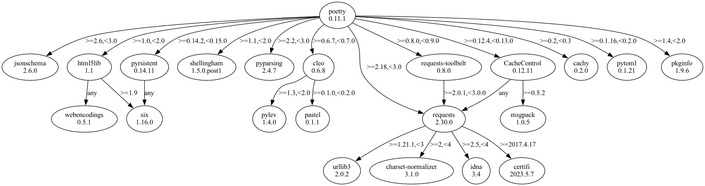
## 0.12.0
```text
graphviz==0.20.1
lockfile==0.12.2
pip==22.0.4
pipdeptree==2.7.1
poetry==0.12.0a4
  - cachecontrol [required: >=0.12.4,<0.13.0, installed: 0.12.11]
    - msgpack [required: >=0.5.2, installed: 1.0.5]
    - requests [required: Any, installed: 2.30.0]
      - certifi [required: >=2017.4.17, installed: 2023.5.7]
      - charset-normalizer [required: >=2,<4, installed: 3.1.0]
      - idna [required: >=2.5,<4, installed: 3.4]
      - urllib3 [required: >=1.21.1,<3, installed: 2.0.2]
  - cachy [required: >=0.2,<0.3, installed: 0.2.0]
  - cleo [required: >=0.6.7,<0.7.0, installed: 0.6.8]
    - pastel [required: >=0.1.0,<0.2.0, installed: 0.1.1]
    - pylev [required: >=1.3,<2.0, installed: 1.4.0]
  - html5lib [required: >=1.0,<2.0, installed: 1.1]
    - six [required: >=1.9, installed: 1.16.0]
    - webencodings [required: Any, installed: 0.5.1]
  - jsonschema [required: >=3.0a3,<4.0, installed: 3.2.0]
    - attrs [required: >=17.4.0, installed: 23.1.0]
    - pyrsistent [required: >=0.14.0, installed: 0.14.11]
      - six [required: Any, installed: 1.16.0]
    - setuptools [required: Any, installed: 56.0.0]
    - six [required: >=1.11.0, installed: 1.16.0]
  - pkginfo [required: >=1.4,<2.0, installed: 1.9.6]
  - pyparsing [required: >=2.2,<3.0, installed: 2.4.7]
  - pyrsistent [required: >=0.14.2,<0.15.0, installed: 0.14.11]
    - six [required: Any, installed: 1.16.0]
  - requests [required: >=2.18,<3.0, installed: 2.30.0]
    - certifi [required: >=2017.4.17, installed: 2023.5.7]
    - charset-normalizer [required: >=2,<4, installed: 3.1.0]
    - idna [required: >=2.5,<4, installed: 3.4]
    - urllib3 [required: >=1.21.1,<3, installed: 2.0.2]
  - requests-toolbelt [required: >=0.8.0,<0.9.0, installed: 0.8.0]
    - requests [required: >=2.0.1,<3.0.0, installed: 2.30.0]
      - certifi [required: >=2017.4.17, installed: 2023.5.7]
      - charset-normalizer [required: >=2,<4, installed: 3.1.0]
      - idna [required: >=2.5,<4, installed: 3.4]
      - urllib3 [required: >=1.21.1,<3, installed: 2.0.2]
  - shellingham [required: >=1.1,<2.0, installed: 1.5.0.post1]
  - tomlkit [required: >=0.4.4,<0.5.0, installed: 0.4.6]
```
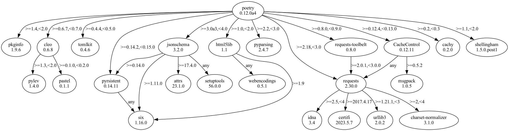
## 0.12.0
```text
graphviz==0.20.1
lockfile==0.12.2
pip==22.0.4
pipdeptree==2.7.1
poetry==0.12.0
  - cachecontrol [required: >=0.12.4,<0.13.0, installed: 0.12.11]
    - msgpack [required: >=0.5.2, installed: 1.0.5]
    - requests [required: Any, installed: 2.30.0]
      - certifi [required: >=2017.4.17, installed: 2023.5.7]
      - charset-normalizer [required: >=2,<4, installed: 3.1.0]
      - idna [required: >=2.5,<4, installed: 3.4]
      - urllib3 [required: >=1.21.1,<3, installed: 2.0.2]
  - cachy [required: >=0.2,<0.3, installed: 0.2.0]
  - cleo [required: >=0.6.7,<0.7.0, installed: 0.6.8]
    - pastel [required: >=0.1.0,<0.2.0, installed: 0.1.1]
    - pylev [required: >=1.3,<2.0, installed: 1.4.0]
  - html5lib [required: >=1.0,<2.0, installed: 1.1]
    - six [required: >=1.9, installed: 1.16.0]
    - webencodings [required: Any, installed: 0.5.1]
  - jsonschema [required: >=3.0a3,<4.0, installed: 3.2.0]
    - attrs [required: >=17.4.0, installed: 23.1.0]
    - pyrsistent [required: >=0.14.0, installed: 0.14.11]
      - six [required: Any, installed: 1.16.0]
    - setuptools [required: Any, installed: 56.0.0]
    - six [required: >=1.11.0, installed: 1.16.0]
  - pkginfo [required: >=1.4,<2.0, installed: 1.9.6]
  - pyparsing [required: >=2.2,<3.0, installed: 2.4.7]
  - pyrsistent [required: >=0.14.2,<0.15.0, installed: 0.14.11]
    - six [required: Any, installed: 1.16.0]
  - requests [required: >=2.18,<3.0, installed: 2.30.0]
    - certifi [required: >=2017.4.17, installed: 2023.5.7]
    - charset-normalizer [required: >=2,<4, installed: 3.1.0]
    - idna [required: >=2.5,<4, installed: 3.4]
    - urllib3 [required: >=1.21.1,<3, installed: 2.0.2]
  - requests-toolbelt [required: >=0.8.0,<0.9.0, installed: 0.8.0]
    - requests [required: >=2.0.1,<3.0.0, installed: 2.30.0]
      - certifi [required: >=2017.4.17, installed: 2023.5.7]
      - charset-normalizer [required: >=2,<4, installed: 3.1.0]
      - idna [required: >=2.5,<4, installed: 3.4]
      - urllib3 [required: >=1.21.1,<3, installed: 2.0.2]
  - shellingham [required: >=1.1,<2.0, installed: 1.5.0.post1]
  - tomlkit [required: >=0.4.4,<0.5.0, installed: 0.4.6]
```
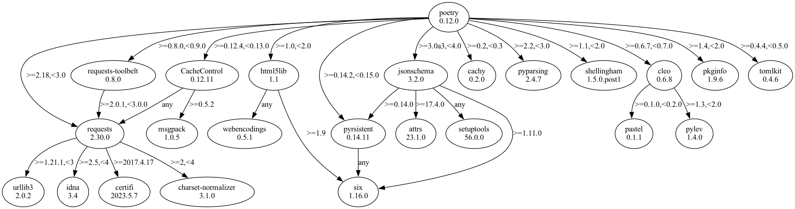
## 0.12.12
```text
graphviz==0.20.1
lockfile==0.12.2
pip==22.0.4
pipdeptree==2.7.1
poetry==0.12.12
  - cachecontrol [required: >=0.12.4,<0.13.0, installed: 0.12.11]
    - msgpack [required: >=0.5.2, installed: 1.0.5]
    - requests [required: Any, installed: 2.30.0]
      - certifi [required: >=2017.4.17, installed: 2023.5.7]
      - charset-normalizer [required: >=2,<4, installed: 3.1.0]
      - idna [required: >=2.5,<4, installed: 3.4]
      - urllib3 [required: >=1.21.1,<3, installed: 2.0.2]
  - cachy [required: >=0.2,<0.3, installed: 0.2.0]
  - cleo [required: >=0.6.7,<0.7.0, installed: 0.6.8]
    - pastel [required: >=0.1.0,<0.2.0, installed: 0.1.1]
    - pylev [required: >=1.3,<2.0, installed: 1.4.0]
  - html5lib [required: >=1.0,<2.0, installed: 1.1]
    - six [required: >=1.9, installed: 1.16.0]
    - webencodings [required: Any, installed: 0.5.1]
  - jsonschema [required: >=3.0a3,<4.0, installed: 3.2.0]
    - attrs [required: >=17.4.0, installed: 23.1.0]
    - pyrsistent [required: >=0.14.0, installed: 0.14.11]
      - six [required: Any, installed: 1.16.0]
    - setuptools [required: Any, installed: 56.0.0]
    - six [required: >=1.11.0, installed: 1.16.0]
  - pkginfo [required: >=1.4,<2.0, installed: 1.9.6]
  - pyparsing [required: >=2.2,<3.0, installed: 2.4.7]
  - pyrsistent [required: >=0.14.2,<0.15.0, installed: 0.14.11]
    - six [required: Any, installed: 1.16.0]
  - requests [required: >=2.18,<3.0, installed: 2.30.0]
    - certifi [required: >=2017.4.17, installed: 2023.5.7]
    - charset-normalizer [required: >=2,<4, installed: 3.1.0]
    - idna [required: >=2.5,<4, installed: 3.4]
    - urllib3 [required: >=1.21.1,<3, installed: 2.0.2]
  - requests-toolbelt [required: >=0.8.0,<0.9.0, installed: 0.8.0]
    - requests [required: >=2.0.1,<3.0.0, installed: 2.30.0]
      - certifi [required: >=2017.4.17, installed: 2023.5.7]
      - charset-normalizer [required: >=2,<4, installed: 3.1.0]
      - idna [required: >=2.5,<4, installed: 3.4]
      - urllib3 [required: >=1.21.1,<3, installed: 2.0.2]
  - shellingham [required: >=1.1,<2.0, installed: 1.5.0.post1]
  - tomlkit [required: >=0.5.1,<0.6.0, installed: 0.5.11]
```
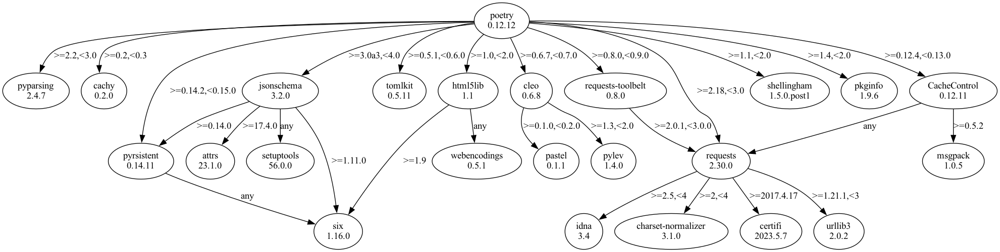
## 0.12.17
```text
graphviz==0.20.1
lockfile==0.12.2
pip==22.0.4
pipdeptree==2.7.1
poetry==0.12.17
  - cachecontrol [required: >=0.12.4,<0.13.0, installed: 0.12.11]
    - msgpack [required: >=0.5.2, installed: 1.0.5]
    - requests [required: Any, installed: 2.30.0]
      - certifi [required: >=2017.4.17, installed: 2023.5.7]
      - charset-normalizer [required: >=2,<4, installed: 3.1.0]
      - idna [required: >=2.5,<4, installed: 3.4]
      - urllib3 [required: >=1.21.1,<3, installed: 2.0.2]
  - cachy [required: >=0.2,<0.3, installed: 0.2.0]
  - cleo [required: >=0.6.7,<0.7.0, installed: 0.6.8]
    - pastel [required: >=0.1.0,<0.2.0, installed: 0.1.1]
    - pylev [required: >=1.3,<2.0, installed: 1.4.0]
  - html5lib [required: >=1.0,<2.0, installed: 1.1]
    - six [required: >=1.9, installed: 1.16.0]
    - webencodings [required: Any, installed: 0.5.1]
  - jsonschema [required: >=3.0a3,<4.0, installed: 3.2.0]
    - attrs [required: >=17.4.0, installed: 23.1.0]
    - pyrsistent [required: >=0.14.0, installed: 0.14.11]
      - six [required: Any, installed: 1.16.0]
    - setuptools [required: Any, installed: 56.0.0]
    - six [required: >=1.11.0, installed: 1.16.0]
  - pkginfo [required: >=1.4,<2.0, installed: 1.9.6]
  - pyparsing [required: >=2.2,<3.0, installed: 2.4.7]
  - pyrsistent [required: >=0.14.2,<0.15.0, installed: 0.14.11]
    - six [required: Any, installed: 1.16.0]
  - requests [required: >=2.18,<3.0, installed: 2.30.0]
    - certifi [required: >=2017.4.17, installed: 2023.5.7]
    - charset-normalizer [required: >=2,<4, installed: 3.1.0]
    - idna [required: >=2.5,<4, installed: 3.4]
    - urllib3 [required: >=1.21.1,<3, installed: 2.0.2]
  - requests-toolbelt [required: >=0.8.0,<0.9.0, installed: 0.8.0]
    - requests [required: >=2.0.1,<3.0.0, installed: 2.30.0]
      - certifi [required: >=2017.4.17, installed: 2023.5.7]
      - charset-normalizer [required: >=2,<4, installed: 3.1.0]
      - idna [required: >=2.5,<4, installed: 3.4]
      - urllib3 [required: >=1.21.1,<3, installed: 2.0.2]
  - shellingham [required: >=1.1,<2.0, installed: 1.5.0.post1]
  - tomlkit [required: >=0.5.1,<0.6.0, installed: 0.5.11]
```
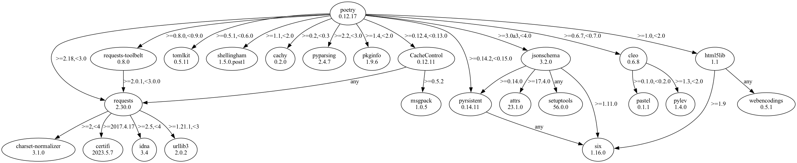
## 0.12.6
```text
graphviz==0.20.1
lockfile==0.12.2
pip==22.0.4
pipdeptree==2.7.1
poetry==0.12.6
  - cachecontrol [required: >=0.12.4,<0.13.0, installed: 0.12.11]
    - msgpack [required: >=0.5.2, installed: 1.0.5]
    - requests [required: Any, installed: 2.30.0]
      - certifi [required: >=2017.4.17, installed: 2023.5.7]
      - charset-normalizer [required: >=2,<4, installed: 3.1.0]
      - idna [required: >=2.5,<4, installed: 3.4]
      - urllib3 [required: >=1.21.1,<3, installed: 2.0.2]
  - cachy [required: >=0.2,<0.3, installed: 0.2.0]
  - cleo [required: >=0.6.7,<0.7.0, installed: 0.6.8]
    - pastel [required: >=0.1.0,<0.2.0, installed: 0.1.1]
    - pylev [required: >=1.3,<2.0, installed: 1.4.0]
  - html5lib [required: >=1.0,<2.0, installed: 1.1]
    - six [required: >=1.9, installed: 1.16.0]
    - webencodings [required: Any, installed: 0.5.1]
  - jsonschema [required: >=3.0a3,<4.0, installed: 3.2.0]
    - attrs [required: >=17.4.0, installed: 23.1.0]
    - pyrsistent [required: >=0.14.0, installed: 0.14.11]
      - six [required: Any, installed: 1.16.0]
    - setuptools [required: Any, installed: 56.0.0]
    - six [required: >=1.11.0, installed: 1.16.0]
  - pkginfo [required: >=1.4,<2.0, installed: 1.9.6]
  - pyparsing [required: >=2.2,<3.0, installed: 2.4.7]
  - pyrsistent [required: >=0.14.2,<0.15.0, installed: 0.14.11]
    - six [required: Any, installed: 1.16.0]
  - requests [required: >=2.18,<3.0, installed: 2.30.0]
    - certifi [required: >=2017.4.17, installed: 2023.5.7]
    - charset-normalizer [required: >=2,<4, installed: 3.1.0]
    - idna [required: >=2.5,<4, installed: 3.4]
    - urllib3 [required: >=1.21.1,<3, installed: 2.0.2]
  - requests-toolbelt [required: >=0.8.0,<0.9.0, installed: 0.8.0]
    - requests [required: >=2.0.1,<3.0.0, installed: 2.30.0]
      - certifi [required: >=2017.4.17, installed: 2023.5.7]
      - charset-normalizer [required: >=2,<4, installed: 3.1.0]
      - idna [required: >=2.5,<4, installed: 3.4]
      - urllib3 [required: >=1.21.1,<3, installed: 2.0.2]
  - shellingham [required: >=1.1,<2.0, installed: 1.5.0.post1]
  - tomlkit [required: >=0.4.4,<0.5.0, installed: 0.4.6]
```
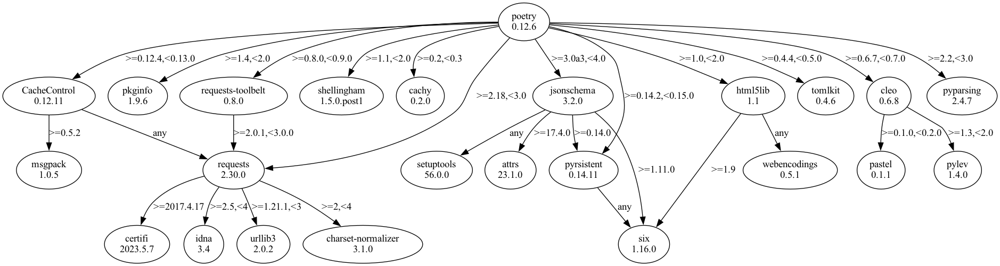
## 0.3.0
```text
graphviz==0.20.1
pip==22.0.4
pipdeptree==2.7.1
poetry==0.3.0
  - cachy [required: >=0.1.0,<0.2.0, installed: 0.1.1]
  - cleo [required: >=0.6.1,<0.7.0, installed: 0.6.8]
    - pastel [required: >=0.1.0,<0.2.0, installed: 0.1.1]
    - pylev [required: >=1.3,<2.0, installed: 1.4.0]
  - pip-tools [required: >=1.11.0,<2.0.0, installed: 1.11.0]
    - click [required: >=6, installed: 8.1.3]
    - first [required: Any, installed: 2.0.2]
    - setuptools [required: Any, installed: 56.0.0]
    - six [required: Any, installed: 1.16.0]
  - requests [required: >=2.18.0,<3.0.0, installed: 2.30.0]
    - certifi [required: >=2017.4.17, installed: 2023.5.7]
    - charset-normalizer [required: >=2,<4, installed: 3.1.0]
    - idna [required: >=2.5,<4, installed: 3.4]
    - urllib3 [required: >=1.21.1,<3, installed: 2.0.2]
  - toml [required: >=0.9.4,<0.10.0, installed: 0.9.6]
```

## 0.5.0
```text
graphviz==0.20.1
pip==22.0.4
pipdeptree==2.7.1
poetry==0.5.0
  - cachy [required: >=0.1.0.0,<0.2.0.0, installed: 0.1.1]
  - cleo [required: >=0.6.0.0,<0.7.0.0, installed: 0.6.8]
    - pastel [required: >=0.1.0,<0.2.0, installed: 0.1.1]
    - pylev [required: >=1.3,<2.0, installed: 1.4.0]
  - pip-tools [required: >=1.11.0.0,<2.0.0.0, installed: 1.11.0]
    - click [required: >=6, installed: 8.1.3]
    - first [required: Any, installed: 2.0.2]
    - setuptools [required: Any, installed: 56.0.0]
    - six [required: Any, installed: 1.16.0]
  - requests [required: >=2.18.0.0,<3.0.0.0, installed: 2.30.0]
    - certifi [required: >=2017.4.17, installed: 2023.5.7]
    - charset-normalizer [required: >=2,<4, installed: 3.1.0]
    - idna [required: >=2.5,<4, installed: 3.4]
    - urllib3 [required: >=1.21.1,<3, installed: 2.0.2]
  - requests-toolbelt [required: >=0.8.0.0,<0.9.0.0, installed: 0.8.0]
    - requests [required: >=2.0.1,<3.0.0, installed: 2.30.0]
      - certifi [required: >=2017.4.17, installed: 2023.5.7]
      - charset-normalizer [required: >=2,<4, installed: 3.1.0]
      - idna [required: >=2.5,<4, installed: 3.4]
      - urllib3 [required: >=1.21.1,<3, installed: 2.0.2]
  - toml [required: >=0.9.0.0,<0.10.0.0, installed: 0.9.6]
```
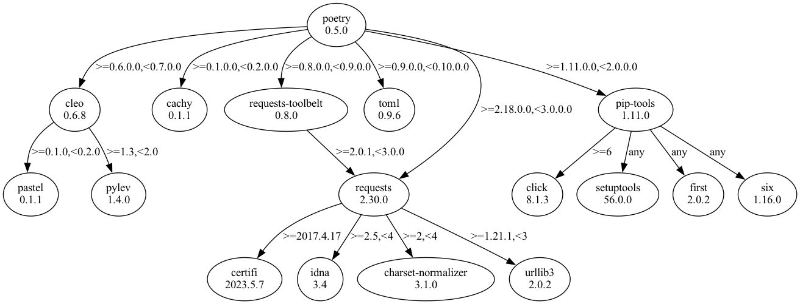
## 0.6.2
```text
graphviz==0.20.1
pip==22.0.4
pipdeptree==2.7.1
poetry==0.6.2
  - cachy [required: >=0.1.0.0,<0.2.0.0, installed: 0.1.1]
  - cleo [required: >=0.6.0.0,<0.7.0.0, installed: 0.6.8]
    - pastel [required: >=0.1.0,<0.2.0, installed: 0.1.1]
    - pylev [required: >=1.3,<2.0, installed: 1.4.0]
  - jsonschema [required: >=2.6.0.0,<3.0.0.0, installed: 2.6.0]
  - pip-tools [required: >=1.11.0.0,<2.0.0.0, installed: 1.11.0]
    - click [required: >=6, installed: 8.1.3]
    - first [required: Any, installed: 2.0.2]
    - setuptools [required: Any, installed: 56.0.0]
    - six [required: Any, installed: 1.16.0]
  - pyparsing [required: >=2.2.0.0,<3.0.0.0, installed: 2.4.7]
  - pyrsistent [required: >=0.14.2.0,<0.15.0.0, installed: 0.14.11]
    - six [required: Any, installed: 1.16.0]
  - requests [required: >=2.18.0.0,<3.0.0.0, installed: 2.30.0]
    - certifi [required: >=2017.4.17, installed: 2023.5.7]
    - charset-normalizer [required: >=2,<4, installed: 3.1.0]
    - idna [required: >=2.5,<4, installed: 3.4]
    - urllib3 [required: >=1.21.1,<3, installed: 2.0.2]
  - requests-toolbelt [required: >=0.8.0.0,<0.9.0.0, installed: 0.8.0]
    - requests [required: >=2.0.1,<3.0.0, installed: 2.30.0]
      - certifi [required: >=2017.4.17, installed: 2023.5.7]
      - charset-normalizer [required: >=2,<4, installed: 3.1.0]
      - idna [required: >=2.5,<4, installed: 3.4]
      - urllib3 [required: >=1.21.1,<3, installed: 2.0.2]
  - toml [required: >=0.9.0.0,<0.10.0.0, installed: 0.9.6]
```
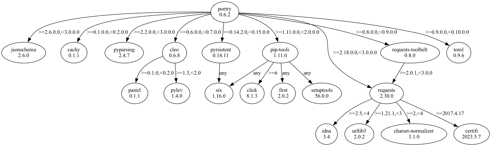
## 0.6.3
```text
graphviz==0.20.1
pip==22.0.4
pipdeptree==2.7.1
poetry==0.6.3b4
  - cachy [required: >=0.1.0.0,<0.2.0.0, installed: 0.1.1]
  - cleo [required: >=0.6.0.0,<0.7.0.0, installed: 0.6.8]
    - pastel [required: >=0.1.0,<0.2.0, installed: 0.1.1]
    - pylev [required: >=1.3,<2.0, installed: 1.4.0]
  - jsonschema [required: >=2.6.0.0,<3.0.0.0, installed: 2.6.0]
  - pip-tools [required: >=1.11.0.0,<2.0.0.0, installed: 1.11.0]
    - click [required: >=6, installed: 8.1.3]
    - first [required: Any, installed: 2.0.2]
    - setuptools [required: Any, installed: 56.0.0]
    - six [required: Any, installed: 1.16.0]
  - pyparsing [required: >=2.2.0.0,<3.0.0.0, installed: 2.4.7]
  - pyrsistent [required: >=0.14.2.0,<0.15.0.0, installed: 0.14.11]
    - six [required: Any, installed: 1.16.0]
  - requests [required: >=2.18.0.0,<3.0.0.0, installed: 2.30.0]
    - certifi [required: >=2017.4.17, installed: 2023.5.7]
    - charset-normalizer [required: >=2,<4, installed: 3.1.0]
    - idna [required: >=2.5,<4, installed: 3.4]
    - urllib3 [required: >=1.21.1,<3, installed: 2.0.2]
  - requests-toolbelt [required: >=0.8.0.0,<0.9.0.0, installed: 0.8.0]
    - requests [required: >=2.0.1,<3.0.0, installed: 2.30.0]
      - certifi [required: >=2017.4.17, installed: 2023.5.7]
      - charset-normalizer [required: >=2,<4, installed: 3.1.0]
      - idna [required: >=2.5,<4, installed: 3.4]
      - urllib3 [required: >=1.21.1,<3, installed: 2.0.2]
  - toml [required: >=0.9.0.0,<0.10.0.0, installed: 0.9.6]
```
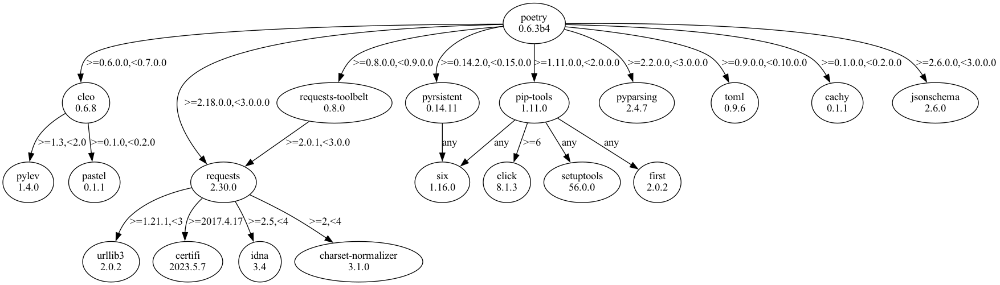
## 0.6.4
```text
graphviz==0.20.1
pip==22.0.4
pipdeptree==2.7.1
poetry==0.6.4b1
  - cachy [required: >=0.1.0.0,<0.2.0.0, installed: 0.1.1]
  - cleo [required: >=0.6.0.0,<0.7.0.0, installed: 0.6.8]
    - pastel [required: >=0.1.0,<0.2.0, installed: 0.1.1]
    - pylev [required: >=1.3,<2.0, installed: 1.4.0]
  - jsonschema [required: >=2.6.0.0,<3.0.0.0, installed: 2.6.0]
  - pip-tools [required: >=1.11.0.0,<2.0.0.0, installed: 1.11.0]
    - click [required: >=6, installed: 8.1.3]
    - first [required: Any, installed: 2.0.2]
    - setuptools [required: Any, installed: 56.0.0]
    - six [required: Any, installed: 1.16.0]
  - pyparsing [required: >=2.2.0.0,<3.0.0.0, installed: 2.4.7]
  - pyrsistent [required: >=0.14.2.0,<0.15.0.0, installed: 0.14.11]
    - six [required: Any, installed: 1.16.0]
  - requests [required: >=2.18.0.0,<3.0.0.0, installed: 2.30.0]
    - certifi [required: >=2017.4.17, installed: 2023.5.7]
    - charset-normalizer [required: >=2,<4, installed: 3.1.0]
    - idna [required: >=2.5,<4, installed: 3.4]
    - urllib3 [required: >=1.21.1,<3, installed: 2.0.2]
  - requests-toolbelt [required: >=0.8.0.0,<0.9.0.0, installed: 0.8.0]
    - requests [required: >=2.0.1,<3.0.0, installed: 2.30.0]
      - certifi [required: >=2017.4.17, installed: 2023.5.7]
      - charset-normalizer [required: >=2,<4, installed: 3.1.0]
      - idna [required: >=2.5,<4, installed: 3.4]
      - urllib3 [required: >=1.21.1,<3, installed: 2.0.2]
  - toml [required: >=0.9.0.0,<0.10.0.0, installed: 0.9.6]
```
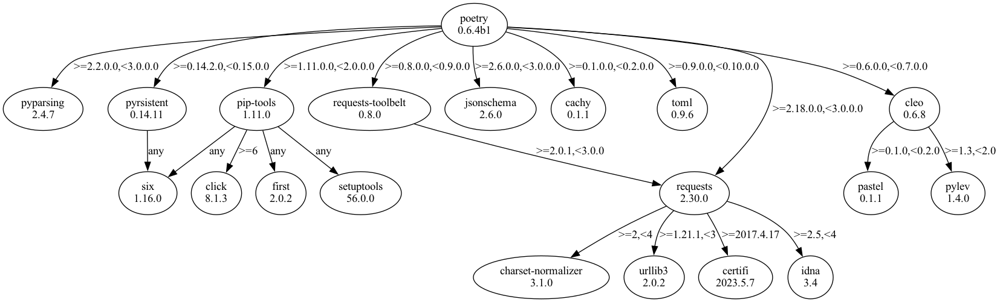
## 0.7.0
```text
graphviz==0.20.1
pip==22.0.4
pipdeptree==2.7.1
poetry==0.7.0b3
  - cachy [required: >=0.1.1.0,<0.2.0.0, installed: 0.1.1]
  - cleo [required: >=0.6.0.0,<0.7.0.0, installed: 0.6.8]
    - pastel [required: >=0.1.0,<0.2.0, installed: 0.1.1]
    - pylev [required: >=1.3,<2.0, installed: 1.4.0]
  - jsonschema [required: >=2.6.0.0,<3.0.0.0, installed: 2.6.0]
  - pip-tools [required: >=1.11.0.0,<2.0.0.0, installed: 1.11.0]
    - click [required: >=6, installed: 8.1.3]
    - first [required: Any, installed: 2.0.2]
    - setuptools [required: Any, installed: 56.0.0]
    - six [required: Any, installed: 1.16.0]
  - pyparsing [required: >=2.2.0.0,<3.0.0.0, installed: 2.4.7]
  - pyrsistent [required: >=0.14.2.0,<0.15.0.0, installed: 0.14.11]
    - six [required: Any, installed: 1.16.0]
  - requests [required: >=2.18.0.0,<3.0.0.0, installed: 2.30.0]
    - certifi [required: >=2017.4.17, installed: 2023.5.7]
    - charset-normalizer [required: >=2,<4, installed: 3.1.0]
    - idna [required: >=2.5,<4, installed: 3.4]
    - urllib3 [required: >=1.21.1,<3, installed: 2.0.2]
  - requests-toolbelt [required: >=0.8.0.0,<0.9.0.0, installed: 0.8.0]
    - requests [required: >=2.0.1,<3.0.0, installed: 2.30.0]
      - certifi [required: >=2017.4.17, installed: 2023.5.7]
      - charset-normalizer [required: >=2,<4, installed: 3.1.0]
      - idna [required: >=2.5,<4, installed: 3.4]
      - urllib3 [required: >=1.21.1,<3, installed: 2.0.2]
  - toml [required: >=0.9.0.0,<0.10.0.0, installed: 0.9.6]
```
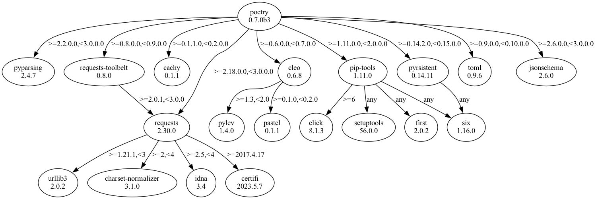
## 0.8.0
```text
graphviz==0.20.1
pip==22.0.4
pipdeptree==2.7.1
poetry==0.8.0a1
  - cachecontrol [required: >=0.12.4.0,<0.13.0.0, installed: 0.12.11]
    - msgpack [required: >=0.5.2, installed: 1.0.5]
    - requests [required: Any, installed: 2.30.0]
      - certifi [required: >=2017.4.17, installed: 2023.5.7]
      - charset-normalizer [required: >=2,<4, installed: 3.1.0]
      - idna [required: >=2.5,<4, installed: 3.4]
      - urllib3 [required: >=1.21.1,<3, installed: 2.0.2]
  - cachy [required: >=0.1.1.0,<0.2.0.0, installed: 0.1.1]
  - cleo [required: >=0.6.0.0,<0.7.0.0, installed: 0.6.8]
    - pastel [required: >=0.1.0,<0.2.0, installed: 0.1.1]
    - pylev [required: >=1.3,<2.0, installed: 1.4.0]
  - jsonschema [required: >=2.6.0.0,<3.0.0.0, installed: 2.6.0]
  - lockfile [required: >=0.12.0.0,<0.13.0.0, installed: 0.12.2]
  - msgpack-python [required: >=0.5.0.0,<0.6.0.0, installed: 0.5.6]
  - pip-tools [required: >=1.11.0.0,<2.0.0.0, installed: 1.11.0]
    - click [required: >=6, installed: 8.1.3]
    - first [required: Any, installed: 2.0.2]
    - setuptools [required: Any, installed: 56.0.0]
    - six [required: Any, installed: 1.16.0]
  - pyparsing [required: >=2.2.0.0,<3.0.0.0, installed: 2.4.7]
  - pyrsistent [required: >=0.14.2.0,<0.15.0.0, installed: 0.14.11]
    - six [required: Any, installed: 1.16.0]
  - requests [required: >=2.18.0.0,<3.0.0.0, installed: 2.30.0]
    - certifi [required: >=2017.4.17, installed: 2023.5.7]
    - charset-normalizer [required: >=2,<4, installed: 3.1.0]
    - idna [required: >=2.5,<4, installed: 3.4]
    - urllib3 [required: >=1.21.1,<3, installed: 2.0.2]
  - requests-toolbelt [required: >=0.8.0.0,<0.9.0.0, installed: 0.8.0]
    - requests [required: >=2.0.1,<3.0.0, installed: 2.30.0]
      - certifi [required: >=2017.4.17, installed: 2023.5.7]
      - charset-normalizer [required: >=2,<4, installed: 3.1.0]
      - idna [required: >=2.5,<4, installed: 3.4]
      - urllib3 [required: >=1.21.1,<3, installed: 2.0.2]
  - toml [required: >=0.9.0.0,<0.10.0.0, installed: 0.9.6]
```
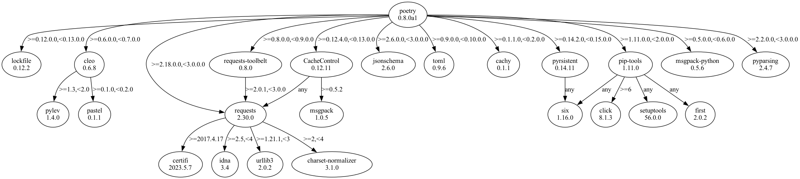
## 0.8.1
```text
graphviz==0.20.1
pip==22.0.4
pipdeptree==2.7.1
poetry==0.8.1a0
  - cachecontrol [required: >=0.12.4.0,<0.13.0.0, installed: 0.12.11]
    - msgpack [required: >=0.5.2, installed: 1.0.5]
    - requests [required: Any, installed: 2.30.0]
      - certifi [required: >=2017.4.17, installed: 2023.5.7]
      - charset-normalizer [required: >=2,<4, installed: 3.1.0]
      - idna [required: >=2.5,<4, installed: 3.4]
      - urllib3 [required: >=1.21.1,<3, installed: 2.0.2]
  - cachy [required: >=0.1.1.0,<0.2.0.0, installed: 0.1.1]
  - cleo [required: >=0.6.0.0,<0.7.0.0, installed: 0.6.8]
    - pastel [required: >=0.1.0,<0.2.0, installed: 0.1.1]
    - pylev [required: >=1.3,<2.0, installed: 1.4.0]
  - jsonschema [required: >=2.6.0.0,<3.0.0.0, installed: 2.6.0]
  - lockfile [required: >=0.12.0.0,<0.13.0.0, installed: 0.12.2]
  - msgpack-python [required: >=0.5.0.0,<0.6.0.0, installed: 0.5.6]
  - pip-tools [required: >=1.11.0.0,<2.0.0.0, installed: 1.11.0]
    - click [required: >=6, installed: 8.1.3]
    - first [required: Any, installed: 2.0.2]
    - setuptools [required: Any, installed: 56.0.0]
    - six [required: Any, installed: 1.16.0]
  - pkginfo [required: >=1.4.0.0,<2.0.0.0, installed: 1.9.6]
  - pyparsing [required: >=2.2.0.0,<3.0.0.0, installed: 2.4.7]
  - pyrsistent [required: >=0.14.2.0,<0.15.0.0, installed: 0.14.11]
    - six [required: Any, installed: 1.16.0]
  - requests [required: >=2.18.0.0,<3.0.0.0, installed: 2.30.0]
    - certifi [required: >=2017.4.17, installed: 2023.5.7]
    - charset-normalizer [required: >=2,<4, installed: 3.1.0]
    - idna [required: >=2.5,<4, installed: 3.4]
    - urllib3 [required: >=1.21.1,<3, installed: 2.0.2]
  - requests-toolbelt [required: >=0.8.0.0,<0.9.0.0, installed: 0.8.0]
    - requests [required: >=2.0.1,<3.0.0, installed: 2.30.0]
      - certifi [required: >=2017.4.17, installed: 2023.5.7]
      - charset-normalizer [required: >=2,<4, installed: 3.1.0]
      - idna [required: >=2.5,<4, installed: 3.4]
      - urllib3 [required: >=1.21.1,<3, installed: 2.0.2]
  - toml [required: >=0.9.0.0,<0.10.0.0, installed: 0.9.6]
```
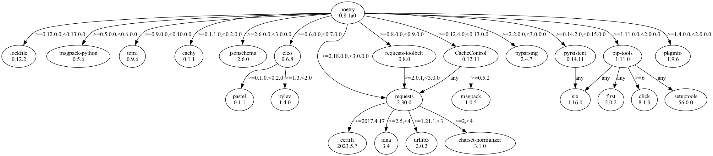
## 0.8.5
```text
graphviz==0.20.1
pip==22.0.4
pipdeptree==2.7.1
poetry==0.8.5a0
  - cachecontrol [required: >=0.12.4.0,<0.13.0.0, installed: 0.12.11]
    - msgpack [required: >=0.5.2, installed: 1.0.5]
    - requests [required: Any, installed: 2.30.0]
      - certifi [required: >=2017.4.17, installed: 2023.5.7]
      - charset-normalizer [required: >=2,<4, installed: 3.1.0]
      - idna [required: >=2.5,<4, installed: 3.4]
      - urllib3 [required: >=1.21.1,<3, installed: 2.0.2]
  - cachy [required: >=0.1.1.0,<0.2.0.0, installed: 0.1.1]
  - cleo [required: >=0.6.0.0,<0.7.0.0, installed: 0.6.8]
    - pastel [required: >=0.1.0,<0.2.0, installed: 0.1.1]
    - pylev [required: >=1.3,<2.0, installed: 1.4.0]
  - jsonschema [required: >=2.6.0.0,<3.0.0.0, installed: 2.6.0]
  - lockfile [required: >=0.12.0.0,<0.13.0.0, installed: 0.12.2]
  - msgpack-python [required: >=0.5.0.0,<0.6.0.0, installed: 0.5.6]
  - pip-tools [required: >=2.0.0.0,<3.0.0.0, installed: 2.0.2]
    - click [required: >=6, installed: 8.1.3]
    - first [required: Any, installed: 2.0.2]
    - six [required: Any, installed: 1.16.0]
  - pkginfo [required: >=1.4.0.0,<2.0.0.0, installed: 1.9.6]
  - pyparsing [required: >=2.2.0.0,<3.0.0.0, installed: 2.4.7]
  - pyrsistent [required: >=0.14.2.0,<0.15.0.0, installed: 0.14.11]
    - six [required: Any, installed: 1.16.0]
  - requests [required: >=2.18.0.0,<3.0.0.0, installed: 2.30.0]
    - certifi [required: >=2017.4.17, installed: 2023.5.7]
    - charset-normalizer [required: >=2,<4, installed: 3.1.0]
    - idna [required: >=2.5,<4, installed: 3.4]
    - urllib3 [required: >=1.21.1,<3, installed: 2.0.2]
  - requests-toolbelt [required: >=0.8.0.0,<0.9.0.0, installed: 0.8.0]
    - requests [required: >=2.0.1,<3.0.0, installed: 2.30.0]
      - certifi [required: >=2017.4.17, installed: 2023.5.7]
      - charset-normalizer [required: >=2,<4, installed: 3.1.0]
      - idna [required: >=2.5,<4, installed: 3.4]
      - urllib3 [required: >=1.21.1,<3, installed: 2.0.2]
  - toml [required: >=0.9.0.0,<0.10.0.0, installed: 0.9.6]
setuptools==56.0.0
```
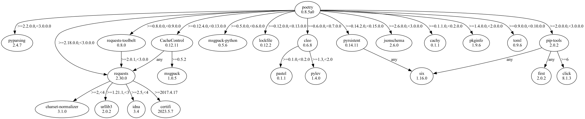
## 0.9.0
```text
graphviz==0.20.1
lockfile==0.12.2
pip==22.0.4
pipdeptree==2.7.1
poetry==0.9.0a2
  - cachecontrol [required: >=0.12.4.0,<0.13.0.0, installed: 0.12.11]
    - msgpack [required: >=0.5.2, installed: 1.0.5]
    - requests [required: Any, installed: 2.30.0]
      - certifi [required: >=2017.4.17, installed: 2023.5.7]
      - charset-normalizer [required: >=2,<4, installed: 3.1.0]
      - idna [required: >=2.5,<4, installed: 3.4]
      - urllib3 [required: >=1.21.1,<3, installed: 2.0.2]
  - cachy [required: >=0.2.0.0,<0.3.0.0, installed: 0.2.0]
  - cleo [required: >=0.6.0.0,<0.7.0.0, installed: 0.6.8]
    - pastel [required: >=0.1.0,<0.2.0, installed: 0.1.1]
    - pylev [required: >=1.3,<2.0, installed: 1.4.0]
  - jsonschema [required: >=2.6.0.0,<3.0.0.0, installed: 2.6.0]
  - pip-tools [required: >=2.0.0.0,<3.0.0.0, installed: 2.0.2]
    - click [required: >=6, installed: 8.1.3]
    - first [required: Any, installed: 2.0.2]
    - six [required: Any, installed: 1.16.0]
  - pkginfo [required: >=1.4.0.0,<2.0.0.0, installed: 1.9.6]
  - pyparsing [required: >=2.2.0.0,<3.0.0.0, installed: 2.4.7]
  - pyrsistent [required: >=0.14.2.0,<0.15.0.0, installed: 0.14.11]
    - six [required: Any, installed: 1.16.0]
  - requests [required: >=2.18.0.0,<3.0.0.0, installed: 2.30.0]
    - certifi [required: >=2017.4.17, installed: 2023.5.7]
    - charset-normalizer [required: >=2,<4, installed: 3.1.0]
    - idna [required: >=2.5,<4, installed: 3.4]
    - urllib3 [required: >=1.21.1,<3, installed: 2.0.2]
  - requests-toolbelt [required: >=0.8.0.0,<0.9.0.0, installed: 0.8.0]
    - requests [required: >=2.0.1,<3.0.0, installed: 2.30.0]
      - certifi [required: >=2017.4.17, installed: 2023.5.7]
      - charset-normalizer [required: >=2,<4, installed: 3.1.0]
      - idna [required: >=2.5,<4, installed: 3.4]
      - urllib3 [required: >=1.21.1,<3, installed: 2.0.2]
  - toml [required: >=0.9.0.0,<0.10.0.0, installed: 0.9.6]
setuptools==56.0.0
```
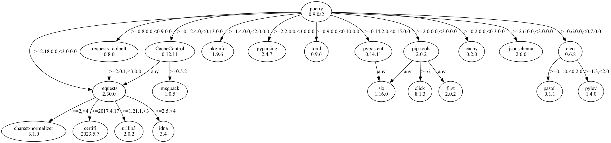
## 1.0.0
```text
graphviz==0.20.1
lockfile==0.12.2
pip==22.0.4
pipdeptree==2.7.1
poetry==1.0.0a1
  - cachecontrol [required: >=0.12.4,<0.13.0, installed: 0.12.11]
    - msgpack [required: >=0.5.2, installed: 1.0.5]
    - requests [required: Any, installed: 2.30.0]
      - certifi [required: >=2017.4.17, installed: 2023.5.7]
      - charset-normalizer [required: >=2,<4, installed: 3.1.0]
      - idna [required: >=2.5,<4, installed: 3.4]
      - urllib3 [required: >=1.21.1,<3, installed: 2.0.2]
  - cachy [required: >=0.2,<0.3, installed: 0.2.0]
  - cleo [required: >=0.6.7,<0.7.0, installed: 0.6.8]
    - pastel [required: >=0.1.0,<0.2.0, installed: 0.1.1]
    - pylev [required: >=1.3,<2.0, installed: 1.4.0]
  - html5lib [required: >=1.0,<2.0, installed: 1.1]
    - six [required: >=1.9, installed: 1.16.0]
    - webencodings [required: Any, installed: 0.5.1]
  - jsonschema [required: >=3.0a3,<4.0, installed: 3.2.0]
    - attrs [required: >=17.4.0, installed: 23.1.0]
    - pyrsistent [required: >=0.14.0, installed: 0.14.11]
      - six [required: Any, installed: 1.16.0]
    - setuptools [required: Any, installed: 56.0.0]
    - six [required: >=1.11.0, installed: 1.16.0]
  - pkginfo [required: >=1.4,<2.0, installed: 1.9.6]
  - pyparsing [required: >=2.2,<3.0, installed: 2.4.7]
  - pyrsistent [required: >=0.14.2,<0.15.0, installed: 0.14.11]
    - six [required: Any, installed: 1.16.0]
  - requests [required: >=2.18,<3.0, installed: 2.30.0]
    - certifi [required: >=2017.4.17, installed: 2023.5.7]
    - charset-normalizer [required: >=2,<4, installed: 3.1.0]
    - idna [required: >=2.5,<4, installed: 3.4]
    - urllib3 [required: >=1.21.1,<3, installed: 2.0.2]
  - requests-toolbelt [required: >=0.8.0,<0.9.0, installed: 0.8.0]
    - requests [required: >=2.0.1,<3.0.0, installed: 2.30.0]
      - certifi [required: >=2017.4.17, installed: 2023.5.7]
      - charset-normalizer [required: >=2,<4, installed: 3.1.0]
      - idna [required: >=2.5,<4, installed: 3.4]
      - urllib3 [required: >=1.21.1,<3, installed: 2.0.2]
  - shellingham [required: >=1.1,<2.0, installed: 1.5.0.post1]
  - tomlkit [required: >=0.5.1,<0.6.0, installed: 0.5.11]
```
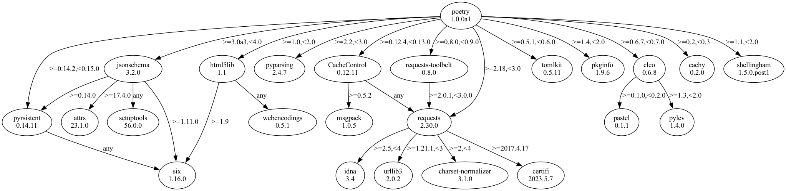
## 1.0.0
```text
graphviz==0.20.1
lockfile==0.12.2
pip==22.0.4
pipdeptree==2.7.1
poetry==1.0.0b1
  - cachecontrol [required: >=0.12.4,<0.13.0, installed: 0.12.11]
    - msgpack [required: >=0.5.2, installed: 1.0.5]
    - requests [required: Any, installed: 2.30.0]
      - certifi [required: >=2017.4.17, installed: 2023.5.7]
      - charset-normalizer [required: >=2,<4, installed: 3.1.0]
      - idna [required: >=2.5,<4, installed: 3.4]
      - urllib3 [required: >=1.21.1,<3, installed: 2.0.2]
  - cachy [required: >=0.3.0,<0.4.0, installed: 0.3.0]
  - cleo [required: >=0.7.5,<0.8.0, installed: 0.7.6]
    - clikit [required: >=0.4.0,<0.5.0, installed: 0.4.3]
      - pastel [required: >=0.2.0,<0.3.0, installed: 0.2.1]
      - pylev [required: >=1.3,<2.0, installed: 1.4.0]
  - html5lib [required: >=1.0,<2.0, installed: 1.1]
    - six [required: >=1.9, installed: 1.16.0]
    - webencodings [required: Any, installed: 0.5.1]
  - jsonschema [required: >=3.0a3,<4.0, installed: 3.2.0]
    - attrs [required: >=17.4.0, installed: 23.1.0]
    - pyrsistent [required: >=0.14.0, installed: 0.14.11]
      - six [required: Any, installed: 1.16.0]
    - setuptools [required: Any, installed: 56.0.0]
    - six [required: >=1.11.0, installed: 1.16.0]
  - keyring [required: >=19.0,<20.0, installed: 19.3.0]
  - pkginfo [required: >=1.4,<2.0, installed: 1.9.6]
  - pyparsing [required: >=2.2,<3.0, installed: 2.4.7]
  - pyrsistent [required: >=0.14.2,<0.15.0, installed: 0.14.11]
    - six [required: Any, installed: 1.16.0]
  - requests [required: >=2.18,<3.0, installed: 2.30.0]
    - certifi [required: >=2017.4.17, installed: 2023.5.7]
    - charset-normalizer [required: >=2,<4, installed: 3.1.0]
    - idna [required: >=2.5,<4, installed: 3.4]
    - urllib3 [required: >=1.21.1,<3, installed: 2.0.2]
  - requests-toolbelt [required: >=0.8.0,<0.9.0, installed: 0.8.0]
    - requests [required: >=2.0.1,<3.0.0, installed: 2.30.0]
      - certifi [required: >=2017.4.17, installed: 2023.5.7]
      - charset-normalizer [required: >=2,<4, installed: 3.1.0]
      - idna [required: >=2.5,<4, installed: 3.4]
      - urllib3 [required: >=1.21.1,<3, installed: 2.0.2]
  - shellingham [required: >=1.1,<2.0, installed: 1.5.0.post1]
  - tomlkit [required: >=0.5.5,<0.6.0, installed: 0.5.11]
```
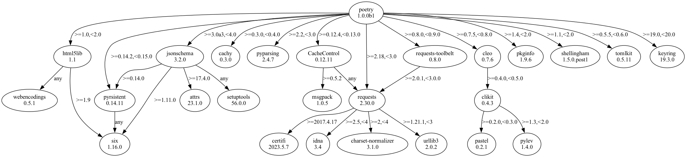
## 1.0.0
```text
graphviz==0.20.1
lockfile==0.12.2
pip==22.0.4
pipdeptree==2.7.1
poetry==1.0.0b6
  - cachecontrol [required: >=0.12.4,<0.13.0, installed: 0.12.11]
    - msgpack [required: >=0.5.2, installed: 1.0.5]
    - requests [required: Any, installed: 2.30.0]
      - certifi [required: >=2017.4.17, installed: 2023.5.7]
      - charset-normalizer [required: >=2,<4, installed: 3.1.0]
      - idna [required: >=2.5,<4, installed: 3.4]
      - urllib3 [required: >=1.21.1,<3, installed: 2.0.2]
  - cachy [required: >=0.3.0,<0.4.0, installed: 0.3.0]
  - cleo [required: >=0.7.6,<0.8.0, installed: 0.7.6]
    - clikit [required: >=0.4.0,<0.5.0, installed: 0.4.3]
      - pastel [required: >=0.2.0,<0.3.0, installed: 0.2.1]
      - pylev [required: >=1.3,<2.0, installed: 1.4.0]
  - clikit [required: >=0.4.0,<0.5.0, installed: 0.4.3]
    - pastel [required: >=0.2.0,<0.3.0, installed: 0.2.1]
    - pylev [required: >=1.3,<2.0, installed: 1.4.0]
  - html5lib [required: >=1.0,<2.0, installed: 1.1]
    - six [required: >=1.9, installed: 1.16.0]
    - webencodings [required: Any, installed: 0.5.1]
  - jsonschema [required: >=3.1,<4.0, installed: 3.2.0]
    - attrs [required: >=17.4.0, installed: 23.1.0]
    - pyrsistent [required: >=0.14.0, installed: 0.14.11]
      - six [required: Any, installed: 1.16.0]
    - setuptools [required: Any, installed: 56.0.0]
    - six [required: >=1.11.0, installed: 1.16.0]
  - keyring [required: >=19.0,<20.0, installed: 19.3.0]
  - pexpect [required: >=4.7.0,<5.0.0, installed: 4.8.0]
    - ptyprocess [required: >=0.5, installed: 0.7.0]
  - pkginfo [required: >=1.4,<2.0, installed: 1.9.6]
  - pyparsing [required: >=2.2,<3.0, installed: 2.4.7]
  - pyrsistent [required: >=0.14.2,<0.15.0, installed: 0.14.11]
    - six [required: Any, installed: 1.16.0]
  - requests [required: >=2.18,<3.0, installed: 2.30.0]
    - certifi [required: >=2017.4.17, installed: 2023.5.7]
    - charset-normalizer [required: >=2,<4, installed: 3.1.0]
    - idna [required: >=2.5,<4, installed: 3.4]
    - urllib3 [required: >=1.21.1,<3, installed: 2.0.2]
  - requests-toolbelt [required: >=0.8.0,<0.9.0, installed: 0.8.0]
    - requests [required: >=2.0.1,<3.0.0, installed: 2.30.0]
      - certifi [required: >=2017.4.17, installed: 2023.5.7]
      - charset-normalizer [required: >=2,<4, installed: 3.1.0]
      - idna [required: >=2.5,<4, installed: 3.4]
      - urllib3 [required: >=1.21.1,<3, installed: 2.0.2]
  - shellingham [required: >=1.1,<2.0, installed: 1.5.0.post1]
  - tomlkit [required: >=0.5.8,<0.6.0, installed: 0.5.11]
```
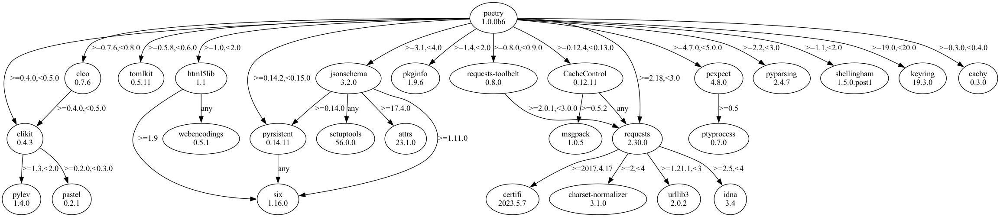
## 1.0.10
```text
graphviz==0.20.1
lockfile==0.12.2
pip==22.0.4
pipdeptree==2.7.1
poetry==1.0.10
  - cachecontrol [required: >=0.12.4,<0.13.0, installed: 0.12.11]
    - msgpack [required: >=0.5.2, installed: 1.0.5]
    - requests [required: Any, installed: 2.30.0]
      - certifi [required: >=2017.4.17, installed: 2023.5.7]
      - charset-normalizer [required: >=2,<4, installed: 3.1.0]
      - idna [required: >=2.5,<4, installed: 3.4]
      - urllib3 [required: >=1.21.1,<3, installed: 2.0.2]
  - cachy [required: >=0.3.0,<0.4.0, installed: 0.3.0]
  - cleo [required: >=0.7.6,<0.8.0, installed: 0.7.6]
    - clikit [required: >=0.4.0,<0.5.0, installed: 0.4.3]
      - pastel [required: >=0.2.0,<0.3.0, installed: 0.2.1]
      - pylev [required: >=1.3,<2.0, installed: 1.4.0]
  - clikit [required: >=0.4.2,<0.5.0, installed: 0.4.3]
    - pastel [required: >=0.2.0,<0.3.0, installed: 0.2.1]
    - pylev [required: >=1.3,<2.0, installed: 1.4.0]
  - html5lib [required: >=1.0,<2.0, installed: 1.1]
    - six [required: >=1.9, installed: 1.16.0]
    - webencodings [required: Any, installed: 0.5.1]
  - jsonschema [required: >=3.1,<4.0, installed: 3.2.0]
    - attrs [required: >=17.4.0, installed: 23.1.0]
    - pyrsistent [required: >=0.14.0, installed: 0.14.11]
      - six [required: Any, installed: 1.16.0]
    - setuptools [required: Any, installed: 56.0.0]
    - six [required: >=1.11.0, installed: 1.16.0]
  - keyring [required: >=20.0.1,<21.0.0, installed: 20.0.1]
  - pexpect [required: >=4.7.0,<5.0.0, installed: 4.8.0]
    - ptyprocess [required: >=0.5, installed: 0.7.0]
  - pkginfo [required: >=1.4,<2.0, installed: 1.9.6]
  - pyparsing [required: >=2.2,<3.0, installed: 2.4.7]
  - pyrsistent [required: >=0.14.2,<0.15.0, installed: 0.14.11]
    - six [required: Any, installed: 1.16.0]
  - requests [required: >=2.18,<3.0, installed: 2.30.0]
    - certifi [required: >=2017.4.17, installed: 2023.5.7]
    - charset-normalizer [required: >=2,<4, installed: 3.1.0]
    - idna [required: >=2.5,<4, installed: 3.4]
    - urllib3 [required: >=1.21.1,<3, installed: 2.0.2]
  - requests-toolbelt [required: >=0.8.0,<0.9.0, installed: 0.8.0]
    - requests [required: >=2.0.1,<3.0.0, installed: 2.30.0]
      - certifi [required: >=2017.4.17, installed: 2023.5.7]
      - charset-normalizer [required: >=2,<4, installed: 3.1.0]
      - idna [required: >=2.5,<4, installed: 3.4]
      - urllib3 [required: >=1.21.1,<3, installed: 2.0.2]
  - shellingham [required: >=1.1,<2.0, installed: 1.5.0.post1]
  - tomlkit [required: >=0.5.11,<0.6.0, installed: 0.5.11]
```
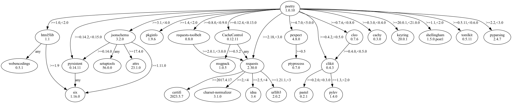
## 1.0.6
```text
graphviz==0.20.1
lockfile==0.12.2
pip==22.0.4
pipdeptree==2.7.1
poetry==1.0.6
  - cachecontrol [required: >=0.12.4,<0.13.0, installed: 0.12.11]
    - msgpack [required: >=0.5.2, installed: 1.0.5]
    - requests [required: Any, installed: 2.30.0]
      - certifi [required: >=2017.4.17, installed: 2023.5.7]
      - charset-normalizer [required: >=2,<4, installed: 3.1.0]
      - idna [required: >=2.5,<4, installed: 3.4]
      - urllib3 [required: >=1.21.1,<3, installed: 2.0.2]
  - cachy [required: >=0.3.0,<0.4.0, installed: 0.3.0]
  - cleo [required: >=0.7.6,<0.8.0, installed: 0.7.6]
    - clikit [required: >=0.4.0,<0.5.0, installed: 0.4.3]
      - pastel [required: >=0.2.0,<0.3.0, installed: 0.2.1]
      - pylev [required: >=1.3,<2.0, installed: 1.4.0]
  - clikit [required: >=0.4.2,<0.5.0, installed: 0.4.3]
    - pastel [required: >=0.2.0,<0.3.0, installed: 0.2.1]
    - pylev [required: >=1.3,<2.0, installed: 1.4.0]
  - html5lib [required: >=1.0,<2.0, installed: 1.1]
    - six [required: >=1.9, installed: 1.16.0]
    - webencodings [required: Any, installed: 0.5.1]
  - jsonschema [required: >=3.1,<4.0, installed: 3.2.0]
    - attrs [required: >=17.4.0, installed: 23.1.0]
    - pyrsistent [required: >=0.14.0, installed: 0.14.11]
      - six [required: Any, installed: 1.16.0]
    - setuptools [required: Any, installed: 56.0.0]
    - six [required: >=1.11.0, installed: 1.16.0]
  - keyring [required: >=20.0.1,<21.0.0, installed: 20.0.1]
  - pexpect [required: >=4.7.0,<5.0.0, installed: 4.8.0]
    - ptyprocess [required: >=0.5, installed: 0.7.0]
  - pkginfo [required: >=1.4,<2.0, installed: 1.9.6]
  - pyparsing [required: >=2.2,<3.0, installed: 2.4.7]
  - pyrsistent [required: >=0.14.2,<0.15.0, installed: 0.14.11]
    - six [required: Any, installed: 1.16.0]
  - requests [required: >=2.18,<3.0, installed: 2.30.0]
    - certifi [required: >=2017.4.17, installed: 2023.5.7]
    - charset-normalizer [required: >=2,<4, installed: 3.1.0]
    - idna [required: >=2.5,<4, installed: 3.4]
    - urllib3 [required: >=1.21.1,<3, installed: 2.0.2]
  - requests-toolbelt [required: >=0.8.0,<0.9.0, installed: 0.8.0]
    - requests [required: >=2.0.1,<3.0.0, installed: 2.30.0]
      - certifi [required: >=2017.4.17, installed: 2023.5.7]
      - charset-normalizer [required: >=2,<4, installed: 3.1.0]
      - idna [required: >=2.5,<4, installed: 3.4]
      - urllib3 [required: >=1.21.1,<3, installed: 2.0.2]
  - shellingham [required: >=1.1,<2.0, installed: 1.5.0.post1]
  - tomlkit [required: >=0.5.11,<0.6.0, installed: 0.5.11]
```
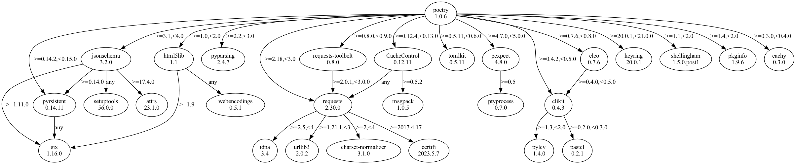
## 1.1.0
```text
graphviz==0.20.1
lockfile==0.12.2
pip==22.0.4
pipdeptree==2.7.1
poetry==1.1.0a1
  - cachecontrol [required: >=0.12.4,<0.13.0, installed: 0.12.11]
    - msgpack [required: >=0.5.2, installed: 1.0.5]
    - requests [required: Any, installed: 2.30.0]
      - certifi [required: >=2017.4.17, installed: 2023.5.7]
      - charset-normalizer [required: >=2,<4, installed: 3.1.0]
      - idna [required: >=2.5,<4, installed: 3.4]
      - urllib3 [required: >=1.21.1,<3, installed: 2.0.2]
  - cachy [required: >=0.3.0,<0.4.0, installed: 0.3.0]
  - cleo [required: >=0.8.0,<0.9.0, installed: 0.8.0]
    - clikit [required: >=0.5.0,<0.6.0, installed: 0.5.1]
      - pastel [required: >=0.2.0,<0.3.0, installed: 0.2.1]
      - pylev [required: >=1.3,<2.0, installed: 1.4.0]
      - woops [required: >=0.2.1,<0.3.0, installed: 0.2.1]
  - clikit [required: >=0.5.1,<0.6.0, installed: 0.5.1]
    - pastel [required: >=0.2.0,<0.3.0, installed: 0.2.1]
    - pylev [required: >=1.3,<2.0, installed: 1.4.0]
    - woops [required: >=0.2.1,<0.3.0, installed: 0.2.1]
  - html5lib [required: >=1.0,<2.0, installed: 1.1]
    - six [required: >=1.9, installed: 1.16.0]
    - webencodings [required: Any, installed: 0.5.1]
  - keyring [required: >=20.0.1,<21.0.0, installed: 20.0.1]
  - pexpect [required: >=4.7.0,<5.0.0, installed: 4.8.0]
    - ptyprocess [required: >=0.5, installed: 0.7.0]
  - pkginfo [required: >=1.4,<2.0, installed: 1.9.6]
  - poetry-core [required: >=1.0.0a5,<2.0.0, installed: 1.6.0]
  - requests [required: >=2.18,<3.0, installed: 2.30.0]
    - certifi [required: >=2017.4.17, installed: 2023.5.7]
    - charset-normalizer [required: >=2,<4, installed: 3.1.0]
    - idna [required: >=2.5,<4, installed: 3.4]
    - urllib3 [required: >=1.21.1,<3, installed: 2.0.2]
  - requests-toolbelt [required: >=0.8.0,<0.9.0, installed: 0.8.0]
    - requests [required: >=2.0.1,<3.0.0, installed: 2.30.0]
      - certifi [required: >=2017.4.17, installed: 2023.5.7]
      - charset-normalizer [required: >=2,<4, installed: 3.1.0]
      - idna [required: >=2.5,<4, installed: 3.4]
      - urllib3 [required: >=1.21.1,<3, installed: 2.0.2]
  - shellingham [required: >=1.1,<2.0, installed: 1.5.0.post1]
  - tomlkit [required: >=0.5.11,<0.6.0, installed: 0.5.11]
setuptools==56.0.0
```
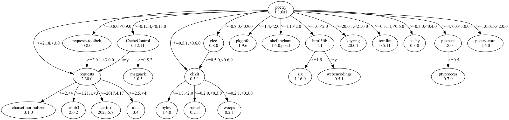
## 1.1.0
```text
graphviz==0.20.1
lockfile==0.12.2
pip==22.0.4
pipdeptree==2.7.1
poetry==1.1.0b3
  - cachecontrol [required: >=0.12.4,<0.13.0, installed: 0.12.11]
    - msgpack [required: >=0.5.2, installed: 1.0.5]
    - requests [required: Any, installed: 2.30.0]
      - certifi [required: >=2017.4.17, installed: 2023.5.7]
      - charset-normalizer [required: >=2,<4, installed: 3.1.0]
      - idna [required: >=2.5,<4, installed: 3.4]
      - urllib3 [required: >=1.21.1,<3, installed: 2.0.2]
  - cachy [required: >=0.3.0,<0.4.0, installed: 0.3.0]
  - cleo [required: >=0.8.1,<0.9.0, installed: 0.8.1]
    - clikit [required: >=0.6.0,<0.7.0, installed: 0.6.2]
      - crashtest [required: >=0.3.0,<0.4.0, installed: 0.3.1]
      - pastel [required: >=0.2.0,<0.3.0, installed: 0.2.1]
      - pylev [required: >=1.3,<2.0, installed: 1.4.0]
  - clikit [required: >=0.6.2,<0.7.0, installed: 0.6.2]
    - crashtest [required: >=0.3.0,<0.4.0, installed: 0.3.1]
    - pastel [required: >=0.2.0,<0.3.0, installed: 0.2.1]
    - pylev [required: >=1.3,<2.0, installed: 1.4.0]
  - crashtest [required: >=0.3.0,<0.4.0, installed: 0.3.1]
  - html5lib [required: >=1.0,<2.0, installed: 1.1]
    - six [required: >=1.9, installed: 1.16.0]
    - webencodings [required: Any, installed: 0.5.1]
  - keyring [required: >=21.2.0,<22.0.0, installed: 21.8.0]
  - packaging [required: >=20.4,<21.0, installed: 20.9]
    - pyparsing [required: >=2.0.2, installed: 3.0.9]
  - pexpect [required: >=4.7.0,<5.0.0, installed: 4.8.0]
    - ptyprocess [required: >=0.5, installed: 0.7.0]
  - pkginfo [required: >=1.4,<2.0, installed: 1.9.6]
  - poetry-core [required: >=1.0.0b1,<2.0.0, installed: 1.6.0]
  - requests [required: >=2.18,<3.0, installed: 2.30.0]
    - certifi [required: >=2017.4.17, installed: 2023.5.7]
    - charset-normalizer [required: >=2,<4, installed: 3.1.0]
    - idna [required: >=2.5,<4, installed: 3.4]
    - urllib3 [required: >=1.21.1,<3, installed: 2.0.2]
  - requests-toolbelt [required: >=0.8.0,<0.9.0, installed: 0.8.0]
    - requests [required: >=2.0.1,<3.0.0, installed: 2.30.0]
      - certifi [required: >=2017.4.17, installed: 2023.5.7]
      - charset-normalizer [required: >=2,<4, installed: 3.1.0]
      - idna [required: >=2.5,<4, installed: 3.4]
      - urllib3 [required: >=1.21.1,<3, installed: 2.0.2]
  - shellingham [required: >=1.1,<2.0, installed: 1.5.0.post1]
  - tomlkit [required: >=0.7.0,<1.0.0, installed: 0.11.8]
  - virtualenv [required: >=20.0.26,<21.0.0, installed: 20.23.0]
    - distlib [required: >=0.3.6,<1, installed: 0.3.6]
    - filelock [required: >=3.11,<4, installed: 3.12.0]
    - platformdirs [required: >=3.2,<4, installed: 3.5.1]
setuptools==56.0.0
```
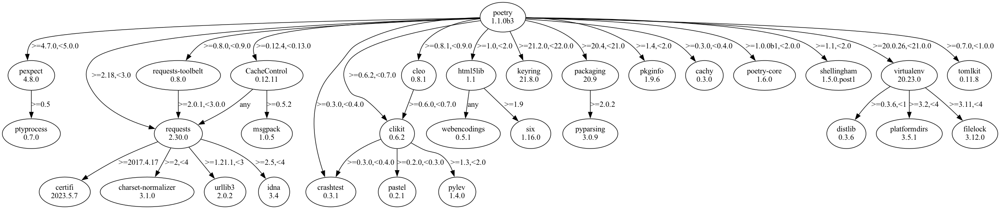
## 1.1.11
```text
graphviz==0.20.1
lockfile==0.12.2
pip==22.0.4
pipdeptree==2.7.1
poetry==1.1.11
  - cachecontrol [required: >=0.12.4,<0.13.0, installed: 0.12.11]
    - msgpack [required: >=0.5.2, installed: 1.0.5]
    - requests [required: Any, installed: 2.30.0]
      - certifi [required: >=2017.4.17, installed: 2023.5.7]
      - charset-normalizer [required: >=2,<4, installed: 3.1.0]
      - idna [required: >=2.5,<4, installed: 3.4]
      - urllib3 [required: >=1.21.1,<3, installed: 2.0.2]
  - cachy [required: >=0.3.0,<0.4.0, installed: 0.3.0]
  - cleo [required: >=0.8.1,<0.9.0, installed: 0.8.1]
    - clikit [required: >=0.6.0,<0.7.0, installed: 0.6.2]
      - crashtest [required: >=0.3.0,<0.4.0, installed: 0.3.1]
      - pastel [required: >=0.2.0,<0.3.0, installed: 0.2.1]
      - pylev [required: >=1.3,<2.0, installed: 1.4.0]
  - clikit [required: >=0.6.2,<0.7.0, installed: 0.6.2]
    - crashtest [required: >=0.3.0,<0.4.0, installed: 0.3.1]
    - pastel [required: >=0.2.0,<0.3.0, installed: 0.2.1]
    - pylev [required: >=1.3,<2.0, installed: 1.4.0]
  - crashtest [required: >=0.3.0,<0.4.0, installed: 0.3.1]
  - html5lib [required: >=1.0,<2.0, installed: 1.1]
    - six [required: >=1.9, installed: 1.16.0]
    - webencodings [required: Any, installed: 0.5.1]
  - keyring [required: >=21.2.0,<22.0.0, installed: 21.8.0]
  - packaging [required: >=20.4,<21.0, installed: 20.9]
    - pyparsing [required: >=2.0.2, installed: 3.0.9]
  - pexpect [required: >=4.7.0,<5.0.0, installed: 4.8.0]
    - ptyprocess [required: >=0.5, installed: 0.7.0]
  - pkginfo [required: >=1.4,<2.0, installed: 1.9.6]
  - poetry-core [required: >=1.0.7,<1.1.0, installed: 1.0.8]
  - requests [required: >=2.18,<3.0, installed: 2.30.0]
    - certifi [required: >=2017.4.17, installed: 2023.5.7]
    - charset-normalizer [required: >=2,<4, installed: 3.1.0]
    - idna [required: >=2.5,<4, installed: 3.4]
    - urllib3 [required: >=1.21.1,<3, installed: 2.0.2]
  - requests-toolbelt [required: >=0.9.1,<0.10.0, installed: 0.9.1]
    - requests [required: >=2.0.1,<3.0.0, installed: 2.30.0]
      - certifi [required: >=2017.4.17, installed: 2023.5.7]
      - charset-normalizer [required: >=2,<4, installed: 3.1.0]
      - idna [required: >=2.5,<4, installed: 3.4]
      - urllib3 [required: >=1.21.1,<3, installed: 2.0.2]
  - shellingham [required: >=1.1,<2.0, installed: 1.5.0.post1]
  - tomlkit [required: >=0.7.0,<1.0.0, installed: 0.11.8]
  - virtualenv [required: >=20.0.26,<21.0.0, installed: 20.23.0]
    - distlib [required: >=0.3.6,<1, installed: 0.3.6]
    - filelock [required: >=3.11,<4, installed: 3.12.0]
    - platformdirs [required: >=3.2,<4, installed: 3.5.1]
setuptools==56.0.0
```
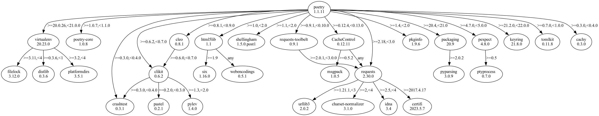
## requests
## 0.13.8
```text
graphviz==0.20.1
pip==22.0.4
pipdeptree==2.7.1
requests==0.13.8
setuptools==56.0.0
```
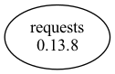
## 2.10.0
```text
graphviz==0.20.1
pip==22.0.4
pipdeptree==2.7.1
requests==2.10.0
setuptools==56.0.0
```
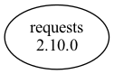
## 2.17.0
```text
graphviz==0.20.1
pip==22.0.4
pipdeptree==2.7.1
requests==2.17.0
  - certifi [required: >=2017.4.17, installed: 2023.5.7]
  - chardet [required: >=3.0.2,<3.1.0, installed: 3.0.4]
  - idna [required: >=2.5,<2.6, installed: 2.5]
  - urllib3 [required: >=1.21.1,<1.22, installed: 1.21.1]
setuptools==56.0.0
```
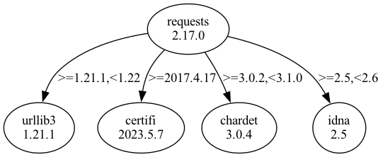
## 2.25.1
```text
graphviz==0.20.1
pip==22.0.4
pipdeptree==2.7.1
requests==2.25.1
  - certifi [required: >=2017.4.17, installed: 2023.5.7]
  - chardet [required: >=3.0.2,<5, installed: 4.0.0]
  - idna [required: >=2.5,<3, installed: 2.10]
  - urllib3 [required: >=1.21.1,<1.27, installed: 1.26.15]
setuptools==56.0.0
```
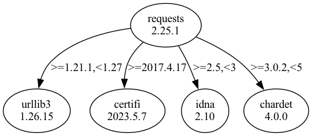
## 2.6.2
```text
graphviz==0.20.1
pip==22.0.4
pipdeptree==2.7.1
requests==2.6.2
setuptools==56.0.0
```

## sphinx
## 1.2.1
```text
graphviz==0.20.1
pip==22.0.4
pipdeptree==2.7.1
setuptools==56.0.0
Sphinx==1.2.1
  - docutils [required: >=0.10, installed: 0.20.1]
  - Jinja2 [required: >=2.3, installed: 3.1.2]
    - MarkupSafe [required: >=2.0, installed: 2.1.2]
  - Pygments [required: >=1.2, installed: 2.15.1]
```

## 1.4.4
```text
graphviz==0.20.1
pip==22.0.4
pipdeptree==2.7.1
setuptools==56.0.0
Sphinx==1.4.4
  - alabaster [required: >=0.7,<0.8, installed: 0.7.13]
  - babel [required: >=1.3,!=2.0, installed: 2.12.1]
    - pytz [required: >=2015.7, installed: 2023.3]
  - docutils [required: >=0.11, installed: 0.20.1]
  - imagesize [required: Any, installed: 1.4.1]
  - Jinja2 [required: >=2.3, installed: 3.1.2]
    - MarkupSafe [required: >=2.0, installed: 2.1.2]
  - Pygments [required: >=2.0, installed: 2.15.1]
  - six [required: >=1.4, installed: 1.16.0]
  - snowballstemmer [required: >=1.1, installed: 2.2.0]
```

## 1.6.3
```text
graphviz==0.20.1
pip==22.0.4
pipdeptree==2.7.1
Sphinx==1.6.3
  - alabaster [required: >=0.7,<0.8, installed: 0.7.13]
  - babel [required: >=1.3,!=2.0, installed: 2.12.1]
    - pytz [required: >=2015.7, installed: 2023.3]
  - docutils [required: >=0.11, installed: 0.20.1]
  - imagesize [required: Any, installed: 1.4.1]
  - Jinja2 [required: >=2.3, installed: 3.1.2]
    - MarkupSafe [required: >=2.0, installed: 2.1.2]
  - Pygments [required: >=2.0, installed: 2.15.1]
  - requests [required: >=2.0.0, installed: 2.30.0]
    - certifi [required: >=2017.4.17, installed: 2023.5.7]
    - charset-normalizer [required: >=2,<4, installed: 3.1.0]
    - idna [required: >=2.5,<4, installed: 3.4]
    - urllib3 [required: >=1.21.1,<3, installed: 2.0.2]
  - setuptools [required: Any, installed: 56.0.0]
  - six [required: >=1.5, installed: 1.16.0]
  - snowballstemmer [required: >=1.1, installed: 2.2.0]
  - sphinxcontrib-websupport [required: Any, installed: 1.2.4]
    - sphinxcontrib-serializinghtml [required: Any, installed: 1.1.5]
```

## 1.8.0
```text
graphviz==0.20.1
pip==22.0.4
pipdeptree==2.7.1
Sphinx==1.8.0
  - alabaster [required: >=0.7,<0.8, installed: 0.7.13]
  - babel [required: >=1.3,!=2.0, installed: 2.12.1]
    - pytz [required: >=2015.7, installed: 2023.3]
  - docutils [required: >=0.11, installed: 0.20.1]
  - imagesize [required: Any, installed: 1.4.1]
  - Jinja2 [required: >=2.3, installed: 3.1.2]
    - MarkupSafe [required: >=2.0, installed: 2.1.2]
  - packaging [required: Any, installed: 23.1]
  - Pygments [required: >=2.0, installed: 2.15.1]
  - requests [required: >=2.0.0, installed: 2.30.0]
    - certifi [required: >=2017.4.17, installed: 2023.5.7]
    - charset-normalizer [required: >=2,<4, installed: 3.1.0]
    - idna [required: >=2.5,<4, installed: 3.4]
    - urllib3 [required: >=1.21.1,<3, installed: 2.0.2]
  - setuptools [required: Any, installed: 56.0.0]
  - six [required: >=1.5, installed: 1.16.0]
  - snowballstemmer [required: >=1.1, installed: 2.2.0]
  - sphinxcontrib-websupport [required: Any, installed: 1.2.4]
    - sphinxcontrib-serializinghtml [required: Any, installed: 1.1.5]
```

## 2.4.0
```text
graphviz==0.20.1
pip==22.0.4
pipdeptree==2.7.1
Sphinx==2.4.0
  - alabaster [required: >=0.7,<0.8, installed: 0.7.13]
  - babel [required: >=1.3,!=2.0, installed: 2.12.1]
    - pytz [required: >=2015.7, installed: 2023.3]
  - docutils [required: >=0.12, installed: 0.20.1]
  - imagesize [required: Any, installed: 1.4.1]
  - Jinja2 [required: >=2.3, installed: 3.1.2]
    - MarkupSafe [required: >=2.0, installed: 2.1.2]
  - packaging [required: Any, installed: 23.1]
  - Pygments [required: >=2.0, installed: 2.15.1]
  - requests [required: >=2.5.0, installed: 2.30.0]
    - certifi [required: >=2017.4.17, installed: 2023.5.7]
    - charset-normalizer [required: >=2,<4, installed: 3.1.0]
    - idna [required: >=2.5,<4, installed: 3.4]
    - urllib3 [required: >=1.21.1,<3, installed: 2.0.2]
  - setuptools [required: Any, installed: 56.0.0]
  - snowballstemmer [required: >=1.1, installed: 2.2.0]
  - sphinxcontrib-applehelp [required: Any, installed: 1.0.4]
  - sphinxcontrib-devhelp [required: Any, installed: 1.0.2]
  - sphinxcontrib-htmlhelp [required: Any, installed: 2.0.1]
  - sphinxcontrib-jsmath [required: Any, installed: 1.0.1]
  - sphinxcontrib-qthelp [required: Any, installed: 1.0.3]
  - sphinxcontrib-serializinghtml [required: Any, installed: 1.1.5]
```

## 3.4.1
```text
graphviz==0.20.1
pip==22.0.4
pipdeptree==2.7.1
Sphinx==3.4.1
  - alabaster [required: >=0.7,<0.8, installed: 0.7.13]
  - babel [required: >=1.3, installed: 2.12.1]
    - pytz [required: >=2015.7, installed: 2023.3]
  - docutils [required: >=0.12, installed: 0.20.1]
  - imagesize [required: Any, installed: 1.4.1]
  - Jinja2 [required: >=2.3, installed: 3.1.2]
    - MarkupSafe [required: >=2.0, installed: 2.1.2]
  - packaging [required: Any, installed: 23.1]
  - Pygments [required: >=2.0, installed: 2.15.1]
  - requests [required: >=2.5.0, installed: 2.30.0]
    - certifi [required: >=2017.4.17, installed: 2023.5.7]
    - charset-normalizer [required: >=2,<4, installed: 3.1.0]
    - idna [required: >=2.5,<4, installed: 3.4]
    - urllib3 [required: >=1.21.1,<3, installed: 2.0.2]
  - setuptools [required: Any, installed: 56.0.0]
  - snowballstemmer [required: >=1.1, installed: 2.2.0]
  - sphinxcontrib-applehelp [required: Any, installed: 1.0.4]
  - sphinxcontrib-devhelp [required: Any, installed: 1.0.2]
  - sphinxcontrib-htmlhelp [required: Any, installed: 2.0.1]
  - sphinxcontrib-jsmath [required: Any, installed: 1.0.1]
  - sphinxcontrib-qthelp [required: Any, installed: 1.0.3]
  - sphinxcontrib-serializinghtml [required: Any, installed: 1.1.5]
```

## 4.3.2
```text
graphviz==0.20.1
pip==22.0.4
pipdeptree==2.7.1
Sphinx==4.3.2
  - alabaster [required: >=0.7,<0.8, installed: 0.7.13]
  - babel [required: >=1.3, installed: 2.12.1]
    - pytz [required: >=2015.7, installed: 2023.3]
  - docutils [required: >=0.14,<0.18, installed: 0.17.1]
  - imagesize [required: Any, installed: 1.4.1]
  - Jinja2 [required: >=2.3, installed: 3.1.2]
    - MarkupSafe [required: >=2.0, installed: 2.1.2]
  - packaging [required: Any, installed: 23.1]
  - Pygments [required: >=2.0, installed: 2.15.1]
  - requests [required: >=2.5.0, installed: 2.30.0]
    - certifi [required: >=2017.4.17, installed: 2023.5.7]
    - charset-normalizer [required: >=2,<4, installed: 3.1.0]
    - idna [required: >=2.5,<4, installed: 3.4]
    - urllib3 [required: >=1.21.1,<3, installed: 2.0.2]
  - setuptools [required: Any, installed: 56.0.0]
  - snowballstemmer [required: >=1.1, installed: 2.2.0]
  - sphinxcontrib-applehelp [required: Any, installed: 1.0.4]
  - sphinxcontrib-devhelp [required: Any, installed: 1.0.2]
  - sphinxcontrib-htmlhelp [required: >=2.0.0, installed: 2.0.1]
  - sphinxcontrib-jsmath [required: Any, installed: 1.0.1]
  - sphinxcontrib-qthelp [required: Any, installed: 1.0.3]
  - sphinxcontrib-serializinghtml [required: >=1.1.5, installed: 1.1.5]
```

## 6.1.1
```text
graphviz==0.20.1
pip==22.0.4
pipdeptree==2.7.1
setuptools==56.0.0
sphinx==6.1.1
  - alabaster [required: >=0.7,<0.8, installed: 0.7.13]
  - babel [required: >=2.9, installed: 2.12.1]
    - pytz [required: >=2015.7, installed: 2023.3]
  - docutils [required: >=0.18,<0.20, installed: 0.19]
  - imagesize [required: >=1.3, installed: 1.4.1]
  - importlib-metadata [required: >=4.8, installed: 6.6.0]
    - zipp [required: >=0.5, installed: 3.15.0]
  - Jinja2 [required: >=3.0, installed: 3.1.2]
    - MarkupSafe [required: >=2.0, installed: 2.1.2]
  - packaging [required: >=21.0, installed: 23.1]
  - Pygments [required: >=2.13, installed: 2.15.1]
  - requests [required: >=2.25.0, installed: 2.30.0]
    - certifi [required: >=2017.4.17, installed: 2023.5.7]
    - charset-normalizer [required: >=2,<4, installed: 3.1.0]
    - idna [required: >=2.5,<4, installed: 3.4]
    - urllib3 [required: >=1.21.1,<3, installed: 2.0.2]
  - snowballstemmer [required: >=2.0, installed: 2.2.0]
  - sphinxcontrib-applehelp [required: Any, installed: 1.0.4]
  - sphinxcontrib-devhelp [required: Any, installed: 1.0.2]
  - sphinxcontrib-htmlhelp [required: >=2.0.0, installed: 2.0.1]
  - sphinxcontrib-jsmath [required: Any, installed: 1.0.1]
  - sphinxcontrib-qthelp [required: Any, installed: 1.0.3]
  - sphinxcontrib-serializinghtml [required: >=1.1.5, installed: 1.1.5]
```

## streamlit
## 
```text
graphviz==0.20.1
pip==22.0.4
pipdeptree==2.7.1
setuptools==56.0.0
streamlit==0.1
  - aiohttp [required: Any, installed: 3.8.4]
    - aiosignal [required: >=1.1.2, installed: 1.3.1]
      - frozenlist [required: >=1.1.0, installed: 1.3.3]
    - async-timeout [required: >=4.0.0a3,<5.0, installed: 4.0.2]
    - attrs [required: >=17.3.0, installed: 23.1.0]
    - charset-normalizer [required: >=2.0,<4.0, installed: 3.1.0]
    - frozenlist [required: >=1.1.1, installed: 1.3.3]
    - multidict [required: >=4.5,<7.0, installed: 6.0.4]
    - yarl [required: >=1.0,<2.0, installed: 1.9.2]
      - idna [required: >=2.0, installed: 3.4]
      - multidict [required: >=4.0, installed: 6.0.4]
  - motor [required: Any, installed: 3.1.2]
    - pymongo [required: >=4.1,<5, installed: 4.3.3]
      - dnspython [required: >=1.16.0,<3.0.0, installed: 2.3.0]
  - pandas [required: Any, installed: 2.0.1]
    - numpy [required: >=1.20.3, installed: 1.24.3]
    - python-dateutil [required: >=2.8.2, installed: 2.8.2]
      - six [required: >=1.5, installed: 1.16.0]
    - pytz [required: >=2020.1, installed: 2023.3]
    - tzdata [required: >=2022.1, installed: 2023.3]
  - Pillow [required: Any, installed: 9.5.0]
  - protobuf [required: Any, installed: 4.23.1]
  - PyYAML [required: Any, installed: 6.0]
```

## 
```text
graphviz==0.20.1
pip==22.0.4
pipdeptree==2.7.1
setuptools==56.0.0
streamlit==0.3
  - aiohttp [required: Any, installed: 3.8.4]
    - aiosignal [required: >=1.1.2, installed: 1.3.1]
      - frozenlist [required: >=1.1.0, installed: 1.3.3]
    - async-timeout [required: >=4.0.0a3,<5.0, installed: 4.0.2]
    - attrs [required: >=17.3.0, installed: 23.1.0]
    - charset-normalizer [required: >=2.0,<4.0, installed: 3.1.0]
    - frozenlist [required: >=1.1.1, installed: 1.3.3]
    - multidict [required: >=4.5,<7.0, installed: 6.0.4]
    - yarl [required: >=1.0,<2.0, installed: 1.9.2]
      - idna [required: >=2.0, installed: 3.4]
      - multidict [required: >=4.0, installed: 6.0.4]
  - motor [required: Any, installed: 3.1.2]
    - pymongo [required: >=4.1,<5, installed: 4.3.3]
      - dnspython [required: >=1.16.0,<3.0.0, installed: 2.3.0]
  - pandas [required: Any, installed: 2.0.1]
    - numpy [required: >=1.20.3, installed: 1.24.3]
    - python-dateutil [required: >=2.8.2, installed: 2.8.2]
      - six [required: >=1.5, installed: 1.16.0]
    - pytz [required: >=2020.1, installed: 2023.3]
    - tzdata [required: >=2022.1, installed: 2023.3]
  - Pillow [required: Any, installed: 9.5.0]
  - protobuf [required: Any, installed: 4.23.1]
  - PyYAML [required: Any, installed: 6.0]
  - tzlocal [required: Any, installed: 5.0.1]
    - backports.zoneinfo [required: Any, installed: 0.2.1]
```

## 0.13.0
```text
graphviz==0.20.1
pip==22.0.4
pipdeptree==2.7.1
setuptools==56.0.0
streamlit==0.13.0
  - backports-abc [required: >=0.5, installed: 0.5]
  - boto3 [required: Any, installed: 1.26.137]
    - botocore [required: >=1.29.137,<1.30.0, installed: 1.29.137]
      - jmespath [required: >=0.7.1,<2.0.0, installed: 1.0.1]
      - python-dateutil [required: >=2.1,<3.0.0, installed: 2.8.2]
        - six [required: >=1.5, installed: 1.16.0]
      - urllib3 [required: >=1.25.4,<1.27, installed: 1.26.15]
    - jmespath [required: >=0.7.1,<2.0.0, installed: 1.0.1]
    - s3transfer [required: >=0.6.0,<0.7.0, installed: 0.6.1]
      - botocore [required: >=1.12.36,<2.0a.0, installed: 1.29.137]
        - jmespath [required: >=0.7.1,<2.0.0, installed: 1.0.1]
        - python-dateutil [required: >=2.1,<3.0.0, installed: 2.8.2]
          - six [required: >=1.5, installed: 1.16.0]
        - urllib3 [required: >=1.25.4,<1.27, installed: 1.26.15]
  - botocore [required: Any, installed: 1.29.137]
    - jmespath [required: >=0.7.1,<2.0.0, installed: 1.0.1]
    - python-dateutil [required: >=2.1,<3.0.0, installed: 2.8.2]
      - six [required: >=1.5, installed: 1.16.0]
    - urllib3 [required: >=1.25.4,<1.27, installed: 1.26.15]
  - click [required: >=6.0, installed: 8.1.3]
  - docutils [required: >=0.14, installed: 0.20.1]
  - enum-compat [required: >=0.0.2, installed: 0.0.3]
  - future [required: >+0.16.0, installed: 0.18.3]
  - future-fstrings [required: >=0.4.0, installed: 1.2.0]
  - futures [required: >=3.0.0, installed: 3.0.5]
  - jmespath [required: >=0.9.0, installed: 1.0.1]
  - numpy [required: >=1.14.0, installed: 1.24.3]
  - pandas [required: >=0.23.0, installed: 2.0.1]
    - numpy [required: >=1.20.3, installed: 1.24.3]
    - python-dateutil [required: >=2.8.2, installed: 2.8.2]
      - six [required: >=1.5, installed: 1.16.0]
    - pytz [required: >=2020.1, installed: 2023.3]
    - tzdata [required: >=2022.1, installed: 2023.3]
  - pillow [required: >=5.0.0, installed: 9.5.0]
  - protobuf [required: >=3.5.0, installed: 4.23.1]
  - python-dateutil [required: >=2.7.0, installed: 2.8.2]
    - six [required: >=1.5, installed: 1.16.0]
  - pytz [required: >=2018.0, installed: 2023.3]
  - pyyaml [required: >=3.0, installed: 6.0]
  - s3transfer [required: >=0.1.0, installed: 0.6.1]
    - botocore [required: >=1.12.36,<2.0a.0, installed: 1.29.137]
      - jmespath [required: >=0.7.1,<2.0.0, installed: 1.0.1]
      - python-dateutil [required: >=2.1,<3.0.0, installed: 2.8.2]
        - six [required: >=1.5, installed: 1.16.0]
      - urllib3 [required: >=1.25.4,<1.27, installed: 1.26.15]
  - singledispatch [required: >=3.4.0.0, installed: 4.0.0]
  - six [required: >=1.0.0, installed: 1.16.0]
  - tokenize-rt [required: >=2.0.0, installed: 5.0.0]
  - tornado [required: >=5.0.0, installed: 6.3.2]
  - tzlocal [required: >=1.5.0, installed: 5.0.1]
    - backports.zoneinfo [required: Any, installed: 0.2.1]
```

## 0.15.0
```text
graphviz==0.20.1
pip==22.0.4
pipdeptree==2.7.1
setuptools==56.0.0
streamlit==0.15.0
  - backports-abc [required: >=0.5, installed: 0.5]
  - base58 [required: >=1.0.0, installed: 2.1.1]
  - boto3 [required: Any, installed: 1.26.137]
    - botocore [required: >=1.29.137,<1.30.0, installed: 1.29.137]
      - jmespath [required: >=0.7.1,<2.0.0, installed: 1.0.1]
      - python-dateutil [required: >=2.1,<3.0.0, installed: 2.8.2]
        - six [required: >=1.5, installed: 1.16.0]
      - urllib3 [required: >=1.25.4,<1.27, installed: 1.26.15]
    - jmespath [required: >=0.7.1,<2.0.0, installed: 1.0.1]
    - s3transfer [required: >=0.6.0,<0.7.0, installed: 0.6.1]
      - botocore [required: >=1.12.36,<2.0a.0, installed: 1.29.137]
        - jmespath [required: >=0.7.1,<2.0.0, installed: 1.0.1]
        - python-dateutil [required: >=2.1,<3.0.0, installed: 2.8.2]
          - six [required: >=1.5, installed: 1.16.0]
        - urllib3 [required: >=1.25.4,<1.27, installed: 1.26.15]
  - botocore [required: Any, installed: 1.29.137]
    - jmespath [required: >=0.7.1,<2.0.0, installed: 1.0.1]
    - python-dateutil [required: >=2.1,<3.0.0, installed: 2.8.2]
      - six [required: >=1.5, installed: 1.16.0]
    - urllib3 [required: >=1.25.4,<1.27, installed: 1.26.15]
  - click [required: >=6.0, installed: 8.1.3]
  - docutils [required: >=0.14, installed: 0.20.1]
  - enum-compat [required: >=0.0.2, installed: 0.0.3]
  - future [required: >+0.16.0, installed: 0.18.3]
  - future-fstrings [required: >=0.4.0, installed: 1.2.0]
  - futures [required: >=3.0.0, installed: 3.0.5]
  - jmespath [required: >=0.9.0, installed: 1.0.1]
  - numpy [required: >=1.14.0, installed: 1.24.3]
  - pandas [required: >=0.23.0, installed: 2.0.1]
    - numpy [required: >=1.20.3, installed: 1.24.3]
    - python-dateutil [required: >=2.8.2, installed: 2.8.2]
      - six [required: >=1.5, installed: 1.16.0]
    - pytz [required: >=2020.1, installed: 2023.3]
    - tzdata [required: >=2022.1, installed: 2023.3]
  - pillow [required: >=5.0.0, installed: 9.5.0]
  - protobuf [required: >=3.5.0, installed: 4.23.1]
  - psutil [required: >=5.4.7, installed: 5.9.5]
  - python-dateutil [required: >=2.7.0, installed: 2.8.2]
    - six [required: >=1.5, installed: 1.16.0]
  - pytz [required: >=2018.0, installed: 2023.3]
  - pyyaml [required: >=3.0, installed: 6.0]
  - s3transfer [required: >=0.1.0, installed: 0.6.1]
    - botocore [required: >=1.12.36,<2.0a.0, installed: 1.29.137]
      - jmespath [required: >=0.7.1,<2.0.0, installed: 1.0.1]
      - python-dateutil [required: >=2.1,<3.0.0, installed: 2.8.2]
        - six [required: >=1.5, installed: 1.16.0]
      - urllib3 [required: >=1.25.4,<1.27, installed: 1.26.15]
  - singledispatch [required: >=3.4.0.0, installed: 4.0.0]
  - six [required: >=1.0.0, installed: 1.16.0]
  - tokenize-rt [required: >=2.0.0, installed: 5.0.0]
  - tornado [required: >=5.0.0, installed: 6.3.2]
  - tzlocal [required: >=1.5.0, installed: 5.0.1]
    - backports.zoneinfo [required: Any, installed: 0.2.1]
```

## 0.15.5
```text
graphviz==0.20.1
pip==22.0.4
pipdeptree==2.7.1
setuptools==56.0.0
streamlit==0.15.5
  - backports-abc [required: >=0.5, installed: 0.5]
  - base58 [required: >=1.0.0, installed: 2.1.1]
  - boto3 [required: Any, installed: 1.26.137]
    - botocore [required: >=1.29.137,<1.30.0, installed: 1.29.137]
      - jmespath [required: >=0.7.1,<2.0.0, installed: 1.0.1]
      - python-dateutil [required: >=2.1,<3.0.0, installed: 2.8.2]
        - six [required: >=1.5, installed: 1.16.0]
      - urllib3 [required: >=1.25.4,<1.27, installed: 1.26.15]
    - jmespath [required: >=0.7.1,<2.0.0, installed: 1.0.1]
    - s3transfer [required: >=0.6.0,<0.7.0, installed: 0.6.1]
      - botocore [required: >=1.12.36,<2.0a.0, installed: 1.29.137]
        - jmespath [required: >=0.7.1,<2.0.0, installed: 1.0.1]
        - python-dateutil [required: >=2.1,<3.0.0, installed: 2.8.2]
          - six [required: >=1.5, installed: 1.16.0]
        - urllib3 [required: >=1.25.4,<1.27, installed: 1.26.15]
  - botocore [required: Any, installed: 1.29.137]
    - jmespath [required: >=0.7.1,<2.0.0, installed: 1.0.1]
    - python-dateutil [required: >=2.1,<3.0.0, installed: 2.8.2]
      - six [required: >=1.5, installed: 1.16.0]
    - urllib3 [required: >=1.25.4,<1.27, installed: 1.26.15]
  - click [required: >=6.0, installed: 8.1.3]
  - docutils [required: >=0.14, installed: 0.20.1]
  - enum-compat [required: >=0.0.2, installed: 0.0.3]
  - future [required: >=0.16.0, installed: 0.18.3]
  - future-fstrings [required: >=0.4.0, installed: 1.2.0]
  - futures [required: >=3.0.0, installed: 3.0.5]
  - jmespath [required: >=0.9.0, installed: 1.0.1]
  - numpy [required: >=1.14.0, installed: 1.24.3]
  - pandas [required: >=0.23.0, installed: 2.0.1]
    - numpy [required: >=1.20.3, installed: 1.24.3]
    - python-dateutil [required: >=2.8.2, installed: 2.8.2]
      - six [required: >=1.5, installed: 1.16.0]
    - pytz [required: >=2020.1, installed: 2023.3]
    - tzdata [required: >=2022.1, installed: 2023.3]
  - pillow [required: >=5.0.0, installed: 9.5.0]
  - protobuf [required: >=3.5.0, installed: 4.23.1]
  - psutil [required: >=5.4.7, installed: 5.9.5]
  - python-dateutil [required: >=2.7.0, installed: 2.8.2]
    - six [required: >=1.5, installed: 1.16.0]
  - pytz [required: >=2017.2, installed: 2023.3]
  - pyyaml [required: >=3.0, installed: 6.0]
  - s3transfer [required: >=0.1.0, installed: 0.6.1]
    - botocore [required: >=1.12.36,<2.0a.0, installed: 1.29.137]
      - jmespath [required: >=0.7.1,<2.0.0, installed: 1.0.1]
      - python-dateutil [required: >=2.1,<3.0.0, installed: 2.8.2]
        - six [required: >=1.5, installed: 1.16.0]
      - urllib3 [required: >=1.25.4,<1.27, installed: 1.26.15]
  - singledispatch [required: >=3.4.0.0, installed: 4.0.0]
  - six [required: >=1.0.0, installed: 1.16.0]
  - tokenize-rt [required: >=2.0.0, installed: 5.0.0]
  - tornado [required: >=4.5.1, installed: 6.3.2]
  - tzlocal [required: >=1.5.0, installed: 5.0.1]
    - backports.zoneinfo [required: Any, installed: 0.2.1]
```

## 0.16.3
```text
graphviz==0.20.1
pip==22.0.4
pipdeptree==2.7.1
setuptools==56.0.0
streamlit==0.16.3
  - backports-abc [required: >=0.5, installed: 0.5]
  - base58 [required: >=1.0.0, installed: 2.1.1]
  - boto3 [required: Any, installed: 1.26.137]
    - botocore [required: >=1.29.137,<1.30.0, installed: 1.29.137]
      - jmespath [required: >=0.7.1,<2.0.0, installed: 1.0.1]
      - python-dateutil [required: >=2.1,<3.0.0, installed: 2.8.2]
        - six [required: >=1.5, installed: 1.16.0]
      - urllib3 [required: >=1.25.4,<1.27, installed: 1.26.15]
    - jmespath [required: >=0.7.1,<2.0.0, installed: 1.0.1]
    - s3transfer [required: >=0.6.0,<0.7.0, installed: 0.6.1]
      - botocore [required: >=1.12.36,<2.0a.0, installed: 1.29.137]
        - jmespath [required: >=0.7.1,<2.0.0, installed: 1.0.1]
        - python-dateutil [required: >=2.1,<3.0.0, installed: 2.8.2]
          - six [required: >=1.5, installed: 1.16.0]
        - urllib3 [required: >=1.25.4,<1.27, installed: 1.26.15]
  - botocore [required: Any, installed: 1.29.137]
    - jmespath [required: >=0.7.1,<2.0.0, installed: 1.0.1]
    - python-dateutil [required: >=2.1,<3.0.0, installed: 2.8.2]
      - six [required: >=1.5, installed: 1.16.0]
    - urllib3 [required: >=1.25.4,<1.27, installed: 1.26.15]
  - click [required: >=6.0, installed: 8.1.3]
  - docutils [required: >=0.14, installed: 0.20.1]
  - enum-compat [required: >=0.0.2, installed: 0.0.3]
  - future [required: >=0.16.0, installed: 0.18.3]
  - future-fstrings [required: >=0.4.0, installed: 1.2.0]
  - futures [required: >=3.0.0, installed: 3.0.5]
  - jmespath [required: >=0.9.0, installed: 1.0.1]
  - numpy [required: >=1.14.0, installed: 1.24.3]
  - pandas [required: >=0.23.0, installed: 2.0.1]
    - numpy [required: >=1.20.3, installed: 1.24.3]
    - python-dateutil [required: >=2.8.2, installed: 2.8.2]
      - six [required: >=1.5, installed: 1.16.0]
    - pytz [required: >=2020.1, installed: 2023.3]
    - tzdata [required: >=2022.1, installed: 2023.3]
  - pillow [required: >=5.0.0, installed: 9.5.0]
  - protobuf [required: >=3.5.0, installed: 4.23.1]
  - psutil [required: >=5.4.7, installed: 5.9.5]
  - python-dateutil [required: >=2.7.0, installed: 2.8.2]
    - six [required: >=1.5, installed: 1.16.0]
  - pytz [required: >=2017.2, installed: 2023.3]
  - pyyaml [required: >=3.0, installed: 6.0]
  - s3transfer [required: >=0.1.0, installed: 0.6.1]
    - botocore [required: >=1.12.36,<2.0a.0, installed: 1.29.137]
      - jmespath [required: >=0.7.1,<2.0.0, installed: 1.0.1]
      - python-dateutil [required: >=2.1,<3.0.0, installed: 2.8.2]
        - six [required: >=1.5, installed: 1.16.0]
      - urllib3 [required: >=1.25.4,<1.27, installed: 1.26.15]
  - singledispatch [required: >=3.4.0.0, installed: 4.0.0]
  - six [required: >=1.0.0, installed: 1.16.0]
  - tokenize-rt [required: >=2.0.0, installed: 5.0.0]
  - tornado [required: >=4.5.1, installed: 6.3.2]
  - tzlocal [required: >=1.5.0, installed: 5.0.1]
    - backports.zoneinfo [required: Any, installed: 0.2.1]
  - watchdog [required: Any, installed: 3.0.0]
```

## 0.18.1
```text
graphviz==0.20.1
pip==22.0.4
pipdeptree==2.7.1
setuptools==56.0.0
streamlit==0.18.1
  - backports-abc [required: >=0.5, installed: 0.5]
  - base58 [required: >=1.0.0, installed: 2.1.1]
  - boto3 [required: >=1.4.4, installed: 1.26.137]
    - botocore [required: >=1.29.137,<1.30.0, installed: 1.29.137]
      - jmespath [required: >=0.7.1,<2.0.0, installed: 1.0.1]
      - python-dateutil [required: >=2.1,<3.0.0, installed: 2.8.2]
        - six [required: >=1.5, installed: 1.16.0]
      - urllib3 [required: >=1.25.4,<1.27, installed: 1.26.15]
    - jmespath [required: >=0.7.1,<2.0.0, installed: 1.0.1]
    - s3transfer [required: >=0.6.0,<0.7.0, installed: 0.6.1]
      - botocore [required: >=1.12.36,<2.0a.0, installed: 1.29.137]
        - jmespath [required: >=0.7.1,<2.0.0, installed: 1.0.1]
        - python-dateutil [required: >=2.1,<3.0.0, installed: 2.8.2]
          - six [required: >=1.5, installed: 1.16.0]
        - urllib3 [required: >=1.25.4,<1.27, installed: 1.26.15]
  - botocore [required: >=1.5.0, installed: 1.29.137]
    - jmespath [required: >=0.7.1,<2.0.0, installed: 1.0.1]
    - python-dateutil [required: >=2.1,<3.0.0, installed: 2.8.2]
      - six [required: >=1.5, installed: 1.16.0]
    - urllib3 [required: >=1.25.4,<1.27, installed: 1.26.15]
  - click [required: >=6.0, installed: 8.1.3]
  - docutils [required: >=0.14, installed: 0.20.1]
  - enum-compat [required: >=0.0.2, installed: 0.0.3]
  - future [required: >=0.16.0, installed: 0.18.3]
  - future-fstrings [required: >=0.4.0, installed: 1.2.0]
  - futures [required: >=2.2.0, installed: 3.0.5]
  - jmespath [required: >=0.9.0, installed: 1.0.1]
  - numpy [required: >=1.14.0, installed: 1.24.3]
  - pandas [required: >=0.23.0, installed: 2.0.1]
    - numpy [required: >=1.20.3, installed: 1.24.3]
    - python-dateutil [required: >=2.8.2, installed: 2.8.2]
      - six [required: >=1.5, installed: 1.16.0]
    - pytz [required: >=2020.1, installed: 2023.3]
    - tzdata [required: >=2022.1, installed: 2023.3]
  - pillow [required: >=5.0.0, installed: 9.5.0]
  - protobuf [required: >=3.5.0, installed: 4.23.1]
  - psutil [required: >=5.4.7, installed: 5.9.5]
  - python-dateutil [required: >=2.7.0, installed: 2.8.2]
    - six [required: >=1.5, installed: 1.16.0]
  - pytz [required: >=2017.2, installed: 2023.3]
  - pyyaml [required: >=3.0, installed: 6.0]
  - s3transfer [required: >=0.1.0, installed: 0.6.1]
    - botocore [required: >=1.12.36,<2.0a.0, installed: 1.29.137]
      - jmespath [required: >=0.7.1,<2.0.0, installed: 1.0.1]
      - python-dateutil [required: >=2.1,<3.0.0, installed: 2.8.2]
        - six [required: >=1.5, installed: 1.16.0]
      - urllib3 [required: >=1.25.4,<1.27, installed: 1.26.15]
  - singledispatch [required: >=3.4.0.0, installed: 4.0.0]
  - six [required: >=1.0.0, installed: 1.16.0]
  - tokenize-rt [required: >=2.0.0, installed: 5.0.0]
  - tornado [required: >=4.5.1, installed: 6.3.2]
  - tzlocal [required: >=1.5.0, installed: 5.0.1]
    - backports.zoneinfo [required: Any, installed: 0.2.1]
  - watchdog [required: >=0.9.0, installed: 3.0.0]
```

## 0.21.0
```text
graphviz==0.20.1
pip==22.0.4
pipdeptree==2.7.1
setuptools==56.0.0
streamlit==0.21.0
  - backports-abc [required: >=0.5, installed: 0.5]
  - base58 [required: >=1.0.0, installed: 2.1.1]
  - boto3 [required: >=1.7.0,<1.10.0, installed: 1.9.253]
    - botocore [required: >=1.12.253,<1.13.0, installed: 1.12.253]
      - docutils [required: >=0.10,<0.16, installed: 0.15.2]
      - jmespath [required: >=0.7.1,<1.0.0, installed: 0.10.0]
      - python-dateutil [required: >=2.1,<3.0.0, installed: 2.8.2]
        - six [required: >=1.5, installed: 1.16.0]
      - urllib3 [required: >=1.20,<1.26, installed: 1.25.11]
    - jmespath [required: >=0.7.1,<1.0.0, installed: 0.10.0]
    - s3transfer [required: >=0.2.0,<0.3.0, installed: 0.2.1]
      - botocore [required: >=1.12.36,<2.0.0, installed: 1.12.253]
        - docutils [required: >=0.10,<0.16, installed: 0.15.2]
        - jmespath [required: >=0.7.1,<1.0.0, installed: 0.10.0]
        - python-dateutil [required: >=2.1,<3.0.0, installed: 2.8.2]
          - six [required: >=1.5, installed: 1.16.0]
        - urllib3 [required: >=1.20,<1.26, installed: 1.25.11]
  - botocore [required: >=1.10,<1.13.0, installed: 1.12.253]
    - docutils [required: >=0.10,<0.16, installed: 0.15.2]
    - jmespath [required: >=0.7.1,<1.0.0, installed: 0.10.0]
    - python-dateutil [required: >=2.1,<3.0.0, installed: 2.8.2]
      - six [required: >=1.5, installed: 1.16.0]
    - urllib3 [required: >=1.20,<1.26, installed: 1.25.11]
  - click [required: >=6.0, installed: 8.1.3]
  - docutils [required: >=0.14, installed: 0.15.2]
  - enum-compat [required: >=0.0.2, installed: 0.0.3]
  - future [required: >=0.16.0, installed: 0.18.3]
  - future-fstrings [required: >=0.4.0, installed: 1.2.0]
  - futures [required: >=2.2.0, installed: 3.0.5]
  - jmespath [required: >=0.9.0, installed: 0.10.0]
  - numpy [required: >=1.14.0, installed: 1.24.3]
  - pandas [required: >=0.23.0, installed: 2.0.1]
    - numpy [required: >=1.20.3, installed: 1.24.3]
    - python-dateutil [required: >=2.8.2, installed: 2.8.2]
      - six [required: >=1.5, installed: 1.16.0]
    - pytz [required: >=2020.1, installed: 2023.3]
    - tzdata [required: >=2022.1, installed: 2023.3]
  - pillow [required: >=5.0.0, installed: 9.5.0]
  - protobuf [required: >=3.5.0, installed: 4.23.1]
  - psutil [required: >=5.4.7, installed: 5.9.5]
  - python-dateutil [required: >=2.7.0, installed: 2.8.2]
    - six [required: >=1.5, installed: 1.16.0]
  - pytz [required: >=2017.2, installed: 2023.3]
  - pyyaml [required: >=3.0, installed: 6.0]
  - s3transfer [required: >=0.1.0, installed: 0.2.1]
    - botocore [required: >=1.12.36,<2.0.0, installed: 1.12.253]
      - docutils [required: >=0.10,<0.16, installed: 0.15.2]
      - jmespath [required: >=0.7.1,<1.0.0, installed: 0.10.0]
      - python-dateutil [required: >=2.1,<3.0.0, installed: 2.8.2]
        - six [required: >=1.5, installed: 1.16.0]
      - urllib3 [required: >=1.20,<1.26, installed: 1.25.11]
  - singledispatch [required: >=3.4.0.0, installed: 4.0.0]
  - six [required: >=1.0.0, installed: 1.16.0]
  - tokenize-rt [required: >=2.0.0, installed: 5.0.0]
  - toml [required: >=0.10.0, installed: 0.10.2]
  - tornado [required: >=4.5.1, installed: 6.3.2]
  - tzlocal [required: >=1.5.0, installed: 5.0.1]
    - backports.zoneinfo [required: Any, installed: 0.2.1]
  - watchdog [required: >=0.8.0, installed: 3.0.0]
```

## 0.24.0
```text
graphviz==0.20.1
pip==22.0.4
pipdeptree==2.7.1
setuptools==56.0.0
streamlit==0.24.0
  - backports-abc [required: >=0.5, installed: 0.5]
  - base58 [required: >=1.0.0, installed: 2.1.1]
  - boto3 [required: >=1.7.0,<1.10.0, installed: 1.9.253]
    - botocore [required: >=1.12.253,<1.13.0, installed: 1.12.253]
      - docutils [required: >=0.10,<0.16, installed: 0.15.2]
      - jmespath [required: >=0.7.1,<1.0.0, installed: 0.10.0]
      - python-dateutil [required: >=2.1,<3.0.0, installed: 2.8.2]
        - six [required: >=1.5, installed: 1.16.0]
      - urllib3 [required: >=1.20,<1.26, installed: 1.25.11]
    - jmespath [required: >=0.7.1,<1.0.0, installed: 0.10.0]
    - s3transfer [required: >=0.2.0,<0.3.0, installed: 0.2.1]
      - botocore [required: >=1.12.36,<2.0.0, installed: 1.12.253]
        - docutils [required: >=0.10,<0.16, installed: 0.15.2]
        - jmespath [required: >=0.7.1,<1.0.0, installed: 0.10.0]
        - python-dateutil [required: >=2.1,<3.0.0, installed: 2.8.2]
          - six [required: >=1.5, installed: 1.16.0]
        - urllib3 [required: >=1.20,<1.26, installed: 1.25.11]
  - botocore [required: >=1.10,<1.13.0, installed: 1.12.253]
    - docutils [required: >=0.10,<0.16, installed: 0.15.2]
    - jmespath [required: >=0.7.1,<1.0.0, installed: 0.10.0]
    - python-dateutil [required: >=2.1,<3.0.0, installed: 2.8.2]
      - six [required: >=1.5, installed: 1.16.0]
    - urllib3 [required: >=1.20,<1.26, installed: 1.25.11]
  - click [required: >=6.0, installed: 8.1.3]
  - docutils [required: >=0.14, installed: 0.15.2]
  - enum-compat [required: >=0.0.2, installed: 0.0.3]
  - future [required: >=0.16.0, installed: 0.18.3]
  - future-fstrings [required: >=0.4.0, installed: 1.2.0]
  - futures [required: >=2.2.0, installed: 3.0.5]
  - jmespath [required: >=0.9.0, installed: 0.10.0]
  - mock [required: ==2.0.0, installed: 2.0.0]
    - pbr [required: >=0.11, installed: 5.11.1]
    - six [required: >=1.9, installed: 1.16.0]
  - numpy [required: >=1.14.0, installed: 1.24.3]
  - pandas [required: >=0.23.0, installed: 2.0.1]
    - numpy [required: >=1.20.3, installed: 1.24.3]
    - python-dateutil [required: >=2.8.2, installed: 2.8.2]
      - six [required: >=1.5, installed: 1.16.0]
    - pytz [required: >=2020.1, installed: 2023.3]
    - tzdata [required: >=2022.1, installed: 2023.3]
  - pillow [required: >=5.0.0, installed: 9.5.0]
  - protobuf [required: >=3.5.0, installed: 4.23.1]
  - psutil [required: >=5.4.7, installed: 5.9.5]
  - python-dateutil [required: >=2.7.0, installed: 2.8.2]
    - six [required: >=1.5, installed: 1.16.0]
  - pytz [required: >=2017.2, installed: 2023.3]
  - pyyaml [required: >=3.0, installed: 6.0]
  - s3transfer [required: >=0.1.0, installed: 0.2.1]
    - botocore [required: >=1.12.36,<2.0.0, installed: 1.12.253]
      - docutils [required: >=0.10,<0.16, installed: 0.15.2]
      - jmespath [required: >=0.7.1,<1.0.0, installed: 0.10.0]
      - python-dateutil [required: >=2.1,<3.0.0, installed: 2.8.2]
        - six [required: >=1.5, installed: 1.16.0]
      - urllib3 [required: >=1.20,<1.26, installed: 1.25.11]
  - singledispatch [required: >=3.4.0.0, installed: 4.0.0]
  - six [required: >=1.0.0, installed: 1.16.0]
  - tokenize-rt [required: >=2.0.0, installed: 5.0.0]
  - toml [required: >=0.10.0, installed: 0.10.2]
  - tornado [required: >=4.5.1, installed: 6.3.2]
  - tzlocal [required: >=1.5.0, installed: 5.0.1]
    - backports.zoneinfo [required: Any, installed: 0.2.1]
  - watchdog [required: >=0.8.0, installed: 3.0.0]
```

## 0.26.0
```text
graphviz==0.20.1
pip==22.0.4
pipdeptree==2.7.1
setuptools==56.0.0
streamlit==0.26.0
  - base58 [required: Any, installed: 2.1.1]
  - boto3 [required: Any, installed: 1.26.137]
    - botocore [required: >=1.29.137,<1.30.0, installed: 1.29.137]
      - jmespath [required: >=0.7.1,<2.0.0, installed: 1.0.1]
      - python-dateutil [required: >=2.1,<3.0.0, installed: 2.8.2]
        - six [required: >=1.5, installed: 1.16.0]
      - urllib3 [required: >=1.25.4,<1.27, installed: 1.26.15]
    - jmespath [required: >=0.7.1,<2.0.0, installed: 1.0.1]
    - s3transfer [required: >=0.6.0,<0.7.0, installed: 0.6.1]
      - botocore [required: >=1.12.36,<2.0a.0, installed: 1.29.137]
        - jmespath [required: >=0.7.1,<2.0.0, installed: 1.0.1]
        - python-dateutil [required: >=2.1,<3.0.0, installed: 2.8.2]
          - six [required: >=1.5, installed: 1.16.0]
        - urllib3 [required: >=1.25.4,<1.27, installed: 1.26.15]
  - botocore [required: Any, installed: 1.29.137]
    - jmespath [required: >=0.7.1,<2.0.0, installed: 1.0.1]
    - python-dateutil [required: >=2.1,<3.0.0, installed: 2.8.2]
      - six [required: >=1.5, installed: 1.16.0]
    - urllib3 [required: >=1.25.4,<1.27, installed: 1.26.15]
  - click [required: Any, installed: 8.1.3]
  - docutils [required: Any, installed: 0.20.1]
  - entrypoints [required: ==0.2.3, installed: 0.2.3]
  - enum-compat [required: Any, installed: 0.0.3]
  - future [required: Any, installed: 0.18.3]
  - future-fstrings [required: Any, installed: 1.2.0]
  - numpy [required: Any, installed: 1.24.3]
  - pandas [required: Any, installed: 2.0.1]
    - numpy [required: >=1.20.3, installed: 1.24.3]
    - python-dateutil [required: >=2.8.2, installed: 2.8.2]
      - six [required: >=1.5, installed: 1.16.0]
    - pytz [required: >=2020.1, installed: 2023.3]
    - tzdata [required: >=2022.1, installed: 2023.3]
  - pillow [required: !=5.1.0, installed: 9.5.0]
  - protobuf [required: Any, installed: 4.23.1]
  - psutil [required: Any, installed: 5.9.5]
  - toml [required: Any, installed: 0.10.2]
  - tornado [required: Any, installed: 6.3.2]
  - tzlocal [required: Any, installed: 5.0.1]
    - backports.zoneinfo [required: Any, installed: 0.2.1]
  - watchdog [required: Any, installed: 3.0.0]
```

## 0.34.0
```text
graphviz==0.20.1
pip==22.0.4
pipdeptree==2.7.1
setuptools==56.0.0
streamlit==0.34.0
  - base58 [required: Any, installed: 2.1.1]
  - blinker [required: Any, installed: 1.6.2]
  - boto3 [required: Any, installed: 1.26.137]
    - botocore [required: >=1.29.137,<1.30.0, installed: 1.29.137]
      - jmespath [required: >=0.7.1,<2.0.0, installed: 1.0.1]
      - python-dateutil [required: >=2.1,<3.0.0, installed: 2.8.2]
        - six [required: >=1.5, installed: 1.16.0]
      - urllib3 [required: >=1.25.4,<1.27, installed: 1.26.15]
    - jmespath [required: >=0.7.1,<2.0.0, installed: 1.0.1]
    - s3transfer [required: >=0.6.0,<0.7.0, installed: 0.6.1]
      - botocore [required: >=1.12.36,<2.0a.0, installed: 1.29.137]
        - jmespath [required: >=0.7.1,<2.0.0, installed: 1.0.1]
        - python-dateutil [required: >=2.1,<3.0.0, installed: 2.8.2]
          - six [required: >=1.5, installed: 1.16.0]
        - urllib3 [required: >=1.25.4,<1.27, installed: 1.26.15]
  - botocore [required: Any, installed: 1.29.137]
    - jmespath [required: >=0.7.1,<2.0.0, installed: 1.0.1]
    - python-dateutil [required: >=2.1,<3.0.0, installed: 2.8.2]
      - six [required: >=1.5, installed: 1.16.0]
    - urllib3 [required: >=1.25.4,<1.27, installed: 1.26.15]
  - click [required: >=7.0, installed: 8.1.3]
  - docutils [required: Any, installed: 0.20.1]
  - enum-compat [required: Any, installed: 0.0.3]
  - future [required: Any, installed: 0.18.3]
  - numpy [required: Any, installed: 1.24.3]
  - pandas [required: Any, installed: 2.0.1]
    - numpy [required: >=1.20.3, installed: 1.24.3]
    - python-dateutil [required: >=2.8.2, installed: 2.8.2]
      - six [required: >=1.5, installed: 1.16.0]
    - pytz [required: >=2020.1, installed: 2023.3]
    - tzdata [required: >=2022.1, installed: 2023.3]
  - pillow [required: !=5.1.0, installed: 9.5.0]
  - protobuf [required: Any, installed: 4.23.1]
  - psutil [required: Any, installed: 5.9.5]
  - toml [required: Any, installed: 0.10.2]
  - tornado [required: <6.0, installed: 5.1.1]
  - tzlocal [required: Any, installed: 5.0.1]
    - backports.zoneinfo [required: Any, installed: 0.2.1]
  - watchdog [required: Any, installed: 3.0.0]
```

## 0.40.0
```text
graphviz==0.20.1
pip==22.0.4
pipdeptree==2.7.1
streamlit==0.40.0
  - base58 [required: Any, installed: 2.1.1]
  - blinker [required: Any, installed: 1.6.2]
  - boto3 [required: Any, installed: 1.26.137]
    - botocore [required: >=1.29.137,<1.30.0, installed: 1.29.137]
      - jmespath [required: >=0.7.1,<2.0.0, installed: 1.0.1]
      - python-dateutil [required: >=2.1,<3.0.0, installed: 2.8.2]
        - six [required: >=1.5, installed: 1.16.0]
      - urllib3 [required: >=1.25.4,<1.27, installed: 1.26.15]
    - jmespath [required: >=0.7.1,<2.0.0, installed: 1.0.1]
    - s3transfer [required: >=0.6.0,<0.7.0, installed: 0.6.1]
      - botocore [required: >=1.12.36,<2.0a.0, installed: 1.29.137]
        - jmespath [required: >=0.7.1,<2.0.0, installed: 1.0.1]
        - python-dateutil [required: >=2.1,<3.0.0, installed: 2.8.2]
          - six [required: >=1.5, installed: 1.16.0]
        - urllib3 [required: >=1.25.4,<1.27, installed: 1.26.15]
  - botocore [required: Any, installed: 1.29.137]
    - jmespath [required: >=0.7.1,<2.0.0, installed: 1.0.1]
    - python-dateutil [required: >=2.1,<3.0.0, installed: 2.8.2]
      - six [required: >=1.5, installed: 1.16.0]
    - urllib3 [required: >=1.25.4,<1.27, installed: 1.26.15]
  - click [required: >=7.0, installed: 8.1.3]
  - docutils [required: Any, installed: 0.20.1]
  - enum-compat [required: Any, installed: 0.0.3]
  - future [required: Any, installed: 0.18.3]
  - numpy [required: Any, installed: 1.24.3]
  - pandas [required: Any, installed: 2.0.1]
    - numpy [required: >=1.20.3, installed: 1.24.3]
    - python-dateutil [required: >=2.8.2, installed: 2.8.2]
      - six [required: >=1.5, installed: 1.16.0]
    - pytz [required: >=2020.1, installed: 2023.3]
    - tzdata [required: >=2022.1, installed: 2023.3]
  - pillow [required: !=5.1.0, installed: 9.5.0]
  - protobuf [required: Any, installed: 4.23.1]
  - psutil [required: Any, installed: 5.9.5]
  - pydot [required: Any, installed: 1.4.2]
    - pyparsing [required: >=2.1.4, installed: 3.0.9]
  - tensorflow [required: Any, installed: 2.13.0rc0]
    - tensorflow-macos [required: ==2.13.0-rc0, installed: 2.13.0rc0]
      - absl-py [required: >=1.0.0, installed: 1.4.0]
      - astunparse [required: >=1.6.0, installed: 1.6.3]
        - six [required: >=1.6.1,<2.0, installed: 1.16.0]
        - wheel [required: >=0.23.0,<1.0, installed: 0.40.0]
      - flatbuffers [required: >=23.1.21, installed: 23.5.9]
      - gast [required: >=0.2.1,<=0.4.0, installed: 0.4.0]
      - google-pasta [required: >=0.1.1, installed: 0.2.0]
        - six [required: Any, installed: 1.16.0]
      - grpcio [required: >=1.24.3,<2.0, installed: 1.54.2]
      - h5py [required: >=2.9.0, installed: 3.8.0]
        - numpy [required: >=1.14.5, installed: 1.24.3]
      - keras [required: >=2.13.1rc0,<2.14, installed: 2.13.1rc0]
      - libclang [required: >=13.0.0, installed: 16.0.0]
      - numpy [required: >=1.22, installed: 1.24.3]
      - opt-einsum [required: >=2.3.2, installed: 3.3.0]
        - numpy [required: >=1.7, installed: 1.24.3]
      - packaging [required: Any, installed: 23.1]
      - protobuf [required: >=3.20.3,<5.0.0dev,!=4.21.5,!=4.21.4,!=4.21.3,!=4.21.2,!=4.21.1,!=4.21.0, installed: 4.23.1]
      - setuptools [required: Any, installed: 56.0.0]
      - six [required: >=1.12.0, installed: 1.16.0]
      - tensorboard [required: >=2.13,<2.14, installed: 2.13.0]
        - absl-py [required: >=0.4, installed: 1.4.0]
        - google-auth [required: >=1.6.3,<3, installed: 2.18.1]
          - cachetools [required: >=2.0.0,<6.0, installed: 5.3.0]
          - pyasn1-modules [required: >=0.2.1, installed: 0.3.0]
            - pyasn1 [required: >=0.4.6,<0.6.0, installed: 0.5.0]
          - rsa [required: >=3.1.4,<5, installed: 4.9]
            - pyasn1 [required: >=0.1.3, installed: 0.5.0]
          - six [required: >=1.9.0, installed: 1.16.0]
          - urllib3 [required: <2.0, installed: 1.26.15]
        - google-auth-oauthlib [required: >=0.5,<1.1, installed: 1.0.0]
          - google-auth [required: >=2.15.0, installed: 2.18.1]
            - cachetools [required: >=2.0.0,<6.0, installed: 5.3.0]
            - pyasn1-modules [required: >=0.2.1, installed: 0.3.0]
              - pyasn1 [required: >=0.4.6,<0.6.0, installed: 0.5.0]
            - rsa [required: >=3.1.4,<5, installed: 4.9]
              - pyasn1 [required: >=0.1.3, installed: 0.5.0]
            - six [required: >=1.9.0, installed: 1.16.0]
            - urllib3 [required: <2.0, installed: 1.26.15]
          - requests-oauthlib [required: >=0.7.0, installed: 1.3.1]
            - oauthlib [required: >=3.0.0, installed: 3.2.2]
            - requests [required: >=2.0.0, installed: 2.30.0]
              - certifi [required: >=2017.4.17, installed: 2023.5.7]
              - charset-normalizer [required: >=2,<4, installed: 3.1.0]
              - idna [required: >=2.5,<4, installed: 3.4]
              - urllib3 [required: >=1.21.1,<3, installed: 1.26.15]
        - grpcio [required: >=1.48.2, installed: 1.54.2]
        - markdown [required: >=2.6.8, installed: 3.4.3]
          - importlib-metadata [required: >=4.4, installed: 6.6.0]
            - zipp [required: >=0.5, installed: 3.15.0]
        - numpy [required: >=1.12.0, installed: 1.24.3]
        - protobuf [required: >=3.19.6, installed: 4.23.1]
        - requests [required: >=2.21.0,<3, installed: 2.30.0]
          - certifi [required: >=2017.4.17, installed: 2023.5.7]
          - charset-normalizer [required: >=2,<4, installed: 3.1.0]
          - idna [required: >=2.5,<4, installed: 3.4]
          - urllib3 [required: >=1.21.1,<3, installed: 1.26.15]
        - setuptools [required: >=41.0.0, installed: 56.0.0]
        - tensorboard-data-server [required: >=0.7.0,<0.8.0, installed: 0.7.0]
        - werkzeug [required: >=1.0.1, installed: 2.3.4]
          - MarkupSafe [required: >=2.1.1, installed: 2.1.2]
        - wheel [required: >=0.26, installed: 0.40.0]
      - tensorflow-estimator [required: >=2.13.0rc0,<2.14, installed: 2.13.0rc0]
      - termcolor [required: >=1.1.0, installed: 2.3.0]
      - typing-extensions [required: >=3.6.6, installed: 4.5.0]
      - wrapt [required: >=1.11.0,<1.15, installed: 1.14.1]
  - toml [required: Any, installed: 0.10.2]
  - tornado [required: <6.0, installed: 5.1.1]
  - tzlocal [required: Any, installed: 5.0.1]
    - backports.zoneinfo [required: Any, installed: 0.2.1]
  - watchdog [required: Any, installed: 3.0.0]
```

## 0.43.1
```text
graphviz==0.20.1
pip==22.0.4
pipdeptree==2.7.1
setuptools==56.0.0
streamlit==0.43.1
  - base58 [required: Any, installed: 2.1.1]
  - blinker [required: Any, installed: 1.6.2]
  - boto3 [required: Any, installed: 1.26.137]
    - botocore [required: >=1.29.137,<1.30.0, installed: 1.29.137]
      - jmespath [required: >=0.7.1,<2.0.0, installed: 1.0.1]
      - python-dateutil [required: >=2.1,<3.0.0, installed: 2.8.2]
        - six [required: >=1.5, installed: 1.16.0]
      - urllib3 [required: >=1.25.4,<1.27, installed: 1.26.15]
    - jmespath [required: >=0.7.1,<2.0.0, installed: 1.0.1]
    - s3transfer [required: >=0.6.0,<0.7.0, installed: 0.6.1]
      - botocore [required: >=1.12.36,<2.0a.0, installed: 1.29.137]
        - jmespath [required: >=0.7.1,<2.0.0, installed: 1.0.1]
        - python-dateutil [required: >=2.1,<3.0.0, installed: 2.8.2]
          - six [required: >=1.5, installed: 1.16.0]
        - urllib3 [required: >=1.25.4,<1.27, installed: 1.26.15]
  - botocore [required: Any, installed: 1.29.137]
    - jmespath [required: >=0.7.1,<2.0.0, installed: 1.0.1]
    - python-dateutil [required: >=2.1,<3.0.0, installed: 2.8.2]
      - six [required: >=1.5, installed: 1.16.0]
    - urllib3 [required: >=1.25.4,<1.27, installed: 1.26.15]
  - click [required: >=7.0, installed: 8.1.3]
  - docutils [required: Any, installed: 0.20.1]
  - enum-compat [required: Any, installed: 0.0.3]
  - future [required: Any, installed: 0.18.3]
  - numpy [required: Any, installed: 1.24.3]
  - pandas [required: Any, installed: 2.0.1]
    - numpy [required: >=1.20.3, installed: 1.24.3]
    - python-dateutil [required: >=2.8.2, installed: 2.8.2]
      - six [required: >=1.5, installed: 1.16.0]
    - pytz [required: >=2020.1, installed: 2023.3]
    - tzdata [required: >=2022.1, installed: 2023.3]
  - pillow [required: !=5.1.0, installed: 9.5.0]
  - protobuf [required: >=3.6.0, installed: 4.23.1]
  - psutil [required: Any, installed: 5.9.5]
  - toml [required: Any, installed: 0.10.2]
  - tornado [required: >=5.0,<6.0, installed: 5.1.1]
  - tzlocal [required: Any, installed: 5.0.1]
    - backports.zoneinfo [required: Any, installed: 0.2.1]
  - watchdog [required: Any, installed: 3.0.0]
```

## 0.47.0
```text
graphviz==0.20.1
pip==22.0.4
pipdeptree==2.7.1
setuptools==56.0.0
streamlit==0.47.0
  - altair [required: Any, installed: 5.0.0]
    - jinja2 [required: Any, installed: 3.1.2]
      - MarkupSafe [required: >=2.0, installed: 2.1.2]
    - jsonschema [required: >=3.0, installed: 4.17.3]
      - attrs [required: >=17.4.0, installed: 23.1.0]
      - importlib-resources [required: >=1.4.0, installed: 5.12.0]
        - zipp [required: >=3.1.0, installed: 3.15.0]
      - pkgutil-resolve-name [required: >=1.3.10, installed: 1.3.10]
      - pyrsistent [required: >=0.14.0,!=0.17.2,!=0.17.1,!=0.17.0, installed: 0.19.3]
    - numpy [required: Any, installed: 1.24.3]
    - pandas [required: >=0.18, installed: 2.0.1]
      - numpy [required: >=1.20.3, installed: 1.24.3]
      - python-dateutil [required: >=2.8.2, installed: 2.8.2]
        - six [required: >=1.5, installed: 1.16.0]
      - pytz [required: >=2020.1, installed: 2023.3]
      - tzdata [required: >=2022.1, installed: 2023.3]
    - toolz [required: Any, installed: 0.12.0]
    - typing-extensions [required: >=4.0.1, installed: 4.5.0]
  - astor [required: Any, installed: 0.8.1]
  - base58 [required: Any, installed: 2.1.1]
  - blinker [required: Any, installed: 1.6.2]
  - boto3 [required: Any, installed: 1.26.137]
    - botocore [required: >=1.29.137,<1.30.0, installed: 1.29.137]
      - jmespath [required: >=0.7.1,<2.0.0, installed: 1.0.1]
      - python-dateutil [required: >=2.1,<3.0.0, installed: 2.8.2]
        - six [required: >=1.5, installed: 1.16.0]
      - urllib3 [required: >=1.25.4,<1.27, installed: 1.26.15]
    - jmespath [required: >=0.7.1,<2.0.0, installed: 1.0.1]
    - s3transfer [required: >=0.6.0,<0.7.0, installed: 0.6.1]
      - botocore [required: >=1.12.36,<2.0a.0, installed: 1.29.137]
        - jmespath [required: >=0.7.1,<2.0.0, installed: 1.0.1]
        - python-dateutil [required: >=2.1,<3.0.0, installed: 2.8.2]
          - six [required: >=1.5, installed: 1.16.0]
        - urllib3 [required: >=1.25.4,<1.27, installed: 1.26.15]
  - botocore [required: Any, installed: 1.29.137]
    - jmespath [required: >=0.7.1,<2.0.0, installed: 1.0.1]
    - python-dateutil [required: >=2.1,<3.0.0, installed: 2.8.2]
      - six [required: >=1.5, installed: 1.16.0]
    - urllib3 [required: >=1.25.4,<1.27, installed: 1.26.15]
  - click [required: >=7.0, installed: 8.1.3]
  - enum-compat [required: Any, installed: 0.0.3]
  - future [required: Any, installed: 0.18.3]
  - numpy [required: Any, installed: 1.24.3]
  - pandas [required: Any, installed: 2.0.1]
    - numpy [required: >=1.20.3, installed: 1.24.3]
    - python-dateutil [required: >=2.8.2, installed: 2.8.2]
      - six [required: >=1.5, installed: 1.16.0]
    - pytz [required: >=2020.1, installed: 2023.3]
    - tzdata [required: >=2022.1, installed: 2023.3]
  - pillow [required: !=5.1.0, installed: 9.5.0]
  - protobuf [required: >=3.6.0, installed: 4.23.1]
  - requests [required: Any, installed: 2.30.0]
    - certifi [required: >=2017.4.17, installed: 2023.5.7]
    - charset-normalizer [required: >=2,<4, installed: 3.1.0]
    - idna [required: >=2.5,<4, installed: 3.4]
    - urllib3 [required: >=1.21.1,<3, installed: 1.26.15]
  - toml [required: Any, installed: 0.10.2]
  - tornado [required: >=5.0,<6.0, installed: 5.1.1]
  - tzlocal [required: Any, installed: 5.0.1]
    - backports.zoneinfo [required: Any, installed: 0.2.1]
  - validators [required: Any, installed: 0.20.0]
    - decorator [required: >=3.4.0, installed: 5.1.1]
  - watchdog [required: Any, installed: 3.0.0]
```

## 0.48.0
```text
graphviz==0.20.1
pip==22.0.4
pipdeptree==2.7.1
setuptools==56.0.0
streamlit==0.48.0
  - altair [required: >=3.2.0, installed: 5.0.0]
    - jinja2 [required: Any, installed: 3.1.2]
      - MarkupSafe [required: >=2.0, installed: 2.1.2]
    - jsonschema [required: >=3.0, installed: 4.17.3]
      - attrs [required: >=17.4.0, installed: 23.1.0]
      - importlib-resources [required: >=1.4.0, installed: 5.12.0]
        - zipp [required: >=3.1.0, installed: 3.15.0]
      - pkgutil-resolve-name [required: >=1.3.10, installed: 1.3.10]
      - pyrsistent [required: >=0.14.0,!=0.17.2,!=0.17.1,!=0.17.0, installed: 0.19.3]
    - numpy [required: Any, installed: 1.24.3]
    - pandas [required: >=0.18, installed: 2.0.1]
      - numpy [required: >=1.20.3, installed: 1.24.3]
      - python-dateutil [required: >=2.8.2, installed: 2.8.2]
        - six [required: >=1.5, installed: 1.16.0]
      - pytz [required: >=2020.1, installed: 2023.3]
      - tzdata [required: >=2022.1, installed: 2023.3]
    - toolz [required: Any, installed: 0.12.0]
    - typing-extensions [required: >=4.0.1, installed: 4.5.0]
  - astor [required: Any, installed: 0.8.1]
  - base58 [required: Any, installed: 2.1.1]
  - blinker [required: Any, installed: 1.6.2]
  - boto3 [required: Any, installed: 1.26.137]
    - botocore [required: >=1.29.137,<1.30.0, installed: 1.29.137]
      - jmespath [required: >=0.7.1,<2.0.0, installed: 1.0.1]
      - python-dateutil [required: >=2.1,<3.0.0, installed: 2.8.2]
        - six [required: >=1.5, installed: 1.16.0]
      - urllib3 [required: >=1.25.4,<1.27, installed: 1.26.15]
    - jmespath [required: >=0.7.1,<2.0.0, installed: 1.0.1]
    - s3transfer [required: >=0.6.0,<0.7.0, installed: 0.6.1]
      - botocore [required: >=1.12.36,<2.0a.0, installed: 1.29.137]
        - jmespath [required: >=0.7.1,<2.0.0, installed: 1.0.1]
        - python-dateutil [required: >=2.1,<3.0.0, installed: 2.8.2]
          - six [required: >=1.5, installed: 1.16.0]
        - urllib3 [required: >=1.25.4,<1.27, installed: 1.26.15]
  - botocore [required: Any, installed: 1.29.137]
    - jmespath [required: >=0.7.1,<2.0.0, installed: 1.0.1]
    - python-dateutil [required: >=2.1,<3.0.0, installed: 2.8.2]
      - six [required: >=1.5, installed: 1.16.0]
    - urllib3 [required: >=1.25.4,<1.27, installed: 1.26.15]
  - click [required: >=7.0, installed: 8.1.3]
  - enum-compat [required: Any, installed: 0.0.3]
  - future [required: Any, installed: 0.18.3]
  - numpy [required: Any, installed: 1.24.3]
  - pandas [required: Any, installed: 2.0.1]
    - numpy [required: >=1.20.3, installed: 1.24.3]
    - python-dateutil [required: >=2.8.2, installed: 2.8.2]
      - six [required: >=1.5, installed: 1.16.0]
    - pytz [required: >=2020.1, installed: 2023.3]
    - tzdata [required: >=2022.1, installed: 2023.3]
  - pillow [required: !=5.1.0, installed: 9.5.0]
  - protobuf [required: >=3.6.0, installed: 4.23.1]
  - requests [required: Any, installed: 2.30.0]
    - certifi [required: >=2017.4.17, installed: 2023.5.7]
    - charset-normalizer [required: >=2,<4, installed: 3.1.0]
    - idna [required: >=2.5,<4, installed: 3.4]
    - urllib3 [required: >=1.21.1,<3, installed: 1.26.15]
  - toml [required: Any, installed: 0.10.2]
  - tornado [required: >=5.0,<6.0, installed: 5.1.1]
  - tzlocal [required: Any, installed: 5.0.1]
    - backports.zoneinfo [required: Any, installed: 0.2.1]
  - validators [required: Any, installed: 0.20.0]
    - decorator [required: >=3.4.0, installed: 5.1.1]
  - watchdog [required: Any, installed: 3.0.0]
```

## 0.50.1
```text
graphviz==0.20.1
pip==22.0.4
pipdeptree==2.7.1
setuptools==56.0.0
streamlit==0.50.1
  - altair [required: >=3.2.0, installed: 5.0.0]
    - jinja2 [required: Any, installed: 3.1.2]
      - MarkupSafe [required: >=2.0, installed: 2.1.2]
    - jsonschema [required: >=3.0, installed: 4.17.3]
      - attrs [required: >=17.4.0, installed: 23.1.0]
      - importlib-resources [required: >=1.4.0, installed: 5.12.0]
        - zipp [required: >=3.1.0, installed: 3.15.0]
      - pkgutil-resolve-name [required: >=1.3.10, installed: 1.3.10]
      - pyrsistent [required: >=0.14.0,!=0.17.2,!=0.17.1,!=0.17.0, installed: 0.19.3]
    - numpy [required: Any, installed: 1.24.3]
    - pandas [required: >=0.18, installed: 2.0.1]
      - numpy [required: >=1.20.3, installed: 1.24.3]
      - python-dateutil [required: >=2.8.2, installed: 2.8.2]
        - six [required: >=1.5, installed: 1.16.0]
      - pytz [required: >=2020.1, installed: 2023.3]
      - tzdata [required: >=2022.1, installed: 2023.3]
    - toolz [required: Any, installed: 0.12.0]
    - typing-extensions [required: >=4.0.1, installed: 4.5.0]
  - astor [required: Any, installed: 0.8.1]
  - base58 [required: Any, installed: 2.1.1]
  - blinker [required: Any, installed: 1.6.2]
  - boto3 [required: Any, installed: 1.26.137]
    - botocore [required: >=1.29.137,<1.30.0, installed: 1.29.137]
      - jmespath [required: >=0.7.1,<2.0.0, installed: 1.0.1]
      - python-dateutil [required: >=2.1,<3.0.0, installed: 2.8.2]
        - six [required: >=1.5, installed: 1.16.0]
      - urllib3 [required: >=1.25.4,<1.27, installed: 1.26.15]
    - jmespath [required: >=0.7.1,<2.0.0, installed: 1.0.1]
    - s3transfer [required: >=0.6.0,<0.7.0, installed: 0.6.1]
      - botocore [required: >=1.12.36,<2.0a.0, installed: 1.29.137]
        - jmespath [required: >=0.7.1,<2.0.0, installed: 1.0.1]
        - python-dateutil [required: >=2.1,<3.0.0, installed: 2.8.2]
          - six [required: >=1.5, installed: 1.16.0]
        - urllib3 [required: >=1.25.4,<1.27, installed: 1.26.15]
  - botocore [required: Any, installed: 1.29.137]
    - jmespath [required: >=0.7.1,<2.0.0, installed: 1.0.1]
    - python-dateutil [required: >=2.1,<3.0.0, installed: 2.8.2]
      - six [required: >=1.5, installed: 1.16.0]
    - urllib3 [required: >=1.25.4,<1.27, installed: 1.26.15]
  - click [required: >=7.0, installed: 8.1.3]
  - enum-compat [required: Any, installed: 0.0.3]
  - future [required: Any, installed: 0.18.3]
  - numpy [required: Any, installed: 1.24.3]
  - pandas [required: Any, installed: 2.0.1]
    - numpy [required: >=1.20.3, installed: 1.24.3]
    - python-dateutil [required: >=2.8.2, installed: 2.8.2]
      - six [required: >=1.5, installed: 1.16.0]
    - pytz [required: >=2020.1, installed: 2023.3]
    - tzdata [required: >=2022.1, installed: 2023.3]
  - pillow [required: >=6.2.0, installed: 9.5.0]
  - protobuf [required: >=3.6.0, installed: 4.23.1]
  - requests [required: Any, installed: 2.30.0]
    - certifi [required: >=2017.4.17, installed: 2023.5.7]
    - charset-normalizer [required: >=2,<4, installed: 3.1.0]
    - idna [required: >=2.5,<4, installed: 3.4]
    - urllib3 [required: >=1.21.1,<3, installed: 1.26.15]
  - toml [required: Any, installed: 0.10.2]
  - tornado [required: >=5.0,<6.0, installed: 5.1.1]
  - tzlocal [required: Any, installed: 5.0.1]
    - backports.zoneinfo [required: Any, installed: 0.2.1]
  - validators [required: Any, installed: 0.20.0]
    - decorator [required: >=3.4.0, installed: 5.1.1]
  - watchdog [required: Any, installed: 3.0.0]
```

## fastapi
## 0.1.0
```text
fastapi==0.1.0
  - pydantic [required: >=0.16, installed: 1.10.7]
    - typing-extensions [required: >=4.2.0, installed: 4.5.0]
  - starlette [required: >=0.9.7, installed: 0.27.0]
    - anyio [required: >=3.4.0,<5, installed: 3.6.2]
      - idna [required: >=2.8, installed: 3.4]
      - sniffio [required: >=1.1, installed: 1.3.0]
    - typing-extensions [required: >=3.10.0, installed: 4.5.0]
graphviz==0.20.1
pip==22.0.4
pipdeptree==2.7.1
setuptools==56.0.0
```

## 0.1.19
```text
fastapi==0.1.19
  - pydantic [required: >=0.17,<=0.18.2, installed: 0.18.2]
  - starlette [required: >=0.9.11,<=0.10.1, installed: 0.10.1]
graphviz==0.20.1
pip==22.0.4
pipdeptree==2.7.1
setuptools==56.0.0
```

## 0.10.1
```text
fastapi==0.10.1
  - pydantic [required: >=0.17,<=0.21.0, installed: 0.21]
  - starlette [required: ==0.11.1, installed: 0.11.1]
graphviz==0.20.1
pip==22.0.4
pipdeptree==2.7.1
setuptools==56.0.0
```

## 0.18.0
```text
fastapi==0.18.0
  - pydantic [required: >=0.17,<=0.23.0, installed: 0.23]
  - starlette [required: ==0.11.1, installed: 0.11.1]
graphviz==0.20.1
pip==22.0.4
pipdeptree==2.7.1
setuptools==56.0.0
```

## 0.25.0
```text
fastapi==0.25.0
  - pydantic [required: >=0.17,<=0.26.0, installed: 0.26]
  - starlette [required: >=0.11.1,<=0.12.0, installed: 0.12.0]
graphviz==0.20.1
pip==22.0.4
pipdeptree==2.7.1
setuptools==56.0.0
```

## 0.30.1
```text
fastapi==0.30.1
  - pydantic [required: >=0.28,<=0.28.0, installed: 0.28]
  - starlette [required: >=0.11.1,<=0.12.0, installed: 0.12.0]
graphviz==0.20.1
pip==22.0.4
pipdeptree==2.7.1
setuptools==56.0.0
```

## 0.39.0
```text
fastapi==0.39.0
  - pydantic [required: >=0.32.2,<=0.32.2, installed: 0.32.2]
  - starlette [required: >=0.11.1,<=0.12.8, installed: 0.12.8]
graphviz==0.20.1
pip==22.0.4
pipdeptree==2.7.1
setuptools==56.0.0
```

## 0.47.0
```text
fastapi==0.47.0
  - pydantic [required: >=0.32.2,<2.0.0, installed: 1.10.7]
    - typing-extensions [required: >=4.2.0, installed: 4.5.0]
  - starlette [required: >=0.12.9,<=0.12.9, installed: 0.12.9]
graphviz==0.20.1
pip==22.0.4
pipdeptree==2.7.1
setuptools==56.0.0
```

## 0.52.0
```text
fastapi==0.52.0
  - pydantic [required: >=0.32.2,<2.0.0, installed: 1.10.7]
    - typing-extensions [required: >=4.2.0, installed: 4.5.0]
  - starlette [required: ==0.13.2, installed: 0.13.2]
graphviz==0.20.1
pip==22.0.4
pipdeptree==2.7.1
setuptools==56.0.0
```

## 0.56.1
```text
fastapi==0.56.1
  - pydantic [required: >=0.32.2,<2.0.0, installed: 1.10.7]
    - typing-extensions [required: >=4.2.0, installed: 4.5.0]
  - starlette [required: ==0.13.2, installed: 0.13.2]
graphviz==0.20.1
pip==22.0.4
pipdeptree==2.7.1
setuptools==56.0.0
```

## 0.60.0
```text
fastapi==0.60.0
  - pydantic [required: >=0.32.2,<2.0.0, installed: 1.10.7]
    - typing-extensions [required: >=4.2.0, installed: 4.5.0]
  - starlette [required: ==0.13.4, installed: 0.13.4]
graphviz==0.20.1
pip==22.0.4
pipdeptree==2.7.1
setuptools==56.0.0
```

## 0.65.1
```text
fastapi==0.65.1
  - pydantic [required: >=1.6.2,<2.0.0,!=1.8.1,!=1.8,!=1.7.3,!=1.7.2,!=1.7.1,!=1.7, installed: 1.10.7]
    - typing-extensions [required: >=4.2.0, installed: 4.5.0]
  - starlette [required: ==0.14.2, installed: 0.14.2]
graphviz==0.20.1
pip==22.0.4
pipdeptree==2.7.1
setuptools==56.0.0
```

## 0.7.0
```text
fastapi==0.7.0
  - pydantic [required: >=0.17,<=0.18.2, installed: 0.18.2]
  - starlette [required: ==0.11.1, installed: 0.11.1]
graphviz==0.20.1
pip==22.0.4
pipdeptree==2.7.1
setuptools==56.0.0
```

## 0.75.1
```text
fastapi==0.75.1
  - pydantic [required: >=1.6.2,<2.0.0,!=1.8.1,!=1.8,!=1.7.3,!=1.7.2,!=1.7.1,!=1.7, installed: 1.10.7]
    - typing-extensions [required: >=4.2.0, installed: 4.5.0]
  - starlette [required: ==0.17.1, installed: 0.17.1]
    - anyio [required: >=3.0.0,<4, installed: 3.6.2]
      - idna [required: >=2.8, installed: 3.4]
      - sniffio [required: >=1.1, installed: 1.3.0]
graphviz==0.20.1
pip==22.0.4
pipdeptree==2.7.1
setuptools==56.0.0
```

## 0.81.0
```text
fastapi==0.81.0
  - pydantic [required: >=1.6.2,<2.0.0,!=1.8.1,!=1.8,!=1.7.3,!=1.7.2,!=1.7.1,!=1.7, installed: 1.10.7]
    - typing-extensions [required: >=4.2.0, installed: 4.5.0]
  - starlette [required: ==0.19.1, installed: 0.19.1]
    - anyio [required: >=3.4.0,<5, installed: 3.6.2]
      - idna [required: >=2.8, installed: 3.4]
      - sniffio [required: >=1.1, installed: 1.3.0]
    - typing-extensions [required: >=3.10.0, installed: 4.5.0]
graphviz==0.20.1
pip==22.0.4
pipdeptree==2.7.1
setuptools==56.0.0
```

## 0.89.0
```text
fastapi==0.89.0
  - pydantic [required: >=1.6.2,<2.0.0,!=1.8.1,!=1.8,!=1.7.3,!=1.7.2,!=1.7.1,!=1.7, installed: 1.10.7]
    - typing-extensions [required: >=4.2.0, installed: 4.5.0]
  - starlette [required: ==0.22.0, installed: 0.22.0]
    - anyio [required: >=3.4.0,<5, installed: 3.6.2]
      - idna [required: >=2.8, installed: 3.4]
      - sniffio [required: >=1.1, installed: 1.3.0]
    - typing-extensions [required: >=3.10.0, installed: 4.5.0]
graphviz==0.20.1
pip==22.0.4
pipdeptree==2.7.1
setuptools==56.0.0
```

## 0.94.1
```text
fastapi==0.94.1
  - pydantic [required: >=1.6.2,<2.0.0,!=1.8.1,!=1.8,!=1.7.3,!=1.7.2,!=1.7.1,!=1.7, installed: 1.10.7]
    - typing-extensions [required: >=4.2.0, installed: 4.5.0]
  - starlette [required: >=0.26.1,<0.27.0, installed: 0.26.1]
    - anyio [required: >=3.4.0,<5, installed: 3.6.2]
      - idna [required: >=2.8, installed: 3.4]
      - sniffio [required: >=1.1, installed: 1.3.0]
    - typing-extensions [required: >=3.10.0, installed: 4.5.0]
graphviz==0.20.1
pip==22.0.4
pipdeptree==2.7.1
setuptools==56.0.0
```

## pandas
## 1.3.4
```text
graphviz==0.20.1
pandas==1.3.4
  - numpy [required: >=1.20.0, installed: 1.24.3]
  - python-dateutil [required: >=2.7.3, installed: 2.8.2]
    - six [required: >=1.5, installed: 1.16.0]
  - pytz [required: >=2017.3, installed: 2023.3]
pip==22.0.4
pipdeptree==2.7.1
setuptools==56.0.0
```

## 1.4.2
```text
graphviz==0.20.1
pandas==1.4.2
  - numpy [required: >=1.20.0, installed: 1.24.3]
  - python-dateutil [required: >=2.8.1, installed: 2.8.2]
    - six [required: >=1.5, installed: 1.16.0]
  - pytz [required: >=2020.1, installed: 2023.3]
pip==22.0.4
pipdeptree==2.7.1
setuptools==56.0.0
```

## 1.5.1
```text
graphviz==0.20.1
pandas==1.5.1
  - numpy [required: >=1.20.3, installed: 1.24.3]
  - python-dateutil [required: >=2.8.1, installed: 2.8.2]
    - six [required: >=1.5, installed: 1.16.0]
  - pytz [required: >=2020.1, installed: 2023.3]
pip==22.0.4
pipdeptree==2.7.1
setuptools==56.0.0
```

## 2.0.0
```text
graphviz==0.20.1
pandas==2.0.0rc1
  - numpy [required: >=1.20.3, installed: 1.24.3]
  - python-dateutil [required: >=2.8.2, installed: 2.8.2]
    - six [required: >=1.5, installed: 1.16.0]
  - pytz [required: >=2020.1, installed: 2023.3]
pip==22.0.4
pipdeptree==2.7.1
setuptools==56.0.0
```

## poetry
## 0.1.0
```text
graphviz==0.20.1
pip==22.0.4
pipdeptree==2.7.1
poetry==0.1.0
  - cachy [required: >=0.1.0,<0.2.0, installed: 0.1.1]
  - cleo [required: >=0.6.1,<0.7.0, installed: 0.6.8]
    - pastel [required: >=0.1.0,<0.2.0, installed: 0.1.1]
    - pylev [required: >=1.3,<2.0, installed: 1.4.0]
  - requests [required: >=2.18.0,<3.0.0, installed: 2.30.0]
    - certifi [required: >=2017.4.17, installed: 2023.5.7]
    - charset-normalizer [required: >=2,<4, installed: 3.1.0]
    - idna [required: >=2.5,<4, installed: 3.4]
    - urllib3 [required: >=1.21.1,<3, installed: 2.0.2]
  - toml [required: >=0.9.4,<0.10.0, installed: 0.9.6]
setuptools==56.0.0
```

## 0.10.0
```text
graphviz==0.20.1
lockfile==0.12.2
pip==22.0.4
pipdeptree==2.7.1
poetry==0.10.0a3
  - cachecontrol [required: >=0.12.4,<0.13.0, installed: 0.12.11]
    - msgpack [required: >=0.5.2, installed: 1.0.5]
    - requests [required: Any, installed: 2.30.0]
      - certifi [required: >=2017.4.17, installed: 2023.5.7]
      - charset-normalizer [required: >=2,<4, installed: 3.1.0]
      - idna [required: >=2.5,<4, installed: 3.4]
      - urllib3 [required: >=1.21.1,<3, installed: 2.0.2]
  - cachy [required: >=0.2,<0.3, installed: 0.2.0]
  - cleo [required: >=0.6.6,<0.7.0, installed: 0.6.8]
    - pastel [required: >=0.1.0,<0.2.0, installed: 0.1.1]
    - pylev [required: >=1.3,<2.0, installed: 1.4.0]
  - html5lib [required: >=1.0,<2.0, installed: 1.1]
    - six [required: >=1.9, installed: 1.16.0]
    - webencodings [required: Any, installed: 0.5.1]
  - jsonschema [required: >=2.6,<3.0, installed: 2.6.0]
  - pkginfo [required: >=1.4,<2.0, installed: 1.9.6]
  - pyparsing [required: >=2.2,<3.0, installed: 2.4.7]
  - pyrsistent [required: >=0.14.2,<0.15.0, installed: 0.14.11]
    - six [required: Any, installed: 1.16.0]
  - requests [required: >=2.18,<3.0, installed: 2.30.0]
    - certifi [required: >=2017.4.17, installed: 2023.5.7]
    - charset-normalizer [required: >=2,<4, installed: 3.1.0]
    - idna [required: >=2.5,<4, installed: 3.4]
    - urllib3 [required: >=1.21.1,<3, installed: 2.0.2]
  - requests-toolbelt [required: >=0.8.0,<0.9.0, installed: 0.8.0]
    - requests [required: >=2.0.1,<3.0.0, installed: 2.30.0]
      - certifi [required: >=2017.4.17, installed: 2023.5.7]
      - charset-normalizer [required: >=2,<4, installed: 3.1.0]
      - idna [required: >=2.5,<4, installed: 3.4]
      - urllib3 [required: >=1.21.1,<3, installed: 2.0.2]
  - toml [required: >=0.9,<0.10, installed: 0.9.6]
setuptools==56.0.0
```

## 0.11.0
```text
graphviz==0.20.1
lockfile==0.12.2
pip==22.0.4
pipdeptree==2.7.1
poetry==0.11.0a0
  - cachecontrol [required: >=0.12.4,<0.13.0, installed: 0.12.11]
    - msgpack [required: >=0.5.2, installed: 1.0.5]
    - requests [required: Any, installed: 2.30.0]
      - certifi [required: >=2017.4.17, installed: 2023.5.7]
      - charset-normalizer [required: >=2,<4, installed: 3.1.0]
      - idna [required: >=2.5,<4, installed: 3.4]
      - urllib3 [required: >=1.21.1,<3, installed: 2.0.2]
  - cachy [required: >=0.2,<0.3, installed: 0.2.0]
  - cleo [required: >=0.6.6,<0.7.0, installed: 0.6.8]
    - pastel [required: >=0.1.0,<0.2.0, installed: 0.1.1]
    - pylev [required: >=1.3,<2.0, installed: 1.4.0]
  - html5lib [required: >=1.0,<2.0, installed: 1.1]
    - six [required: >=1.9, installed: 1.16.0]
    - webencodings [required: Any, installed: 0.5.1]
  - jsonschema [required: >=2.6,<3.0, installed: 2.6.0]
  - pkginfo [required: >=1.4,<2.0, installed: 1.9.6]
  - pyparsing [required: >=2.2,<3.0, installed: 2.4.7]
  - pyrsistent [required: >=0.14.2,<0.15.0, installed: 0.14.11]
    - six [required: Any, installed: 1.16.0]
  - requests [required: >=2.18,<3.0, installed: 2.30.0]
    - certifi [required: >=2017.4.17, installed: 2023.5.7]
    - charset-normalizer [required: >=2,<4, installed: 3.1.0]
    - idna [required: >=2.5,<4, installed: 3.4]
    - urllib3 [required: >=1.21.1,<3, installed: 2.0.2]
  - requests-toolbelt [required: >=0.8.0,<0.9.0, installed: 0.8.0]
    - requests [required: >=2.0.1,<3.0.0, installed: 2.30.0]
      - certifi [required: >=2017.4.17, installed: 2023.5.7]
      - charset-normalizer [required: >=2,<4, installed: 3.1.0]
      - idna [required: >=2.5,<4, installed: 3.4]
      - urllib3 [required: >=1.21.1,<3, installed: 2.0.2]
  - toml [required: >=0.9,<0.10, installed: 0.9.6]
setuptools==56.0.0
```

## 0.11.1
```text
graphviz==0.20.1
lockfile==0.12.2
pip==22.0.4
pipdeptree==2.7.1
poetry==0.11.1
  - cachecontrol [required: >=0.12.4,<0.13.0, installed: 0.12.11]
    - msgpack [required: >=0.5.2, installed: 1.0.5]
    - requests [required: Any, installed: 2.30.0]
      - certifi [required: >=2017.4.17, installed: 2023.5.7]
      - charset-normalizer [required: >=2,<4, installed: 3.1.0]
      - idna [required: >=2.5,<4, installed: 3.4]
      - urllib3 [required: >=1.21.1,<3, installed: 2.0.2]
  - cachy [required: >=0.2,<0.3, installed: 0.2.0]
  - cleo [required: >=0.6.7,<0.7.0, installed: 0.6.8]
    - pastel [required: >=0.1.0,<0.2.0, installed: 0.1.1]
    - pylev [required: >=1.3,<2.0, installed: 1.4.0]
  - html5lib [required: >=1.0,<2.0, installed: 1.1]
    - six [required: >=1.9, installed: 1.16.0]
    - webencodings [required: Any, installed: 0.5.1]
  - jsonschema [required: >=2.6,<3.0, installed: 2.6.0]
  - pkginfo [required: >=1.4,<2.0, installed: 1.9.6]
  - pyparsing [required: >=2.2,<3.0, installed: 2.4.7]
  - pyrsistent [required: >=0.14.2,<0.15.0, installed: 0.14.11]
    - six [required: Any, installed: 1.16.0]
  - pytoml [required: >=0.1.16,<0.2.0, installed: 0.1.21]
  - requests [required: >=2.18,<3.0, installed: 2.30.0]
    - certifi [required: >=2017.4.17, installed: 2023.5.7]
    - charset-normalizer [required: >=2,<4, installed: 3.1.0]
    - idna [required: >=2.5,<4, installed: 3.4]
    - urllib3 [required: >=1.21.1,<3, installed: 2.0.2]
  - requests-toolbelt [required: >=0.8.0,<0.9.0, installed: 0.8.0]
    - requests [required: >=2.0.1,<3.0.0, installed: 2.30.0]
      - certifi [required: >=2017.4.17, installed: 2023.5.7]
      - charset-normalizer [required: >=2,<4, installed: 3.1.0]
      - idna [required: >=2.5,<4, installed: 3.4]
      - urllib3 [required: >=1.21.1,<3, installed: 2.0.2]
  - shellingham [required: >=1.1,<2.0, installed: 1.5.0.post1]
setuptools==56.0.0
```

## 0.12.0
```text
graphviz==0.20.1
lockfile==0.12.2
pip==22.0.4
pipdeptree==2.7.1
poetry==0.12.0a4
  - cachecontrol [required: >=0.12.4,<0.13.0, installed: 0.12.11]
    - msgpack [required: >=0.5.2, installed: 1.0.5]
    - requests [required: Any, installed: 2.30.0]
      - certifi [required: >=2017.4.17, installed: 2023.5.7]
      - charset-normalizer [required: >=2,<4, installed: 3.1.0]
      - idna [required: >=2.5,<4, installed: 3.4]
      - urllib3 [required: >=1.21.1,<3, installed: 2.0.2]
  - cachy [required: >=0.2,<0.3, installed: 0.2.0]
  - cleo [required: >=0.6.7,<0.7.0, installed: 0.6.8]
    - pastel [required: >=0.1.0,<0.2.0, installed: 0.1.1]
    - pylev [required: >=1.3,<2.0, installed: 1.4.0]
  - html5lib [required: >=1.0,<2.0, installed: 1.1]
    - six [required: >=1.9, installed: 1.16.0]
    - webencodings [required: Any, installed: 0.5.1]
  - jsonschema [required: >=3.0a3,<4.0, installed: 3.2.0]
    - attrs [required: >=17.4.0, installed: 23.1.0]
    - pyrsistent [required: >=0.14.0, installed: 0.14.11]
      - six [required: Any, installed: 1.16.0]
    - setuptools [required: Any, installed: 56.0.0]
    - six [required: >=1.11.0, installed: 1.16.0]
  - pkginfo [required: >=1.4,<2.0, installed: 1.9.6]
  - pyparsing [required: >=2.2,<3.0, installed: 2.4.7]
  - pyrsistent [required: >=0.14.2,<0.15.0, installed: 0.14.11]
    - six [required: Any, installed: 1.16.0]
  - requests [required: >=2.18,<3.0, installed: 2.30.0]
    - certifi [required: >=2017.4.17, installed: 2023.5.7]
    - charset-normalizer [required: >=2,<4, installed: 3.1.0]
    - idna [required: >=2.5,<4, installed: 3.4]
    - urllib3 [required: >=1.21.1,<3, installed: 2.0.2]
  - requests-toolbelt [required: >=0.8.0,<0.9.0, installed: 0.8.0]
    - requests [required: >=2.0.1,<3.0.0, installed: 2.30.0]
      - certifi [required: >=2017.4.17, installed: 2023.5.7]
      - charset-normalizer [required: >=2,<4, installed: 3.1.0]
      - idna [required: >=2.5,<4, installed: 3.4]
      - urllib3 [required: >=1.21.1,<3, installed: 2.0.2]
  - shellingham [required: >=1.1,<2.0, installed: 1.5.0.post1]
  - tomlkit [required: >=0.4.4,<0.5.0, installed: 0.4.6]
```

## 0.12.0
```text
graphviz==0.20.1
lockfile==0.12.2
pip==22.0.4
pipdeptree==2.7.1
poetry==0.12.0
  - cachecontrol [required: >=0.12.4,<0.13.0, installed: 0.12.11]
    - msgpack [required: >=0.5.2, installed: 1.0.5]
    - requests [required: Any, installed: 2.30.0]
      - certifi [required: >=2017.4.17, installed: 2023.5.7]
      - charset-normalizer [required: >=2,<4, installed: 3.1.0]
      - idna [required: >=2.5,<4, installed: 3.4]
      - urllib3 [required: >=1.21.1,<3, installed: 2.0.2]
  - cachy [required: >=0.2,<0.3, installed: 0.2.0]
  - cleo [required: >=0.6.7,<0.7.0, installed: 0.6.8]
    - pastel [required: >=0.1.0,<0.2.0, installed: 0.1.1]
    - pylev [required: >=1.3,<2.0, installed: 1.4.0]
  - html5lib [required: >=1.0,<2.0, installed: 1.1]
    - six [required: >=1.9, installed: 1.16.0]
    - webencodings [required: Any, installed: 0.5.1]
  - jsonschema [required: >=3.0a3,<4.0, installed: 3.2.0]
    - attrs [required: >=17.4.0, installed: 23.1.0]
    - pyrsistent [required: >=0.14.0, installed: 0.14.11]
      - six [required: Any, installed: 1.16.0]
    - setuptools [required: Any, installed: 56.0.0]
    - six [required: >=1.11.0, installed: 1.16.0]
  - pkginfo [required: >=1.4,<2.0, installed: 1.9.6]
  - pyparsing [required: >=2.2,<3.0, installed: 2.4.7]
  - pyrsistent [required: >=0.14.2,<0.15.0, installed: 0.14.11]
    - six [required: Any, installed: 1.16.0]
  - requests [required: >=2.18,<3.0, installed: 2.30.0]
    - certifi [required: >=2017.4.17, installed: 2023.5.7]
    - charset-normalizer [required: >=2,<4, installed: 3.1.0]
    - idna [required: >=2.5,<4, installed: 3.4]
    - urllib3 [required: >=1.21.1,<3, installed: 2.0.2]
  - requests-toolbelt [required: >=0.8.0,<0.9.0, installed: 0.8.0]
    - requests [required: >=2.0.1,<3.0.0, installed: 2.30.0]
      - certifi [required: >=2017.4.17, installed: 2023.5.7]
      - charset-normalizer [required: >=2,<4, installed: 3.1.0]
      - idna [required: >=2.5,<4, installed: 3.4]
      - urllib3 [required: >=1.21.1,<3, installed: 2.0.2]
  - shellingham [required: >=1.1,<2.0, installed: 1.5.0.post1]
  - tomlkit [required: >=0.4.4,<0.5.0, installed: 0.4.6]
```

## 0.12.12
```text
graphviz==0.20.1
lockfile==0.12.2
pip==22.0.4
pipdeptree==2.7.1
poetry==0.12.12
  - cachecontrol [required: >=0.12.4,<0.13.0, installed: 0.12.11]
    - msgpack [required: >=0.5.2, installed: 1.0.5]
    - requests [required: Any, installed: 2.30.0]
      - certifi [required: >=2017.4.17, installed: 2023.5.7]
      - charset-normalizer [required: >=2,<4, installed: 3.1.0]
      - idna [required: >=2.5,<4, installed: 3.4]
      - urllib3 [required: >=1.21.1,<3, installed: 2.0.2]
  - cachy [required: >=0.2,<0.3, installed: 0.2.0]
  - cleo [required: >=0.6.7,<0.7.0, installed: 0.6.8]
    - pastel [required: >=0.1.0,<0.2.0, installed: 0.1.1]
    - pylev [required: >=1.3,<2.0, installed: 1.4.0]
  - html5lib [required: >=1.0,<2.0, installed: 1.1]
    - six [required: >=1.9, installed: 1.16.0]
    - webencodings [required: Any, installed: 0.5.1]
  - jsonschema [required: >=3.0a3,<4.0, installed: 3.2.0]
    - attrs [required: >=17.4.0, installed: 23.1.0]
    - pyrsistent [required: >=0.14.0, installed: 0.14.11]
      - six [required: Any, installed: 1.16.0]
    - setuptools [required: Any, installed: 56.0.0]
    - six [required: >=1.11.0, installed: 1.16.0]
  - pkginfo [required: >=1.4,<2.0, installed: 1.9.6]
  - pyparsing [required: >=2.2,<3.0, installed: 2.4.7]
  - pyrsistent [required: >=0.14.2,<0.15.0, installed: 0.14.11]
    - six [required: Any, installed: 1.16.0]
  - requests [required: >=2.18,<3.0, installed: 2.30.0]
    - certifi [required: >=2017.4.17, installed: 2023.5.7]
    - charset-normalizer [required: >=2,<4, installed: 3.1.0]
    - idna [required: >=2.5,<4, installed: 3.4]
    - urllib3 [required: >=1.21.1,<3, installed: 2.0.2]
  - requests-toolbelt [required: >=0.8.0,<0.9.0, installed: 0.8.0]
    - requests [required: >=2.0.1,<3.0.0, installed: 2.30.0]
      - certifi [required: >=2017.4.17, installed: 2023.5.7]
      - charset-normalizer [required: >=2,<4, installed: 3.1.0]
      - idna [required: >=2.5,<4, installed: 3.4]
      - urllib3 [required: >=1.21.1,<3, installed: 2.0.2]
  - shellingham [required: >=1.1,<2.0, installed: 1.5.0.post1]
  - tomlkit [required: >=0.5.1,<0.6.0, installed: 0.5.11]
```

## 0.12.17
```text
graphviz==0.20.1
lockfile==0.12.2
pip==22.0.4
pipdeptree==2.7.1
poetry==0.12.17
  - cachecontrol [required: >=0.12.4,<0.13.0, installed: 0.12.11]
    - msgpack [required: >=0.5.2, installed: 1.0.5]
    - requests [required: Any, installed: 2.30.0]
      - certifi [required: >=2017.4.17, installed: 2023.5.7]
      - charset-normalizer [required: >=2,<4, installed: 3.1.0]
      - idna [required: >=2.5,<4, installed: 3.4]
      - urllib3 [required: >=1.21.1,<3, installed: 2.0.2]
  - cachy [required: >=0.2,<0.3, installed: 0.2.0]
  - cleo [required: >=0.6.7,<0.7.0, installed: 0.6.8]
    - pastel [required: >=0.1.0,<0.2.0, installed: 0.1.1]
    - pylev [required: >=1.3,<2.0, installed: 1.4.0]
  - html5lib [required: >=1.0,<2.0, installed: 1.1]
    - six [required: >=1.9, installed: 1.16.0]
    - webencodings [required: Any, installed: 0.5.1]
  - jsonschema [required: >=3.0a3,<4.0, installed: 3.2.0]
    - attrs [required: >=17.4.0, installed: 23.1.0]
    - pyrsistent [required: >=0.14.0, installed: 0.14.11]
      - six [required: Any, installed: 1.16.0]
    - setuptools [required: Any, installed: 56.0.0]
    - six [required: >=1.11.0, installed: 1.16.0]
  - pkginfo [required: >=1.4,<2.0, installed: 1.9.6]
  - pyparsing [required: >=2.2,<3.0, installed: 2.4.7]
  - pyrsistent [required: >=0.14.2,<0.15.0, installed: 0.14.11]
    - six [required: Any, installed: 1.16.0]
  - requests [required: >=2.18,<3.0, installed: 2.30.0]
    - certifi [required: >=2017.4.17, installed: 2023.5.7]
    - charset-normalizer [required: >=2,<4, installed: 3.1.0]
    - idna [required: >=2.5,<4, installed: 3.4]
    - urllib3 [required: >=1.21.1,<3, installed: 2.0.2]
  - requests-toolbelt [required: >=0.8.0,<0.9.0, installed: 0.8.0]
    - requests [required: >=2.0.1,<3.0.0, installed: 2.30.0]
      - certifi [required: >=2017.4.17, installed: 2023.5.7]
      - charset-normalizer [required: >=2,<4, installed: 3.1.0]
      - idna [required: >=2.5,<4, installed: 3.4]
      - urllib3 [required: >=1.21.1,<3, installed: 2.0.2]
  - shellingham [required: >=1.1,<2.0, installed: 1.5.0.post1]
  - tomlkit [required: >=0.5.1,<0.6.0, installed: 0.5.11]
```

## 0.12.6
```text
graphviz==0.20.1
lockfile==0.12.2
pip==22.0.4
pipdeptree==2.7.1
poetry==0.12.6
  - cachecontrol [required: >=0.12.4,<0.13.0, installed: 0.12.11]
    - msgpack [required: >=0.5.2, installed: 1.0.5]
    - requests [required: Any, installed: 2.30.0]
      - certifi [required: >=2017.4.17, installed: 2023.5.7]
      - charset-normalizer [required: >=2,<4, installed: 3.1.0]
      - idna [required: >=2.5,<4, installed: 3.4]
      - urllib3 [required: >=1.21.1,<3, installed: 2.0.2]
  - cachy [required: >=0.2,<0.3, installed: 0.2.0]
  - cleo [required: >=0.6.7,<0.7.0, installed: 0.6.8]
    - pastel [required: >=0.1.0,<0.2.0, installed: 0.1.1]
    - pylev [required: >=1.3,<2.0, installed: 1.4.0]
  - html5lib [required: >=1.0,<2.0, installed: 1.1]
    - six [required: >=1.9, installed: 1.16.0]
    - webencodings [required: Any, installed: 0.5.1]
  - jsonschema [required: >=3.0a3,<4.0, installed: 3.2.0]
    - attrs [required: >=17.4.0, installed: 23.1.0]
    - pyrsistent [required: >=0.14.0, installed: 0.14.11]
      - six [required: Any, installed: 1.16.0]
    - setuptools [required: Any, installed: 56.0.0]
    - six [required: >=1.11.0, installed: 1.16.0]
  - pkginfo [required: >=1.4,<2.0, installed: 1.9.6]
  - pyparsing [required: >=2.2,<3.0, installed: 2.4.7]
  - pyrsistent [required: >=0.14.2,<0.15.0, installed: 0.14.11]
    - six [required: Any, installed: 1.16.0]
  - requests [required: >=2.18,<3.0, installed: 2.30.0]
    - certifi [required: >=2017.4.17, installed: 2023.5.7]
    - charset-normalizer [required: >=2,<4, installed: 3.1.0]
    - idna [required: >=2.5,<4, installed: 3.4]
    - urllib3 [required: >=1.21.1,<3, installed: 2.0.2]
  - requests-toolbelt [required: >=0.8.0,<0.9.0, installed: 0.8.0]
    - requests [required: >=2.0.1,<3.0.0, installed: 2.30.0]
      - certifi [required: >=2017.4.17, installed: 2023.5.7]
      - charset-normalizer [required: >=2,<4, installed: 3.1.0]
      - idna [required: >=2.5,<4, installed: 3.4]
      - urllib3 [required: >=1.21.1,<3, installed: 2.0.2]
  - shellingham [required: >=1.1,<2.0, installed: 1.5.0.post1]
  - tomlkit [required: >=0.4.4,<0.5.0, installed: 0.4.6]
```

## 0.3.0
```text
graphviz==0.20.1
pip==22.0.4
pipdeptree==2.7.1
poetry==0.3.0
  - cachy [required: >=0.1.0,<0.2.0, installed: 0.1.1]
  - cleo [required: >=0.6.1,<0.7.0, installed: 0.6.8]
    - pastel [required: >=0.1.0,<0.2.0, installed: 0.1.1]
    - pylev [required: >=1.3,<2.0, installed: 1.4.0]
  - pip-tools [required: >=1.11.0,<2.0.0, installed: 1.11.0]
    - click [required: >=6, installed: 8.1.3]
    - first [required: Any, installed: 2.0.2]
    - setuptools [required: Any, installed: 56.0.0]
    - six [required: Any, installed: 1.16.0]
  - requests [required: >=2.18.0,<3.0.0, installed: 2.30.0]
    - certifi [required: >=2017.4.17, installed: 2023.5.7]
    - charset-normalizer [required: >=2,<4, installed: 3.1.0]
    - idna [required: >=2.5,<4, installed: 3.4]
    - urllib3 [required: >=1.21.1,<3, installed: 2.0.2]
  - toml [required: >=0.9.4,<0.10.0, installed: 0.9.6]
```

## 0.5.0
```text
graphviz==0.20.1
pip==22.0.4
pipdeptree==2.7.1
poetry==0.5.0
  - cachy [required: >=0.1.0.0,<0.2.0.0, installed: 0.1.1]
  - cleo [required: >=0.6.0.0,<0.7.0.0, installed: 0.6.8]
    - pastel [required: >=0.1.0,<0.2.0, installed: 0.1.1]
    - pylev [required: >=1.3,<2.0, installed: 1.4.0]
  - pip-tools [required: >=1.11.0.0,<2.0.0.0, installed: 1.11.0]
    - click [required: >=6, installed: 8.1.3]
    - first [required: Any, installed: 2.0.2]
    - setuptools [required: Any, installed: 56.0.0]
    - six [required: Any, installed: 1.16.0]
  - requests [required: >=2.18.0.0,<3.0.0.0, installed: 2.30.0]
    - certifi [required: >=2017.4.17, installed: 2023.5.7]
    - charset-normalizer [required: >=2,<4, installed: 3.1.0]
    - idna [required: >=2.5,<4, installed: 3.4]
    - urllib3 [required: >=1.21.1,<3, installed: 2.0.2]
  - requests-toolbelt [required: >=0.8.0.0,<0.9.0.0, installed: 0.8.0]
    - requests [required: >=2.0.1,<3.0.0, installed: 2.30.0]
      - certifi [required: >=2017.4.17, installed: 2023.5.7]
      - charset-normalizer [required: >=2,<4, installed: 3.1.0]
      - idna [required: >=2.5,<4, installed: 3.4]
      - urllib3 [required: >=1.21.1,<3, installed: 2.0.2]
  - toml [required: >=0.9.0.0,<0.10.0.0, installed: 0.9.6]
```

## 0.6.2
```text
graphviz==0.20.1
pip==22.0.4
pipdeptree==2.7.1
poetry==0.6.2
  - cachy [required: >=0.1.0.0,<0.2.0.0, installed: 0.1.1]
  - cleo [required: >=0.6.0.0,<0.7.0.0, installed: 0.6.8]
    - pastel [required: >=0.1.0,<0.2.0, installed: 0.1.1]
    - pylev [required: >=1.3,<2.0, installed: 1.4.0]
  - jsonschema [required: >=2.6.0.0,<3.0.0.0, installed: 2.6.0]
  - pip-tools [required: >=1.11.0.0,<2.0.0.0, installed: 1.11.0]
    - click [required: >=6, installed: 8.1.3]
    - first [required: Any, installed: 2.0.2]
    - setuptools [required: Any, installed: 56.0.0]
    - six [required: Any, installed: 1.16.0]
  - pyparsing [required: >=2.2.0.0,<3.0.0.0, installed: 2.4.7]
  - pyrsistent [required: >=0.14.2.0,<0.15.0.0, installed: 0.14.11]
    - six [required: Any, installed: 1.16.0]
  - requests [required: >=2.18.0.0,<3.0.0.0, installed: 2.30.0]
    - certifi [required: >=2017.4.17, installed: 2023.5.7]
    - charset-normalizer [required: >=2,<4, installed: 3.1.0]
    - idna [required: >=2.5,<4, installed: 3.4]
    - urllib3 [required: >=1.21.1,<3, installed: 2.0.2]
  - requests-toolbelt [required: >=0.8.0.0,<0.9.0.0, installed: 0.8.0]
    - requests [required: >=2.0.1,<3.0.0, installed: 2.30.0]
      - certifi [required: >=2017.4.17, installed: 2023.5.7]
      - charset-normalizer [required: >=2,<4, installed: 3.1.0]
      - idna [required: >=2.5,<4, installed: 3.4]
      - urllib3 [required: >=1.21.1,<3, installed: 2.0.2]
  - toml [required: >=0.9.0.0,<0.10.0.0, installed: 0.9.6]
```

## 0.6.3
```text
graphviz==0.20.1
pip==22.0.4
pipdeptree==2.7.1
poetry==0.6.3b4
  - cachy [required: >=0.1.0.0,<0.2.0.0, installed: 0.1.1]
  - cleo [required: >=0.6.0.0,<0.7.0.0, installed: 0.6.8]
    - pastel [required: >=0.1.0,<0.2.0, installed: 0.1.1]
    - pylev [required: >=1.3,<2.0, installed: 1.4.0]
  - jsonschema [required: >=2.6.0.0,<3.0.0.0, installed: 2.6.0]
  - pip-tools [required: >=1.11.0.0,<2.0.0.0, installed: 1.11.0]
    - click [required: >=6, installed: 8.1.3]
    - first [required: Any, installed: 2.0.2]
    - setuptools [required: Any, installed: 56.0.0]
    - six [required: Any, installed: 1.16.0]
  - pyparsing [required: >=2.2.0.0,<3.0.0.0, installed: 2.4.7]
  - pyrsistent [required: >=0.14.2.0,<0.15.0.0, installed: 0.14.11]
    - six [required: Any, installed: 1.16.0]
  - requests [required: >=2.18.0.0,<3.0.0.0, installed: 2.30.0]
    - certifi [required: >=2017.4.17, installed: 2023.5.7]
    - charset-normalizer [required: >=2,<4, installed: 3.1.0]
    - idna [required: >=2.5,<4, installed: 3.4]
    - urllib3 [required: >=1.21.1,<3, installed: 2.0.2]
  - requests-toolbelt [required: >=0.8.0.0,<0.9.0.0, installed: 0.8.0]
    - requests [required: >=2.0.1,<3.0.0, installed: 2.30.0]
      - certifi [required: >=2017.4.17, installed: 2023.5.7]
      - charset-normalizer [required: >=2,<4, installed: 3.1.0]
      - idna [required: >=2.5,<4, installed: 3.4]
      - urllib3 [required: >=1.21.1,<3, installed: 2.0.2]
  - toml [required: >=0.9.0.0,<0.10.0.0, installed: 0.9.6]
```

## 0.6.4
```text
graphviz==0.20.1
pip==22.0.4
pipdeptree==2.7.1
poetry==0.6.4b1
  - cachy [required: >=0.1.0.0,<0.2.0.0, installed: 0.1.1]
  - cleo [required: >=0.6.0.0,<0.7.0.0, installed: 0.6.8]
    - pastel [required: >=0.1.0,<0.2.0, installed: 0.1.1]
    - pylev [required: >=1.3,<2.0, installed: 1.4.0]
  - jsonschema [required: >=2.6.0.0,<3.0.0.0, installed: 2.6.0]
  - pip-tools [required: >=1.11.0.0,<2.0.0.0, installed: 1.11.0]
    - click [required: >=6, installed: 8.1.3]
    - first [required: Any, installed: 2.0.2]
    - setuptools [required: Any, installed: 56.0.0]
    - six [required: Any, installed: 1.16.0]
  - pyparsing [required: >=2.2.0.0,<3.0.0.0, installed: 2.4.7]
  - pyrsistent [required: >=0.14.2.0,<0.15.0.0, installed: 0.14.11]
    - six [required: Any, installed: 1.16.0]
  - requests [required: >=2.18.0.0,<3.0.0.0, installed: 2.30.0]
    - certifi [required: >=2017.4.17, installed: 2023.5.7]
    - charset-normalizer [required: >=2,<4, installed: 3.1.0]
    - idna [required: >=2.5,<4, installed: 3.4]
    - urllib3 [required: >=1.21.1,<3, installed: 2.0.2]
  - requests-toolbelt [required: >=0.8.0.0,<0.9.0.0, installed: 0.8.0]
    - requests [required: >=2.0.1,<3.0.0, installed: 2.30.0]
      - certifi [required: >=2017.4.17, installed: 2023.5.7]
      - charset-normalizer [required: >=2,<4, installed: 3.1.0]
      - idna [required: >=2.5,<4, installed: 3.4]
      - urllib3 [required: >=1.21.1,<3, installed: 2.0.2]
  - toml [required: >=0.9.0.0,<0.10.0.0, installed: 0.9.6]
```

## 0.7.0
```text
graphviz==0.20.1
pip==22.0.4
pipdeptree==2.7.1
poetry==0.7.0b3
  - cachy [required: >=0.1.1.0,<0.2.0.0, installed: 0.1.1]
  - cleo [required: >=0.6.0.0,<0.7.0.0, installed: 0.6.8]
    - pastel [required: >=0.1.0,<0.2.0, installed: 0.1.1]
    - pylev [required: >=1.3,<2.0, installed: 1.4.0]
  - jsonschema [required: >=2.6.0.0,<3.0.0.0, installed: 2.6.0]
  - pip-tools [required: >=1.11.0.0,<2.0.0.0, installed: 1.11.0]
    - click [required: >=6, installed: 8.1.3]
    - first [required: Any, installed: 2.0.2]
    - setuptools [required: Any, installed: 56.0.0]
    - six [required: Any, installed: 1.16.0]
  - pyparsing [required: >=2.2.0.0,<3.0.0.0, installed: 2.4.7]
  - pyrsistent [required: >=0.14.2.0,<0.15.0.0, installed: 0.14.11]
    - six [required: Any, installed: 1.16.0]
  - requests [required: >=2.18.0.0,<3.0.0.0, installed: 2.30.0]
    - certifi [required: >=2017.4.17, installed: 2023.5.7]
    - charset-normalizer [required: >=2,<4, installed: 3.1.0]
    - idna [required: >=2.5,<4, installed: 3.4]
    - urllib3 [required: >=1.21.1,<3, installed: 2.0.2]
  - requests-toolbelt [required: >=0.8.0.0,<0.9.0.0, installed: 0.8.0]
    - requests [required: >=2.0.1,<3.0.0, installed: 2.30.0]
      - certifi [required: >=2017.4.17, installed: 2023.5.7]
      - charset-normalizer [required: >=2,<4, installed: 3.1.0]
      - idna [required: >=2.5,<4, installed: 3.4]
      - urllib3 [required: >=1.21.1,<3, installed: 2.0.2]
  - toml [required: >=0.9.0.0,<0.10.0.0, installed: 0.9.6]
```

## 0.8.0
```text
graphviz==0.20.1
pip==22.0.4
pipdeptree==2.7.1
poetry==0.8.0a1
  - cachecontrol [required: >=0.12.4.0,<0.13.0.0, installed: 0.12.11]
    - msgpack [required: >=0.5.2, installed: 1.0.5]
    - requests [required: Any, installed: 2.30.0]
      - certifi [required: >=2017.4.17, installed: 2023.5.7]
      - charset-normalizer [required: >=2,<4, installed: 3.1.0]
      - idna [required: >=2.5,<4, installed: 3.4]
      - urllib3 [required: >=1.21.1,<3, installed: 2.0.2]
  - cachy [required: >=0.1.1.0,<0.2.0.0, installed: 0.1.1]
  - cleo [required: >=0.6.0.0,<0.7.0.0, installed: 0.6.8]
    - pastel [required: >=0.1.0,<0.2.0, installed: 0.1.1]
    - pylev [required: >=1.3,<2.0, installed: 1.4.0]
  - jsonschema [required: >=2.6.0.0,<3.0.0.0, installed: 2.6.0]
  - lockfile [required: >=0.12.0.0,<0.13.0.0, installed: 0.12.2]
  - msgpack-python [required: >=0.5.0.0,<0.6.0.0, installed: 0.5.6]
  - pip-tools [required: >=1.11.0.0,<2.0.0.0, installed: 1.11.0]
    - click [required: >=6, installed: 8.1.3]
    - first [required: Any, installed: 2.0.2]
    - setuptools [required: Any, installed: 56.0.0]
    - six [required: Any, installed: 1.16.0]
  - pyparsing [required: >=2.2.0.0,<3.0.0.0, installed: 2.4.7]
  - pyrsistent [required: >=0.14.2.0,<0.15.0.0, installed: 0.14.11]
    - six [required: Any, installed: 1.16.0]
  - requests [required: >=2.18.0.0,<3.0.0.0, installed: 2.30.0]
    - certifi [required: >=2017.4.17, installed: 2023.5.7]
    - charset-normalizer [required: >=2,<4, installed: 3.1.0]
    - idna [required: >=2.5,<4, installed: 3.4]
    - urllib3 [required: >=1.21.1,<3, installed: 2.0.2]
  - requests-toolbelt [required: >=0.8.0.0,<0.9.0.0, installed: 0.8.0]
    - requests [required: >=2.0.1,<3.0.0, installed: 2.30.0]
      - certifi [required: >=2017.4.17, installed: 2023.5.7]
      - charset-normalizer [required: >=2,<4, installed: 3.1.0]
      - idna [required: >=2.5,<4, installed: 3.4]
      - urllib3 [required: >=1.21.1,<3, installed: 2.0.2]
  - toml [required: >=0.9.0.0,<0.10.0.0, installed: 0.9.6]
```

## 0.8.1
```text
graphviz==0.20.1
pip==22.0.4
pipdeptree==2.7.1
poetry==0.8.1a0
  - cachecontrol [required: >=0.12.4.0,<0.13.0.0, installed: 0.12.11]
    - msgpack [required: >=0.5.2, installed: 1.0.5]
    - requests [required: Any, installed: 2.30.0]
      - certifi [required: >=2017.4.17, installed: 2023.5.7]
      - charset-normalizer [required: >=2,<4, installed: 3.1.0]
      - idna [required: >=2.5,<4, installed: 3.4]
      - urllib3 [required: >=1.21.1,<3, installed: 2.0.2]
  - cachy [required: >=0.1.1.0,<0.2.0.0, installed: 0.1.1]
  - cleo [required: >=0.6.0.0,<0.7.0.0, installed: 0.6.8]
    - pastel [required: >=0.1.0,<0.2.0, installed: 0.1.1]
    - pylev [required: >=1.3,<2.0, installed: 1.4.0]
  - jsonschema [required: >=2.6.0.0,<3.0.0.0, installed: 2.6.0]
  - lockfile [required: >=0.12.0.0,<0.13.0.0, installed: 0.12.2]
  - msgpack-python [required: >=0.5.0.0,<0.6.0.0, installed: 0.5.6]
  - pip-tools [required: >=1.11.0.0,<2.0.0.0, installed: 1.11.0]
    - click [required: >=6, installed: 8.1.3]
    - first [required: Any, installed: 2.0.2]
    - setuptools [required: Any, installed: 56.0.0]
    - six [required: Any, installed: 1.16.0]
  - pkginfo [required: >=1.4.0.0,<2.0.0.0, installed: 1.9.6]
  - pyparsing [required: >=2.2.0.0,<3.0.0.0, installed: 2.4.7]
  - pyrsistent [required: >=0.14.2.0,<0.15.0.0, installed: 0.14.11]
    - six [required: Any, installed: 1.16.0]
  - requests [required: >=2.18.0.0,<3.0.0.0, installed: 2.30.0]
    - certifi [required: >=2017.4.17, installed: 2023.5.7]
    - charset-normalizer [required: >=2,<4, installed: 3.1.0]
    - idna [required: >=2.5,<4, installed: 3.4]
    - urllib3 [required: >=1.21.1,<3, installed: 2.0.2]
  - requests-toolbelt [required: >=0.8.0.0,<0.9.0.0, installed: 0.8.0]
    - requests [required: >=2.0.1,<3.0.0, installed: 2.30.0]
      - certifi [required: >=2017.4.17, installed: 2023.5.7]
      - charset-normalizer [required: >=2,<4, installed: 3.1.0]
      - idna [required: >=2.5,<4, installed: 3.4]
      - urllib3 [required: >=1.21.1,<3, installed: 2.0.2]
  - toml [required: >=0.9.0.0,<0.10.0.0, installed: 0.9.6]
```

## 0.8.5
```text
graphviz==0.20.1
pip==22.0.4
pipdeptree==2.7.1
poetry==0.8.5a0
  - cachecontrol [required: >=0.12.4.0,<0.13.0.0, installed: 0.12.11]
    - msgpack [required: >=0.5.2, installed: 1.0.5]
    - requests [required: Any, installed: 2.30.0]
      - certifi [required: >=2017.4.17, installed: 2023.5.7]
      - charset-normalizer [required: >=2,<4, installed: 3.1.0]
      - idna [required: >=2.5,<4, installed: 3.4]
      - urllib3 [required: >=1.21.1,<3, installed: 2.0.2]
  - cachy [required: >=0.1.1.0,<0.2.0.0, installed: 0.1.1]
  - cleo [required: >=0.6.0.0,<0.7.0.0, installed: 0.6.8]
    - pastel [required: >=0.1.0,<0.2.0, installed: 0.1.1]
    - pylev [required: >=1.3,<2.0, installed: 1.4.0]
  - jsonschema [required: >=2.6.0.0,<3.0.0.0, installed: 2.6.0]
  - lockfile [required: >=0.12.0.0,<0.13.0.0, installed: 0.12.2]
  - msgpack-python [required: >=0.5.0.0,<0.6.0.0, installed: 0.5.6]
  - pip-tools [required: >=2.0.0.0,<3.0.0.0, installed: 2.0.2]
    - click [required: >=6, installed: 8.1.3]
    - first [required: Any, installed: 2.0.2]
    - six [required: Any, installed: 1.16.0]
  - pkginfo [required: >=1.4.0.0,<2.0.0.0, installed: 1.9.6]
  - pyparsing [required: >=2.2.0.0,<3.0.0.0, installed: 2.4.7]
  - pyrsistent [required: >=0.14.2.0,<0.15.0.0, installed: 0.14.11]
    - six [required: Any, installed: 1.16.0]
  - requests [required: >=2.18.0.0,<3.0.0.0, installed: 2.30.0]
    - certifi [required: >=2017.4.17, installed: 2023.5.7]
    - charset-normalizer [required: >=2,<4, installed: 3.1.0]
    - idna [required: >=2.5,<4, installed: 3.4]
    - urllib3 [required: >=1.21.1,<3, installed: 2.0.2]
  - requests-toolbelt [required: >=0.8.0.0,<0.9.0.0, installed: 0.8.0]
    - requests [required: >=2.0.1,<3.0.0, installed: 2.30.0]
      - certifi [required: >=2017.4.17, installed: 2023.5.7]
      - charset-normalizer [required: >=2,<4, installed: 3.1.0]
      - idna [required: >=2.5,<4, installed: 3.4]
      - urllib3 [required: >=1.21.1,<3, installed: 2.0.2]
  - toml [required: >=0.9.0.0,<0.10.0.0, installed: 0.9.6]
setuptools==56.0.0
```

## 0.9.0
```text
graphviz==0.20.1
lockfile==0.12.2
pip==22.0.4
pipdeptree==2.7.1
poetry==0.9.0a2
  - cachecontrol [required: >=0.12.4.0,<0.13.0.0, installed: 0.12.11]
    - msgpack [required: >=0.5.2, installed: 1.0.5]
    - requests [required: Any, installed: 2.30.0]
      - certifi [required: >=2017.4.17, installed: 2023.5.7]
      - charset-normalizer [required: >=2,<4, installed: 3.1.0]
      - idna [required: >=2.5,<4, installed: 3.4]
      - urllib3 [required: >=1.21.1,<3, installed: 2.0.2]
  - cachy [required: >=0.2.0.0,<0.3.0.0, installed: 0.2.0]
  - cleo [required: >=0.6.0.0,<0.7.0.0, installed: 0.6.8]
    - pastel [required: >=0.1.0,<0.2.0, installed: 0.1.1]
    - pylev [required: >=1.3,<2.0, installed: 1.4.0]
  - jsonschema [required: >=2.6.0.0,<3.0.0.0, installed: 2.6.0]
  - pip-tools [required: >=2.0.0.0,<3.0.0.0, installed: 2.0.2]
    - click [required: >=6, installed: 8.1.3]
    - first [required: Any, installed: 2.0.2]
    - six [required: Any, installed: 1.16.0]
  - pkginfo [required: >=1.4.0.0,<2.0.0.0, installed: 1.9.6]
  - pyparsing [required: >=2.2.0.0,<3.0.0.0, installed: 2.4.7]
  - pyrsistent [required: >=0.14.2.0,<0.15.0.0, installed: 0.14.11]
    - six [required: Any, installed: 1.16.0]
  - requests [required: >=2.18.0.0,<3.0.0.0, installed: 2.30.0]
    - certifi [required: >=2017.4.17, installed: 2023.5.7]
    - charset-normalizer [required: >=2,<4, installed: 3.1.0]
    - idna [required: >=2.5,<4, installed: 3.4]
    - urllib3 [required: >=1.21.1,<3, installed: 2.0.2]
  - requests-toolbelt [required: >=0.8.0.0,<0.9.0.0, installed: 0.8.0]
    - requests [required: >=2.0.1,<3.0.0, installed: 2.30.0]
      - certifi [required: >=2017.4.17, installed: 2023.5.7]
      - charset-normalizer [required: >=2,<4, installed: 3.1.0]
      - idna [required: >=2.5,<4, installed: 3.4]
      - urllib3 [required: >=1.21.1,<3, installed: 2.0.2]
  - toml [required: >=0.9.0.0,<0.10.0.0, installed: 0.9.6]
setuptools==56.0.0
```

## 1.0.0
```text
graphviz==0.20.1
lockfile==0.12.2
pip==22.0.4
pipdeptree==2.7.1
poetry==1.0.0b1
  - cachecontrol [required: >=0.12.4,<0.13.0, installed: 0.12.11]
    - msgpack [required: >=0.5.2, installed: 1.0.5]
    - requests [required: Any, installed: 2.30.0]
      - certifi [required: >=2017.4.17, installed: 2023.5.7]
      - charset-normalizer [required: >=2,<4, installed: 3.1.0]
      - idna [required: >=2.5,<4, installed: 3.4]
      - urllib3 [required: >=1.21.1,<3, installed: 2.0.2]
  - cachy [required: >=0.3.0,<0.4.0, installed: 0.3.0]
  - cleo [required: >=0.7.5,<0.8.0, installed: 0.7.6]
    - clikit [required: >=0.4.0,<0.5.0, installed: 0.4.3]
      - pastel [required: >=0.2.0,<0.3.0, installed: 0.2.1]
      - pylev [required: >=1.3,<2.0, installed: 1.4.0]
  - html5lib [required: >=1.0,<2.0, installed: 1.1]
    - six [required: >=1.9, installed: 1.16.0]
    - webencodings [required: Any, installed: 0.5.1]
  - jsonschema [required: >=3.0a3,<4.0, installed: 3.2.0]
    - attrs [required: >=17.4.0, installed: 23.1.0]
    - pyrsistent [required: >=0.14.0, installed: 0.14.11]
      - six [required: Any, installed: 1.16.0]
    - setuptools [required: Any, installed: 56.0.0]
    - six [required: >=1.11.0, installed: 1.16.0]
  - keyring [required: >=19.0,<20.0, installed: 19.3.0]
  - pkginfo [required: >=1.4,<2.0, installed: 1.9.6]
  - pyparsing [required: >=2.2,<3.0, installed: 2.4.7]
  - pyrsistent [required: >=0.14.2,<0.15.0, installed: 0.14.11]
    - six [required: Any, installed: 1.16.0]
  - requests [required: >=2.18,<3.0, installed: 2.30.0]
    - certifi [required: >=2017.4.17, installed: 2023.5.7]
    - charset-normalizer [required: >=2,<4, installed: 3.1.0]
    - idna [required: >=2.5,<4, installed: 3.4]
    - urllib3 [required: >=1.21.1,<3, installed: 2.0.2]
  - requests-toolbelt [required: >=0.8.0,<0.9.0, installed: 0.8.0]
    - requests [required: >=2.0.1,<3.0.0, installed: 2.30.0]
      - certifi [required: >=2017.4.17, installed: 2023.5.7]
      - charset-normalizer [required: >=2,<4, installed: 3.1.0]
      - idna [required: >=2.5,<4, installed: 3.4]
      - urllib3 [required: >=1.21.1,<3, installed: 2.0.2]
  - shellingham [required: >=1.1,<2.0, installed: 1.5.0.post1]
  - tomlkit [required: >=0.5.5,<0.6.0, installed: 0.5.11]
```

## 1.0.0
```text
graphviz==0.20.1
lockfile==0.12.2
pip==22.0.4
pipdeptree==2.7.1
poetry==1.0.0a1
  - cachecontrol [required: >=0.12.4,<0.13.0, installed: 0.12.11]
    - msgpack [required: >=0.5.2, installed: 1.0.5]
    - requests [required: Any, installed: 2.30.0]
      - certifi [required: >=2017.4.17, installed: 2023.5.7]
      - charset-normalizer [required: >=2,<4, installed: 3.1.0]
      - idna [required: >=2.5,<4, installed: 3.4]
      - urllib3 [required: >=1.21.1,<3, installed: 2.0.2]
  - cachy [required: >=0.2,<0.3, installed: 0.2.0]
  - cleo [required: >=0.6.7,<0.7.0, installed: 0.6.8]
    - pastel [required: >=0.1.0,<0.2.0, installed: 0.1.1]
    - pylev [required: >=1.3,<2.0, installed: 1.4.0]
  - html5lib [required: >=1.0,<2.0, installed: 1.1]
    - six [required: >=1.9, installed: 1.16.0]
    - webencodings [required: Any, installed: 0.5.1]
  - jsonschema [required: >=3.0a3,<4.0, installed: 3.2.0]
    - attrs [required: >=17.4.0, installed: 23.1.0]
    - pyrsistent [required: >=0.14.0, installed: 0.14.11]
      - six [required: Any, installed: 1.16.0]
    - setuptools [required: Any, installed: 56.0.0]
    - six [required: >=1.11.0, installed: 1.16.0]
  - pkginfo [required: >=1.4,<2.0, installed: 1.9.6]
  - pyparsing [required: >=2.2,<3.0, installed: 2.4.7]
  - pyrsistent [required: >=0.14.2,<0.15.0, installed: 0.14.11]
    - six [required: Any, installed: 1.16.0]
  - requests [required: >=2.18,<3.0, installed: 2.30.0]
    - certifi [required: >=2017.4.17, installed: 2023.5.7]
    - charset-normalizer [required: >=2,<4, installed: 3.1.0]
    - idna [required: >=2.5,<4, installed: 3.4]
    - urllib3 [required: >=1.21.1,<3, installed: 2.0.2]
  - requests-toolbelt [required: >=0.8.0,<0.9.0, installed: 0.8.0]
    - requests [required: >=2.0.1,<3.0.0, installed: 2.30.0]
      - certifi [required: >=2017.4.17, installed: 2023.5.7]
      - charset-normalizer [required: >=2,<4, installed: 3.1.0]
      - idna [required: >=2.5,<4, installed: 3.4]
      - urllib3 [required: >=1.21.1,<3, installed: 2.0.2]
  - shellingham [required: >=1.1,<2.0, installed: 1.5.0.post1]
  - tomlkit [required: >=0.5.1,<0.6.0, installed: 0.5.11]
```

## 1.0.0
```text
graphviz==0.20.1
lockfile==0.12.2
pip==22.0.4
pipdeptree==2.7.1
poetry==1.0.0b6
  - cachecontrol [required: >=0.12.4,<0.13.0, installed: 0.12.11]
    - msgpack [required: >=0.5.2, installed: 1.0.5]
    - requests [required: Any, installed: 2.30.0]
      - certifi [required: >=2017.4.17, installed: 2023.5.7]
      - charset-normalizer [required: >=2,<4, installed: 3.1.0]
      - idna [required: >=2.5,<4, installed: 3.4]
      - urllib3 [required: >=1.21.1,<3, installed: 2.0.2]
  - cachy [required: >=0.3.0,<0.4.0, installed: 0.3.0]
  - cleo [required: >=0.7.6,<0.8.0, installed: 0.7.6]
    - clikit [required: >=0.4.0,<0.5.0, installed: 0.4.3]
      - pastel [required: >=0.2.0,<0.3.0, installed: 0.2.1]
      - pylev [required: >=1.3,<2.0, installed: 1.4.0]
  - clikit [required: >=0.4.0,<0.5.0, installed: 0.4.3]
    - pastel [required: >=0.2.0,<0.3.0, installed: 0.2.1]
    - pylev [required: >=1.3,<2.0, installed: 1.4.0]
  - html5lib [required: >=1.0,<2.0, installed: 1.1]
    - six [required: >=1.9, installed: 1.16.0]
    - webencodings [required: Any, installed: 0.5.1]
  - jsonschema [required: >=3.1,<4.0, installed: 3.2.0]
    - attrs [required: >=17.4.0, installed: 23.1.0]
    - pyrsistent [required: >=0.14.0, installed: 0.14.11]
      - six [required: Any, installed: 1.16.0]
    - setuptools [required: Any, installed: 56.0.0]
    - six [required: >=1.11.0, installed: 1.16.0]
  - keyring [required: >=19.0,<20.0, installed: 19.3.0]
  - pexpect [required: >=4.7.0,<5.0.0, installed: 4.8.0]
    - ptyprocess [required: >=0.5, installed: 0.7.0]
  - pkginfo [required: >=1.4,<2.0, installed: 1.9.6]
  - pyparsing [required: >=2.2,<3.0, installed: 2.4.7]
  - pyrsistent [required: >=0.14.2,<0.15.0, installed: 0.14.11]
    - six [required: Any, installed: 1.16.0]
  - requests [required: >=2.18,<3.0, installed: 2.30.0]
    - certifi [required: >=2017.4.17, installed: 2023.5.7]
    - charset-normalizer [required: >=2,<4, installed: 3.1.0]
    - idna [required: >=2.5,<4, installed: 3.4]
    - urllib3 [required: >=1.21.1,<3, installed: 2.0.2]
  - requests-toolbelt [required: >=0.8.0,<0.9.0, installed: 0.8.0]
    - requests [required: >=2.0.1,<3.0.0, installed: 2.30.0]
      - certifi [required: >=2017.4.17, installed: 2023.5.7]
      - charset-normalizer [required: >=2,<4, installed: 3.1.0]
      - idna [required: >=2.5,<4, installed: 3.4]
      - urllib3 [required: >=1.21.1,<3, installed: 2.0.2]
  - shellingham [required: >=1.1,<2.0, installed: 1.5.0.post1]
  - tomlkit [required: >=0.5.8,<0.6.0, installed: 0.5.11]
```

## 1.0.10
```text
graphviz==0.20.1
lockfile==0.12.2
pip==22.0.4
pipdeptree==2.7.1
poetry==1.0.10
  - cachecontrol [required: >=0.12.4,<0.13.0, installed: 0.12.11]
    - msgpack [required: >=0.5.2, installed: 1.0.5]
    - requests [required: Any, installed: 2.30.0]
      - certifi [required: >=2017.4.17, installed: 2023.5.7]
      - charset-normalizer [required: >=2,<4, installed: 3.1.0]
      - idna [required: >=2.5,<4, installed: 3.4]
      - urllib3 [required: >=1.21.1,<3, installed: 2.0.2]
  - cachy [required: >=0.3.0,<0.4.0, installed: 0.3.0]
  - cleo [required: >=0.7.6,<0.8.0, installed: 0.7.6]
    - clikit [required: >=0.4.0,<0.5.0, installed: 0.4.3]
      - pastel [required: >=0.2.0,<0.3.0, installed: 0.2.1]
      - pylev [required: >=1.3,<2.0, installed: 1.4.0]
  - clikit [required: >=0.4.2,<0.5.0, installed: 0.4.3]
    - pastel [required: >=0.2.0,<0.3.0, installed: 0.2.1]
    - pylev [required: >=1.3,<2.0, installed: 1.4.0]
  - html5lib [required: >=1.0,<2.0, installed: 1.1]
    - six [required: >=1.9, installed: 1.16.0]
    - webencodings [required: Any, installed: 0.5.1]
  - jsonschema [required: >=3.1,<4.0, installed: 3.2.0]
    - attrs [required: >=17.4.0, installed: 23.1.0]
    - pyrsistent [required: >=0.14.0, installed: 0.14.11]
      - six [required: Any, installed: 1.16.0]
    - setuptools [required: Any, installed: 56.0.0]
    - six [required: >=1.11.0, installed: 1.16.0]
  - keyring [required: >=20.0.1,<21.0.0, installed: 20.0.1]
  - pexpect [required: >=4.7.0,<5.0.0, installed: 4.8.0]
    - ptyprocess [required: >=0.5, installed: 0.7.0]
  - pkginfo [required: >=1.4,<2.0, installed: 1.9.6]
  - pyparsing [required: >=2.2,<3.0, installed: 2.4.7]
  - pyrsistent [required: >=0.14.2,<0.15.0, installed: 0.14.11]
    - six [required: Any, installed: 1.16.0]
  - requests [required: >=2.18,<3.0, installed: 2.30.0]
    - certifi [required: >=2017.4.17, installed: 2023.5.7]
    - charset-normalizer [required: >=2,<4, installed: 3.1.0]
    - idna [required: >=2.5,<4, installed: 3.4]
    - urllib3 [required: >=1.21.1,<3, installed: 2.0.2]
  - requests-toolbelt [required: >=0.8.0,<0.9.0, installed: 0.8.0]
    - requests [required: >=2.0.1,<3.0.0, installed: 2.30.0]
      - certifi [required: >=2017.4.17, installed: 2023.5.7]
      - charset-normalizer [required: >=2,<4, installed: 3.1.0]
      - idna [required: >=2.5,<4, installed: 3.4]
      - urllib3 [required: >=1.21.1,<3, installed: 2.0.2]
  - shellingham [required: >=1.1,<2.0, installed: 1.5.0.post1]
  - tomlkit [required: >=0.5.11,<0.6.0, installed: 0.5.11]
```

## 1.0.6
```text
graphviz==0.20.1
lockfile==0.12.2
pip==22.0.4
pipdeptree==2.7.1
poetry==1.0.6
  - cachecontrol [required: >=0.12.4,<0.13.0, installed: 0.12.11]
    - msgpack [required: >=0.5.2, installed: 1.0.5]
    - requests [required: Any, installed: 2.30.0]
      - certifi [required: >=2017.4.17, installed: 2023.5.7]
      - charset-normalizer [required: >=2,<4, installed: 3.1.0]
      - idna [required: >=2.5,<4, installed: 3.4]
      - urllib3 [required: >=1.21.1,<3, installed: 2.0.2]
  - cachy [required: >=0.3.0,<0.4.0, installed: 0.3.0]
  - cleo [required: >=0.7.6,<0.8.0, installed: 0.7.6]
    - clikit [required: >=0.4.0,<0.5.0, installed: 0.4.3]
      - pastel [required: >=0.2.0,<0.3.0, installed: 0.2.1]
      - pylev [required: >=1.3,<2.0, installed: 1.4.0]
  - clikit [required: >=0.4.2,<0.5.0, installed: 0.4.3]
    - pastel [required: >=0.2.0,<0.3.0, installed: 0.2.1]
    - pylev [required: >=1.3,<2.0, installed: 1.4.0]
  - html5lib [required: >=1.0,<2.0, installed: 1.1]
    - six [required: >=1.9, installed: 1.16.0]
    - webencodings [required: Any, installed: 0.5.1]
  - jsonschema [required: >=3.1,<4.0, installed: 3.2.0]
    - attrs [required: >=17.4.0, installed: 23.1.0]
    - pyrsistent [required: >=0.14.0, installed: 0.14.11]
      - six [required: Any, installed: 1.16.0]
    - setuptools [required: Any, installed: 56.0.0]
    - six [required: >=1.11.0, installed: 1.16.0]
  - keyring [required: >=20.0.1,<21.0.0, installed: 20.0.1]
  - pexpect [required: >=4.7.0,<5.0.0, installed: 4.8.0]
    - ptyprocess [required: >=0.5, installed: 0.7.0]
  - pkginfo [required: >=1.4,<2.0, installed: 1.9.6]
  - pyparsing [required: >=2.2,<3.0, installed: 2.4.7]
  - pyrsistent [required: >=0.14.2,<0.15.0, installed: 0.14.11]
    - six [required: Any, installed: 1.16.0]
  - requests [required: >=2.18,<3.0, installed: 2.30.0]
    - certifi [required: >=2017.4.17, installed: 2023.5.7]
    - charset-normalizer [required: >=2,<4, installed: 3.1.0]
    - idna [required: >=2.5,<4, installed: 3.4]
    - urllib3 [required: >=1.21.1,<3, installed: 2.0.2]
  - requests-toolbelt [required: >=0.8.0,<0.9.0, installed: 0.8.0]
    - requests [required: >=2.0.1,<3.0.0, installed: 2.30.0]
      - certifi [required: >=2017.4.17, installed: 2023.5.7]
      - charset-normalizer [required: >=2,<4, installed: 3.1.0]
      - idna [required: >=2.5,<4, installed: 3.4]
      - urllib3 [required: >=1.21.1,<3, installed: 2.0.2]
  - shellingham [required: >=1.1,<2.0, installed: 1.5.0.post1]
  - tomlkit [required: >=0.5.11,<0.6.0, installed: 0.5.11]
```

## 1.1.0
```text
graphviz==0.20.1
lockfile==0.12.2
pip==22.0.4
pipdeptree==2.7.1
poetry==1.1.0b3
  - cachecontrol [required: >=0.12.4,<0.13.0, installed: 0.12.11]
    - msgpack [required: >=0.5.2, installed: 1.0.5]
    - requests [required: Any, installed: 2.30.0]
      - certifi [required: >=2017.4.17, installed: 2023.5.7]
      - charset-normalizer [required: >=2,<4, installed: 3.1.0]
      - idna [required: >=2.5,<4, installed: 3.4]
      - urllib3 [required: >=1.21.1,<3, installed: 2.0.2]
  - cachy [required: >=0.3.0,<0.4.0, installed: 0.3.0]
  - cleo [required: >=0.8.1,<0.9.0, installed: 0.8.1]
    - clikit [required: >=0.6.0,<0.7.0, installed: 0.6.2]
      - crashtest [required: >=0.3.0,<0.4.0, installed: 0.3.1]
      - pastel [required: >=0.2.0,<0.3.0, installed: 0.2.1]
      - pylev [required: >=1.3,<2.0, installed: 1.4.0]
  - clikit [required: >=0.6.2,<0.7.0, installed: 0.6.2]
    - crashtest [required: >=0.3.0,<0.4.0, installed: 0.3.1]
    - pastel [required: >=0.2.0,<0.3.0, installed: 0.2.1]
    - pylev [required: >=1.3,<2.0, installed: 1.4.0]
  - crashtest [required: >=0.3.0,<0.4.0, installed: 0.3.1]
  - html5lib [required: >=1.0,<2.0, installed: 1.1]
    - six [required: >=1.9, installed: 1.16.0]
    - webencodings [required: Any, installed: 0.5.1]
  - keyring [required: >=21.2.0,<22.0.0, installed: 21.8.0]
  - packaging [required: >=20.4,<21.0, installed: 20.9]
    - pyparsing [required: >=2.0.2, installed: 3.0.9]
  - pexpect [required: >=4.7.0,<5.0.0, installed: 4.8.0]
    - ptyprocess [required: >=0.5, installed: 0.7.0]
  - pkginfo [required: >=1.4,<2.0, installed: 1.9.6]
  - poetry-core [required: >=1.0.0b1,<2.0.0, installed: 1.6.0]
  - requests [required: >=2.18,<3.0, installed: 2.30.0]
    - certifi [required: >=2017.4.17, installed: 2023.5.7]
    - charset-normalizer [required: >=2,<4, installed: 3.1.0]
    - idna [required: >=2.5,<4, installed: 3.4]
    - urllib3 [required: >=1.21.1,<3, installed: 2.0.2]
  - requests-toolbelt [required: >=0.8.0,<0.9.0, installed: 0.8.0]
    - requests [required: >=2.0.1,<3.0.0, installed: 2.30.0]
      - certifi [required: >=2017.4.17, installed: 2023.5.7]
      - charset-normalizer [required: >=2,<4, installed: 3.1.0]
      - idna [required: >=2.5,<4, installed: 3.4]
      - urllib3 [required: >=1.21.1,<3, installed: 2.0.2]
  - shellingham [required: >=1.1,<2.0, installed: 1.5.0.post1]
  - tomlkit [required: >=0.7.0,<1.0.0, installed: 0.11.8]
  - virtualenv [required: >=20.0.26,<21.0.0, installed: 20.23.0]
    - distlib [required: >=0.3.6,<1, installed: 0.3.6]
    - filelock [required: >=3.11,<4, installed: 3.12.0]
    - platformdirs [required: >=3.2,<4, installed: 3.5.1]
setuptools==56.0.0
```

## 1.1.0
```text
graphviz==0.20.1
lockfile==0.12.2
pip==22.0.4
pipdeptree==2.7.1
poetry==1.1.0a1
  - cachecontrol [required: >=0.12.4,<0.13.0, installed: 0.12.11]
    - msgpack [required: >=0.5.2, installed: 1.0.5]
    - requests [required: Any, installed: 2.30.0]
      - certifi [required: >=2017.4.17, installed: 2023.5.7]
      - charset-normalizer [required: >=2,<4, installed: 3.1.0]
      - idna [required: >=2.5,<4, installed: 3.4]
      - urllib3 [required: >=1.21.1,<3, installed: 2.0.2]
  - cachy [required: >=0.3.0,<0.4.0, installed: 0.3.0]
  - cleo [required: >=0.8.0,<0.9.0, installed: 0.8.0]
    - clikit [required: >=0.5.0,<0.6.0, installed: 0.5.1]
      - pastel [required: >=0.2.0,<0.3.0, installed: 0.2.1]
      - pylev [required: >=1.3,<2.0, installed: 1.4.0]
      - woops [required: >=0.2.1,<0.3.0, installed: 0.2.1]
  - clikit [required: >=0.5.1,<0.6.0, installed: 0.5.1]
    - pastel [required: >=0.2.0,<0.3.0, installed: 0.2.1]
    - pylev [required: >=1.3,<2.0, installed: 1.4.0]
    - woops [required: >=0.2.1,<0.3.0, installed: 0.2.1]
  - html5lib [required: >=1.0,<2.0, installed: 1.1]
    - six [required: >=1.9, installed: 1.16.0]
    - webencodings [required: Any, installed: 0.5.1]
  - keyring [required: >=20.0.1,<21.0.0, installed: 20.0.1]
  - pexpect [required: >=4.7.0,<5.0.0, installed: 4.8.0]
    - ptyprocess [required: >=0.5, installed: 0.7.0]
  - pkginfo [required: >=1.4,<2.0, installed: 1.9.6]
  - poetry-core [required: >=1.0.0a5,<2.0.0, installed: 1.6.0]
  - requests [required: >=2.18,<3.0, installed: 2.30.0]
    - certifi [required: >=2017.4.17, installed: 2023.5.7]
    - charset-normalizer [required: >=2,<4, installed: 3.1.0]
    - idna [required: >=2.5,<4, installed: 3.4]
    - urllib3 [required: >=1.21.1,<3, installed: 2.0.2]
  - requests-toolbelt [required: >=0.8.0,<0.9.0, installed: 0.8.0]
    - requests [required: >=2.0.1,<3.0.0, installed: 2.30.0]
      - certifi [required: >=2017.4.17, installed: 2023.5.7]
      - charset-normalizer [required: >=2,<4, installed: 3.1.0]
      - idna [required: >=2.5,<4, installed: 3.4]
      - urllib3 [required: >=1.21.1,<3, installed: 2.0.2]
  - shellingham [required: >=1.1,<2.0, installed: 1.5.0.post1]
  - tomlkit [required: >=0.5.11,<0.6.0, installed: 0.5.11]
setuptools==56.0.0
```

## 1.1.11
```text
graphviz==0.20.1
lockfile==0.12.2
pip==22.0.4
pipdeptree==2.7.1
poetry==1.1.11
  - cachecontrol [required: >=0.12.4,<0.13.0, installed: 0.12.11]
    - msgpack [required: >=0.5.2, installed: 1.0.5]
    - requests [required: Any, installed: 2.30.0]
      - certifi [required: >=2017.4.17, installed: 2023.5.7]
      - charset-normalizer [required: >=2,<4, installed: 3.1.0]
      - idna [required: >=2.5,<4, installed: 3.4]
      - urllib3 [required: >=1.21.1,<3, installed: 2.0.2]
  - cachy [required: >=0.3.0,<0.4.0, installed: 0.3.0]
  - cleo [required: >=0.8.1,<0.9.0, installed: 0.8.1]
    - clikit [required: >=0.6.0,<0.7.0, installed: 0.6.2]
      - crashtest [required: >=0.3.0,<0.4.0, installed: 0.3.1]
      - pastel [required: >=0.2.0,<0.3.0, installed: 0.2.1]
      - pylev [required: >=1.3,<2.0, installed: 1.4.0]
  - clikit [required: >=0.6.2,<0.7.0, installed: 0.6.2]
    - crashtest [required: >=0.3.0,<0.4.0, installed: 0.3.1]
    - pastel [required: >=0.2.0,<0.3.0, installed: 0.2.1]
    - pylev [required: >=1.3,<2.0, installed: 1.4.0]
  - crashtest [required: >=0.3.0,<0.4.0, installed: 0.3.1]
  - html5lib [required: >=1.0,<2.0, installed: 1.1]
    - six [required: >=1.9, installed: 1.16.0]
    - webencodings [required: Any, installed: 0.5.1]
  - keyring [required: >=21.2.0,<22.0.0, installed: 21.8.0]
  - packaging [required: >=20.4,<21.0, installed: 20.9]
    - pyparsing [required: >=2.0.2, installed: 3.0.9]
  - pexpect [required: >=4.7.0,<5.0.0, installed: 4.8.0]
    - ptyprocess [required: >=0.5, installed: 0.7.0]
  - pkginfo [required: >=1.4,<2.0, installed: 1.9.6]
  - poetry-core [required: >=1.0.7,<1.1.0, installed: 1.0.8]
  - requests [required: >=2.18,<3.0, installed: 2.30.0]
    - certifi [required: >=2017.4.17, installed: 2023.5.7]
    - charset-normalizer [required: >=2,<4, installed: 3.1.0]
    - idna [required: >=2.5,<4, installed: 3.4]
    - urllib3 [required: >=1.21.1,<3, installed: 2.0.2]
  - requests-toolbelt [required: >=0.9.1,<0.10.0, installed: 0.9.1]
    - requests [required: >=2.0.1,<3.0.0, installed: 2.30.0]
      - certifi [required: >=2017.4.17, installed: 2023.5.7]
      - charset-normalizer [required: >=2,<4, installed: 3.1.0]
      - idna [required: >=2.5,<4, installed: 3.4]
      - urllib3 [required: >=1.21.1,<3, installed: 2.0.2]
  - shellingham [required: >=1.1,<2.0, installed: 1.5.0.post1]
  - tomlkit [required: >=0.7.0,<1.0.0, installed: 0.11.8]
  - virtualenv [required: >=20.0.26,<21.0.0, installed: 20.23.0]
    - distlib [required: >=0.3.6,<1, installed: 0.3.6]
    - filelock [required: >=3.11,<4, installed: 3.12.0]
    - platformdirs [required: >=3.2,<4, installed: 3.5.1]
setuptools==56.0.0
```

## requests
## 0.13.8
```text
graphviz==0.20.1
pip==22.0.4
pipdeptree==2.7.1
requests==0.13.8
setuptools==56.0.0
```

## 2.10.0
```text
graphviz==0.20.1
pip==22.0.4
pipdeptree==2.7.1
requests==2.10.0
setuptools==56.0.0
```

## 2.17.0
```text
graphviz==0.20.1
pip==22.0.4
pipdeptree==2.7.1
requests==2.17.0
  - certifi [required: >=2017.4.17, installed: 2023.5.7]
  - chardet [required: >=3.0.2,<3.1.0, installed: 3.0.4]
  - idna [required: >=2.5,<2.6, installed: 2.5]
  - urllib3 [required: >=1.21.1,<1.22, installed: 1.21.1]
setuptools==56.0.0
```

## 2.25.1
```text
graphviz==0.20.1
pip==22.0.4
pipdeptree==2.7.1
requests==2.25.1
  - certifi [required: >=2017.4.17, installed: 2023.5.7]
  - chardet [required: >=3.0.2,<5, installed: 4.0.0]
  - idna [required: >=2.5,<3, installed: 2.10]
  - urllib3 [required: >=1.21.1,<1.27, installed: 1.26.15]
setuptools==56.0.0
```

## 2.6.2
```text
graphviz==0.20.1
pip==22.0.4
pipdeptree==2.7.1
requests==2.6.2
setuptools==56.0.0
```

## sphinx
## 1.2.1
```text
graphviz==0.20.1
pip==22.0.4
pipdeptree==2.7.1
setuptools==56.0.0
Sphinx==1.2.1
  - docutils [required: >=0.10, installed: 0.20.1]
  - Jinja2 [required: >=2.3, installed: 3.1.2]
    - MarkupSafe [required: >=2.0, installed: 2.1.2]
  - Pygments [required: >=1.2, installed: 2.15.1]
```

## 1.4.4
```text
graphviz==0.20.1
pip==22.0.4
pipdeptree==2.7.1
setuptools==56.0.0
Sphinx==1.4.4
  - alabaster [required: >=0.7,<0.8, installed: 0.7.13]
  - babel [required: >=1.3,!=2.0, installed: 2.12.1]
    - pytz [required: >=2015.7, installed: 2023.3]
  - docutils [required: >=0.11, installed: 0.20.1]
  - imagesize [required: Any, installed: 1.4.1]
  - Jinja2 [required: >=2.3, installed: 3.1.2]
    - MarkupSafe [required: >=2.0, installed: 2.1.2]
  - Pygments [required: >=2.0, installed: 2.15.1]
  - six [required: >=1.4, installed: 1.16.0]
  - snowballstemmer [required: >=1.1, installed: 2.2.0]
```

## 1.6.3
```text
graphviz==0.20.1
pip==22.0.4
pipdeptree==2.7.1
Sphinx==1.6.3
  - alabaster [required: >=0.7,<0.8, installed: 0.7.13]
  - babel [required: >=1.3,!=2.0, installed: 2.12.1]
    - pytz [required: >=2015.7, installed: 2023.3]
  - docutils [required: >=0.11, installed: 0.20.1]
  - imagesize [required: Any, installed: 1.4.1]
  - Jinja2 [required: >=2.3, installed: 3.1.2]
    - MarkupSafe [required: >=2.0, installed: 2.1.2]
  - Pygments [required: >=2.0, installed: 2.15.1]
  - requests [required: >=2.0.0, installed: 2.30.0]
    - certifi [required: >=2017.4.17, installed: 2023.5.7]
    - charset-normalizer [required: >=2,<4, installed: 3.1.0]
    - idna [required: >=2.5,<4, installed: 3.4]
    - urllib3 [required: >=1.21.1,<3, installed: 2.0.2]
  - setuptools [required: Any, installed: 56.0.0]
  - six [required: >=1.5, installed: 1.16.0]
  - snowballstemmer [required: >=1.1, installed: 2.2.0]
  - sphinxcontrib-websupport [required: Any, installed: 1.2.4]
    - sphinxcontrib-serializinghtml [required: Any, installed: 1.1.5]
```

## 1.8.0
```text
graphviz==0.20.1
pip==22.0.4
pipdeptree==2.7.1
Sphinx==1.8.0
  - alabaster [required: >=0.7,<0.8, installed: 0.7.13]
  - babel [required: >=1.3,!=2.0, installed: 2.12.1]
    - pytz [required: >=2015.7, installed: 2023.3]
  - docutils [required: >=0.11, installed: 0.20.1]
  - imagesize [required: Any, installed: 1.4.1]
  - Jinja2 [required: >=2.3, installed: 3.1.2]
    - MarkupSafe [required: >=2.0, installed: 2.1.2]
  - packaging [required: Any, installed: 23.1]
  - Pygments [required: >=2.0, installed: 2.15.1]
  - requests [required: >=2.0.0, installed: 2.30.0]
    - certifi [required: >=2017.4.17, installed: 2023.5.7]
    - charset-normalizer [required: >=2,<4, installed: 3.1.0]
    - idna [required: >=2.5,<4, installed: 3.4]
    - urllib3 [required: >=1.21.1,<3, installed: 2.0.2]
  - setuptools [required: Any, installed: 56.0.0]
  - six [required: >=1.5, installed: 1.16.0]
  - snowballstemmer [required: >=1.1, installed: 2.2.0]
  - sphinxcontrib-websupport [required: Any, installed: 1.2.4]
    - sphinxcontrib-serializinghtml [required: Any, installed: 1.1.5]
```

## 2.4.0
```text
graphviz==0.20.1
pip==22.0.4
pipdeptree==2.7.1
Sphinx==2.4.0
  - alabaster [required: >=0.7,<0.8, installed: 0.7.13]
  - babel [required: >=1.3,!=2.0, installed: 2.12.1]
    - pytz [required: >=2015.7, installed: 2023.3]
  - docutils [required: >=0.12, installed: 0.20.1]
  - imagesize [required: Any, installed: 1.4.1]
  - Jinja2 [required: >=2.3, installed: 3.1.2]
    - MarkupSafe [required: >=2.0, installed: 2.1.2]
  - packaging [required: Any, installed: 23.1]
  - Pygments [required: >=2.0, installed: 2.15.1]
  - requests [required: >=2.5.0, installed: 2.30.0]
    - certifi [required: >=2017.4.17, installed: 2023.5.7]
    - charset-normalizer [required: >=2,<4, installed: 3.1.0]
    - idna [required: >=2.5,<4, installed: 3.4]
    - urllib3 [required: >=1.21.1,<3, installed: 2.0.2]
  - setuptools [required: Any, installed: 56.0.0]
  - snowballstemmer [required: >=1.1, installed: 2.2.0]
  - sphinxcontrib-applehelp [required: Any, installed: 1.0.4]
  - sphinxcontrib-devhelp [required: Any, installed: 1.0.2]
  - sphinxcontrib-htmlhelp [required: Any, installed: 2.0.1]
  - sphinxcontrib-jsmath [required: Any, installed: 1.0.1]
  - sphinxcontrib-qthelp [required: Any, installed: 1.0.3]
  - sphinxcontrib-serializinghtml [required: Any, installed: 1.1.5]
```

## 3.4.1
```text
graphviz==0.20.1
pip==22.0.4
pipdeptree==2.7.1
Sphinx==3.4.1
  - alabaster [required: >=0.7,<0.8, installed: 0.7.13]
  - babel [required: >=1.3, installed: 2.12.1]
    - pytz [required: >=2015.7, installed: 2023.3]
  - docutils [required: >=0.12, installed: 0.20.1]
  - imagesize [required: Any, installed: 1.4.1]
  - Jinja2 [required: >=2.3, installed: 3.1.2]
    - MarkupSafe [required: >=2.0, installed: 2.1.2]
  - packaging [required: Any, installed: 23.1]
  - Pygments [required: >=2.0, installed: 2.15.1]
  - requests [required: >=2.5.0, installed: 2.30.0]
    - certifi [required: >=2017.4.17, installed: 2023.5.7]
    - charset-normalizer [required: >=2,<4, installed: 3.1.0]
    - idna [required: >=2.5,<4, installed: 3.4]
    - urllib3 [required: >=1.21.1,<3, installed: 2.0.2]
  - setuptools [required: Any, installed: 56.0.0]
  - snowballstemmer [required: >=1.1, installed: 2.2.0]
  - sphinxcontrib-applehelp [required: Any, installed: 1.0.4]
  - sphinxcontrib-devhelp [required: Any, installed: 1.0.2]
  - sphinxcontrib-htmlhelp [required: Any, installed: 2.0.1]
  - sphinxcontrib-jsmath [required: Any, installed: 1.0.1]
  - sphinxcontrib-qthelp [required: Any, installed: 1.0.3]
  - sphinxcontrib-serializinghtml [required: Any, installed: 1.1.5]
```

## 4.3.2
```text
graphviz==0.20.1
pip==22.0.4
pipdeptree==2.7.1
Sphinx==4.3.2
  - alabaster [required: >=0.7,<0.8, installed: 0.7.13]
  - babel [required: >=1.3, installed: 2.12.1]
    - pytz [required: >=2015.7, installed: 2023.3]
  - docutils [required: >=0.14,<0.18, installed: 0.17.1]
  - imagesize [required: Any, installed: 1.4.1]
  - Jinja2 [required: >=2.3, installed: 3.1.2]
    - MarkupSafe [required: >=2.0, installed: 2.1.2]
  - packaging [required: Any, installed: 23.1]
  - Pygments [required: >=2.0, installed: 2.15.1]
  - requests [required: >=2.5.0, installed: 2.30.0]
    - certifi [required: >=2017.4.17, installed: 2023.5.7]
    - charset-normalizer [required: >=2,<4, installed: 3.1.0]
    - idna [required: >=2.5,<4, installed: 3.4]
    - urllib3 [required: >=1.21.1,<3, installed: 2.0.2]
  - setuptools [required: Any, installed: 56.0.0]
  - snowballstemmer [required: >=1.1, installed: 2.2.0]
  - sphinxcontrib-applehelp [required: Any, installed: 1.0.4]
  - sphinxcontrib-devhelp [required: Any, installed: 1.0.2]
  - sphinxcontrib-htmlhelp [required: >=2.0.0, installed: 2.0.1]
  - sphinxcontrib-jsmath [required: Any, installed: 1.0.1]
  - sphinxcontrib-qthelp [required: Any, installed: 1.0.3]
  - sphinxcontrib-serializinghtml [required: >=1.1.5, installed: 1.1.5]
```

## 6.1.1
```text
graphviz==0.20.1
pip==22.0.4
pipdeptree==2.7.1
setuptools==56.0.0
sphinx==6.1.1
  - alabaster [required: >=0.7,<0.8, installed: 0.7.13]
  - babel [required: >=2.9, installed: 2.12.1]
    - pytz [required: >=2015.7, installed: 2023.3]
  - docutils [required: >=0.18,<0.20, installed: 0.19]
  - imagesize [required: >=1.3, installed: 1.4.1]
  - importlib-metadata [required: >=4.8, installed: 6.6.0]
    - zipp [required: >=0.5, installed: 3.15.0]
  - Jinja2 [required: >=3.0, installed: 3.1.2]
    - MarkupSafe [required: >=2.0, installed: 2.1.2]
  - packaging [required: >=21.0, installed: 23.1]
  - Pygments [required: >=2.13, installed: 2.15.1]
  - requests [required: >=2.25.0, installed: 2.30.0]
    - certifi [required: >=2017.4.17, installed: 2023.5.7]
    - charset-normalizer [required: >=2,<4, installed: 3.1.0]
    - idna [required: >=2.5,<4, installed: 3.4]
    - urllib3 [required: >=1.21.1,<3, installed: 2.0.2]
  - snowballstemmer [required: >=2.0, installed: 2.2.0]
  - sphinxcontrib-applehelp [required: Any, installed: 1.0.4]
  - sphinxcontrib-devhelp [required: Any, installed: 1.0.2]
  - sphinxcontrib-htmlhelp [required: >=2.0.0, installed: 2.0.1]
  - sphinxcontrib-jsmath [required: Any, installed: 1.0.1]
  - sphinxcontrib-qthelp [required: Any, installed: 1.0.3]
  - sphinxcontrib-serializinghtml [required: >=1.1.5, installed: 1.1.5]
```

## streamlit
## 
```text
graphviz==0.20.1
pip==22.0.4
pipdeptree==2.7.1
setuptools==56.0.0
streamlit==0.1
  - aiohttp [required: Any, installed: 3.8.4]
    - aiosignal [required: >=1.1.2, installed: 1.3.1]
      - frozenlist [required: >=1.1.0, installed: 1.3.3]
    - async-timeout [required: >=4.0.0a3,<5.0, installed: 4.0.2]
    - attrs [required: >=17.3.0, installed: 23.1.0]
    - charset-normalizer [required: >=2.0,<4.0, installed: 3.1.0]
    - frozenlist [required: >=1.1.1, installed: 1.3.3]
    - multidict [required: >=4.5,<7.0, installed: 6.0.4]
    - yarl [required: >=1.0,<2.0, installed: 1.9.2]
      - idna [required: >=2.0, installed: 3.4]
      - multidict [required: >=4.0, installed: 6.0.4]
  - motor [required: Any, installed: 3.1.2]
    - pymongo [required: >=4.1,<5, installed: 4.3.3]
      - dnspython [required: >=1.16.0,<3.0.0, installed: 2.3.0]
  - pandas [required: Any, installed: 2.0.1]
    - numpy [required: >=1.20.3, installed: 1.24.3]
    - python-dateutil [required: >=2.8.2, installed: 2.8.2]
      - six [required: >=1.5, installed: 1.16.0]
    - pytz [required: >=2020.1, installed: 2023.3]
    - tzdata [required: >=2022.1, installed: 2023.3]
  - Pillow [required: Any, installed: 9.5.0]
  - protobuf [required: Any, installed: 4.23.1]
  - PyYAML [required: Any, installed: 6.0]
```

## 
```text
graphviz==0.20.1
pip==22.0.4
pipdeptree==2.7.1
setuptools==56.0.0
streamlit==0.3
  - aiohttp [required: Any, installed: 3.8.4]
    - aiosignal [required: >=1.1.2, installed: 1.3.1]
      - frozenlist [required: >=1.1.0, installed: 1.3.3]
    - async-timeout [required: >=4.0.0a3,<5.0, installed: 4.0.2]
    - attrs [required: >=17.3.0, installed: 23.1.0]
    - charset-normalizer [required: >=2.0,<4.0, installed: 3.1.0]
    - frozenlist [required: >=1.1.1, installed: 1.3.3]
    - multidict [required: >=4.5,<7.0, installed: 6.0.4]
    - yarl [required: >=1.0,<2.0, installed: 1.9.2]
      - idna [required: >=2.0, installed: 3.4]
      - multidict [required: >=4.0, installed: 6.0.4]
  - motor [required: Any, installed: 3.1.2]
    - pymongo [required: >=4.1,<5, installed: 4.3.3]
      - dnspython [required: >=1.16.0,<3.0.0, installed: 2.3.0]
  - pandas [required: Any, installed: 2.0.1]
    - numpy [required: >=1.20.3, installed: 1.24.3]
    - python-dateutil [required: >=2.8.2, installed: 2.8.2]
      - six [required: >=1.5, installed: 1.16.0]
    - pytz [required: >=2020.1, installed: 2023.3]
    - tzdata [required: >=2022.1, installed: 2023.3]
  - Pillow [required: Any, installed: 9.5.0]
  - protobuf [required: Any, installed: 4.23.1]
  - PyYAML [required: Any, installed: 6.0]
  - tzlocal [required: Any, installed: 5.0.1]
    - backports.zoneinfo [required: Any, installed: 0.2.1]
```

## 0.13.0
```text
graphviz==0.20.1
pip==22.0.4
pipdeptree==2.7.1
setuptools==56.0.0
streamlit==0.13.0
  - backports-abc [required: >=0.5, installed: 0.5]
  - boto3 [required: Any, installed: 1.26.137]
    - botocore [required: >=1.29.137,<1.30.0, installed: 1.29.137]
      - jmespath [required: >=0.7.1,<2.0.0, installed: 1.0.1]
      - python-dateutil [required: >=2.1,<3.0.0, installed: 2.8.2]
        - six [required: >=1.5, installed: 1.16.0]
      - urllib3 [required: >=1.25.4,<1.27, installed: 1.26.15]
    - jmespath [required: >=0.7.1,<2.0.0, installed: 1.0.1]
    - s3transfer [required: >=0.6.0,<0.7.0, installed: 0.6.1]
      - botocore [required: >=1.12.36,<2.0a.0, installed: 1.29.137]
        - jmespath [required: >=0.7.1,<2.0.0, installed: 1.0.1]
        - python-dateutil [required: >=2.1,<3.0.0, installed: 2.8.2]
          - six [required: >=1.5, installed: 1.16.0]
        - urllib3 [required: >=1.25.4,<1.27, installed: 1.26.15]
  - botocore [required: Any, installed: 1.29.137]
    - jmespath [required: >=0.7.1,<2.0.0, installed: 1.0.1]
    - python-dateutil [required: >=2.1,<3.0.0, installed: 2.8.2]
      - six [required: >=1.5, installed: 1.16.0]
    - urllib3 [required: >=1.25.4,<1.27, installed: 1.26.15]
  - click [required: >=6.0, installed: 8.1.3]
  - docutils [required: >=0.14, installed: 0.20.1]
  - enum-compat [required: >=0.0.2, installed: 0.0.3]
  - future [required: >+0.16.0, installed: 0.18.3]
  - future-fstrings [required: >=0.4.0, installed: 1.2.0]
  - futures [required: >=3.0.0, installed: 3.0.5]
  - jmespath [required: >=0.9.0, installed: 1.0.1]
  - numpy [required: >=1.14.0, installed: 1.24.3]
  - pandas [required: >=0.23.0, installed: 2.0.1]
    - numpy [required: >=1.20.3, installed: 1.24.3]
    - python-dateutil [required: >=2.8.2, installed: 2.8.2]
      - six [required: >=1.5, installed: 1.16.0]
    - pytz [required: >=2020.1, installed: 2023.3]
    - tzdata [required: >=2022.1, installed: 2023.3]
  - pillow [required: >=5.0.0, installed: 9.5.0]
  - protobuf [required: >=3.5.0, installed: 4.23.1]
  - python-dateutil [required: >=2.7.0, installed: 2.8.2]
    - six [required: >=1.5, installed: 1.16.0]
  - pytz [required: >=2018.0, installed: 2023.3]
  - pyyaml [required: >=3.0, installed: 6.0]
  - s3transfer [required: >=0.1.0, installed: 0.6.1]
    - botocore [required: >=1.12.36,<2.0a.0, installed: 1.29.137]
      - jmespath [required: >=0.7.1,<2.0.0, installed: 1.0.1]
      - python-dateutil [required: >=2.1,<3.0.0, installed: 2.8.2]
        - six [required: >=1.5, installed: 1.16.0]
      - urllib3 [required: >=1.25.4,<1.27, installed: 1.26.15]
  - singledispatch [required: >=3.4.0.0, installed: 4.0.0]
  - six [required: >=1.0.0, installed: 1.16.0]
  - tokenize-rt [required: >=2.0.0, installed: 5.0.0]
  - tornado [required: >=5.0.0, installed: 6.3.2]
  - tzlocal [required: >=1.5.0, installed: 5.0.1]
    - backports.zoneinfo [required: Any, installed: 0.2.1]
```

## 0.15.0
```text
graphviz==0.20.1
pip==22.0.4
pipdeptree==2.7.1
setuptools==56.0.0
streamlit==0.15.0
  - backports-abc [required: >=0.5, installed: 0.5]
  - base58 [required: >=1.0.0, installed: 2.1.1]
  - boto3 [required: Any, installed: 1.26.137]
    - botocore [required: >=1.29.137,<1.30.0, installed: 1.29.137]
      - jmespath [required: >=0.7.1,<2.0.0, installed: 1.0.1]
      - python-dateutil [required: >=2.1,<3.0.0, installed: 2.8.2]
        - six [required: >=1.5, installed: 1.16.0]
      - urllib3 [required: >=1.25.4,<1.27, installed: 1.26.15]
    - jmespath [required: >=0.7.1,<2.0.0, installed: 1.0.1]
    - s3transfer [required: >=0.6.0,<0.7.0, installed: 0.6.1]
      - botocore [required: >=1.12.36,<2.0a.0, installed: 1.29.137]
        - jmespath [required: >=0.7.1,<2.0.0, installed: 1.0.1]
        - python-dateutil [required: >=2.1,<3.0.0, installed: 2.8.2]
          - six [required: >=1.5, installed: 1.16.0]
        - urllib3 [required: >=1.25.4,<1.27, installed: 1.26.15]
  - botocore [required: Any, installed: 1.29.137]
    - jmespath [required: >=0.7.1,<2.0.0, installed: 1.0.1]
    - python-dateutil [required: >=2.1,<3.0.0, installed: 2.8.2]
      - six [required: >=1.5, installed: 1.16.0]
    - urllib3 [required: >=1.25.4,<1.27, installed: 1.26.15]
  - click [required: >=6.0, installed: 8.1.3]
  - docutils [required: >=0.14, installed: 0.20.1]
  - enum-compat [required: >=0.0.2, installed: 0.0.3]
  - future [required: >+0.16.0, installed: 0.18.3]
  - future-fstrings [required: >=0.4.0, installed: 1.2.0]
  - futures [required: >=3.0.0, installed: 3.0.5]
  - jmespath [required: >=0.9.0, installed: 1.0.1]
  - numpy [required: >=1.14.0, installed: 1.24.3]
  - pandas [required: >=0.23.0, installed: 2.0.1]
    - numpy [required: >=1.20.3, installed: 1.24.3]
    - python-dateutil [required: >=2.8.2, installed: 2.8.2]
      - six [required: >=1.5, installed: 1.16.0]
    - pytz [required: >=2020.1, installed: 2023.3]
    - tzdata [required: >=2022.1, installed: 2023.3]
  - pillow [required: >=5.0.0, installed: 9.5.0]
  - protobuf [required: >=3.5.0, installed: 4.23.1]
  - psutil [required: >=5.4.7, installed: 5.9.5]
  - python-dateutil [required: >=2.7.0, installed: 2.8.2]
    - six [required: >=1.5, installed: 1.16.0]
  - pytz [required: >=2018.0, installed: 2023.3]
  - pyyaml [required: >=3.0, installed: 6.0]
  - s3transfer [required: >=0.1.0, installed: 0.6.1]
    - botocore [required: >=1.12.36,<2.0a.0, installed: 1.29.137]
      - jmespath [required: >=0.7.1,<2.0.0, installed: 1.0.1]
      - python-dateutil [required: >=2.1,<3.0.0, installed: 2.8.2]
        - six [required: >=1.5, installed: 1.16.0]
      - urllib3 [required: >=1.25.4,<1.27, installed: 1.26.15]
  - singledispatch [required: >=3.4.0.0, installed: 4.0.0]
  - six [required: >=1.0.0, installed: 1.16.0]
  - tokenize-rt [required: >=2.0.0, installed: 5.0.0]
  - tornado [required: >=5.0.0, installed: 6.3.2]
  - tzlocal [required: >=1.5.0, installed: 5.0.1]
    - backports.zoneinfo [required: Any, installed: 0.2.1]
```

## 0.15.5
```text
graphviz==0.20.1
pip==22.0.4
pipdeptree==2.7.1
setuptools==56.0.0
streamlit==0.15.5
  - backports-abc [required: >=0.5, installed: 0.5]
  - base58 [required: >=1.0.0, installed: 2.1.1]
  - boto3 [required: Any, installed: 1.26.137]
    - botocore [required: >=1.29.137,<1.30.0, installed: 1.29.137]
      - jmespath [required: >=0.7.1,<2.0.0, installed: 1.0.1]
      - python-dateutil [required: >=2.1,<3.0.0, installed: 2.8.2]
        - six [required: >=1.5, installed: 1.16.0]
      - urllib3 [required: >=1.25.4,<1.27, installed: 1.26.15]
    - jmespath [required: >=0.7.1,<2.0.0, installed: 1.0.1]
    - s3transfer [required: >=0.6.0,<0.7.0, installed: 0.6.1]
      - botocore [required: >=1.12.36,<2.0a.0, installed: 1.29.137]
        - jmespath [required: >=0.7.1,<2.0.0, installed: 1.0.1]
        - python-dateutil [required: >=2.1,<3.0.0, installed: 2.8.2]
          - six [required: >=1.5, installed: 1.16.0]
        - urllib3 [required: >=1.25.4,<1.27, installed: 1.26.15]
  - botocore [required: Any, installed: 1.29.137]
    - jmespath [required: >=0.7.1,<2.0.0, installed: 1.0.1]
    - python-dateutil [required: >=2.1,<3.0.0, installed: 2.8.2]
      - six [required: >=1.5, installed: 1.16.0]
    - urllib3 [required: >=1.25.4,<1.27, installed: 1.26.15]
  - click [required: >=6.0, installed: 8.1.3]
  - docutils [required: >=0.14, installed: 0.20.1]
  - enum-compat [required: >=0.0.2, installed: 0.0.3]
  - future [required: >=0.16.0, installed: 0.18.3]
  - future-fstrings [required: >=0.4.0, installed: 1.2.0]
  - futures [required: >=3.0.0, installed: 3.0.5]
  - jmespath [required: >=0.9.0, installed: 1.0.1]
  - numpy [required: >=1.14.0, installed: 1.24.3]
  - pandas [required: >=0.23.0, installed: 2.0.1]
    - numpy [required: >=1.20.3, installed: 1.24.3]
    - python-dateutil [required: >=2.8.2, installed: 2.8.2]
      - six [required: >=1.5, installed: 1.16.0]
    - pytz [required: >=2020.1, installed: 2023.3]
    - tzdata [required: >=2022.1, installed: 2023.3]
  - pillow [required: >=5.0.0, installed: 9.5.0]
  - protobuf [required: >=3.5.0, installed: 4.23.1]
  - psutil [required: >=5.4.7, installed: 5.9.5]
  - python-dateutil [required: >=2.7.0, installed: 2.8.2]
    - six [required: >=1.5, installed: 1.16.0]
  - pytz [required: >=2017.2, installed: 2023.3]
  - pyyaml [required: >=3.0, installed: 6.0]
  - s3transfer [required: >=0.1.0, installed: 0.6.1]
    - botocore [required: >=1.12.36,<2.0a.0, installed: 1.29.137]
      - jmespath [required: >=0.7.1,<2.0.0, installed: 1.0.1]
      - python-dateutil [required: >=2.1,<3.0.0, installed: 2.8.2]
        - six [required: >=1.5, installed: 1.16.0]
      - urllib3 [required: >=1.25.4,<1.27, installed: 1.26.15]
  - singledispatch [required: >=3.4.0.0, installed: 4.0.0]
  - six [required: >=1.0.0, installed: 1.16.0]
  - tokenize-rt [required: >=2.0.0, installed: 5.0.0]
  - tornado [required: >=4.5.1, installed: 6.3.2]
  - tzlocal [required: >=1.5.0, installed: 5.0.1]
    - backports.zoneinfo [required: Any, installed: 0.2.1]
```

## 0.16.3
```text
graphviz==0.20.1
pip==22.0.4
pipdeptree==2.7.1
setuptools==56.0.0
streamlit==0.16.3
  - backports-abc [required: >=0.5, installed: 0.5]
  - base58 [required: >=1.0.0, installed: 2.1.1]
  - boto3 [required: Any, installed: 1.26.137]
    - botocore [required: >=1.29.137,<1.30.0, installed: 1.29.137]
      - jmespath [required: >=0.7.1,<2.0.0, installed: 1.0.1]
      - python-dateutil [required: >=2.1,<3.0.0, installed: 2.8.2]
        - six [required: >=1.5, installed: 1.16.0]
      - urllib3 [required: >=1.25.4,<1.27, installed: 1.26.15]
    - jmespath [required: >=0.7.1,<2.0.0, installed: 1.0.1]
    - s3transfer [required: >=0.6.0,<0.7.0, installed: 0.6.1]
      - botocore [required: >=1.12.36,<2.0a.0, installed: 1.29.137]
        - jmespath [required: >=0.7.1,<2.0.0, installed: 1.0.1]
        - python-dateutil [required: >=2.1,<3.0.0, installed: 2.8.2]
          - six [required: >=1.5, installed: 1.16.0]
        - urllib3 [required: >=1.25.4,<1.27, installed: 1.26.15]
  - botocore [required: Any, installed: 1.29.137]
    - jmespath [required: >=0.7.1,<2.0.0, installed: 1.0.1]
    - python-dateutil [required: >=2.1,<3.0.0, installed: 2.8.2]
      - six [required: >=1.5, installed: 1.16.0]
    - urllib3 [required: >=1.25.4,<1.27, installed: 1.26.15]
  - click [required: >=6.0, installed: 8.1.3]
  - docutils [required: >=0.14, installed: 0.20.1]
  - enum-compat [required: >=0.0.2, installed: 0.0.3]
  - future [required: >=0.16.0, installed: 0.18.3]
  - future-fstrings [required: >=0.4.0, installed: 1.2.0]
  - futures [required: >=3.0.0, installed: 3.0.5]
  - jmespath [required: >=0.9.0, installed: 1.0.1]
  - numpy [required: >=1.14.0, installed: 1.24.3]
  - pandas [required: >=0.23.0, installed: 2.0.1]
    - numpy [required: >=1.20.3, installed: 1.24.3]
    - python-dateutil [required: >=2.8.2, installed: 2.8.2]
      - six [required: >=1.5, installed: 1.16.0]
    - pytz [required: >=2020.1, installed: 2023.3]
    - tzdata [required: >=2022.1, installed: 2023.3]
  - pillow [required: >=5.0.0, installed: 9.5.0]
  - protobuf [required: >=3.5.0, installed: 4.23.1]
  - psutil [required: >=5.4.7, installed: 5.9.5]
  - python-dateutil [required: >=2.7.0, installed: 2.8.2]
    - six [required: >=1.5, installed: 1.16.0]
  - pytz [required: >=2017.2, installed: 2023.3]
  - pyyaml [required: >=3.0, installed: 6.0]
  - s3transfer [required: >=0.1.0, installed: 0.6.1]
    - botocore [required: >=1.12.36,<2.0a.0, installed: 1.29.137]
      - jmespath [required: >=0.7.1,<2.0.0, installed: 1.0.1]
      - python-dateutil [required: >=2.1,<3.0.0, installed: 2.8.2]
        - six [required: >=1.5, installed: 1.16.0]
      - urllib3 [required: >=1.25.4,<1.27, installed: 1.26.15]
  - singledispatch [required: >=3.4.0.0, installed: 4.0.0]
  - six [required: >=1.0.0, installed: 1.16.0]
  - tokenize-rt [required: >=2.0.0, installed: 5.0.0]
  - tornado [required: >=4.5.1, installed: 6.3.2]
  - tzlocal [required: >=1.5.0, installed: 5.0.1]
    - backports.zoneinfo [required: Any, installed: 0.2.1]
  - watchdog [required: Any, installed: 3.0.0]
```

## 0.18.1
```text
graphviz==0.20.1
pip==22.0.4
pipdeptree==2.7.1
setuptools==56.0.0
streamlit==0.18.1
  - backports-abc [required: >=0.5, installed: 0.5]
  - base58 [required: >=1.0.0, installed: 2.1.1]
  - boto3 [required: >=1.4.4, installed: 1.26.137]
    - botocore [required: >=1.29.137,<1.30.0, installed: 1.29.137]
      - jmespath [required: >=0.7.1,<2.0.0, installed: 1.0.1]
      - python-dateutil [required: >=2.1,<3.0.0, installed: 2.8.2]
        - six [required: >=1.5, installed: 1.16.0]
      - urllib3 [required: >=1.25.4,<1.27, installed: 1.26.15]
    - jmespath [required: >=0.7.1,<2.0.0, installed: 1.0.1]
    - s3transfer [required: >=0.6.0,<0.7.0, installed: 0.6.1]
      - botocore [required: >=1.12.36,<2.0a.0, installed: 1.29.137]
        - jmespath [required: >=0.7.1,<2.0.0, installed: 1.0.1]
        - python-dateutil [required: >=2.1,<3.0.0, installed: 2.8.2]
          - six [required: >=1.5, installed: 1.16.0]
        - urllib3 [required: >=1.25.4,<1.27, installed: 1.26.15]
  - botocore [required: >=1.5.0, installed: 1.29.137]
    - jmespath [required: >=0.7.1,<2.0.0, installed: 1.0.1]
    - python-dateutil [required: >=2.1,<3.0.0, installed: 2.8.2]
      - six [required: >=1.5, installed: 1.16.0]
    - urllib3 [required: >=1.25.4,<1.27, installed: 1.26.15]
  - click [required: >=6.0, installed: 8.1.3]
  - docutils [required: >=0.14, installed: 0.20.1]
  - enum-compat [required: >=0.0.2, installed: 0.0.3]
  - future [required: >=0.16.0, installed: 0.18.3]
  - future-fstrings [required: >=0.4.0, installed: 1.2.0]
  - futures [required: >=2.2.0, installed: 3.0.5]
  - jmespath [required: >=0.9.0, installed: 1.0.1]
  - numpy [required: >=1.14.0, installed: 1.24.3]
  - pandas [required: >=0.23.0, installed: 2.0.1]
    - numpy [required: >=1.20.3, installed: 1.24.3]
    - python-dateutil [required: >=2.8.2, installed: 2.8.2]
      - six [required: >=1.5, installed: 1.16.0]
    - pytz [required: >=2020.1, installed: 2023.3]
    - tzdata [required: >=2022.1, installed: 2023.3]
  - pillow [required: >=5.0.0, installed: 9.5.0]
  - protobuf [required: >=3.5.0, installed: 4.23.1]
  - psutil [required: >=5.4.7, installed: 5.9.5]
  - python-dateutil [required: >=2.7.0, installed: 2.8.2]
    - six [required: >=1.5, installed: 1.16.0]
  - pytz [required: >=2017.2, installed: 2023.3]
  - pyyaml [required: >=3.0, installed: 6.0]
  - s3transfer [required: >=0.1.0, installed: 0.6.1]
    - botocore [required: >=1.12.36,<2.0a.0, installed: 1.29.137]
      - jmespath [required: >=0.7.1,<2.0.0, installed: 1.0.1]
      - python-dateutil [required: >=2.1,<3.0.0, installed: 2.8.2]
        - six [required: >=1.5, installed: 1.16.0]
      - urllib3 [required: >=1.25.4,<1.27, installed: 1.26.15]
  - singledispatch [required: >=3.4.0.0, installed: 4.0.0]
  - six [required: >=1.0.0, installed: 1.16.0]
  - tokenize-rt [required: >=2.0.0, installed: 5.0.0]
  - tornado [required: >=4.5.1, installed: 6.3.2]
  - tzlocal [required: >=1.5.0, installed: 5.0.1]
    - backports.zoneinfo [required: Any, installed: 0.2.1]
  - watchdog [required: >=0.9.0, installed: 3.0.0]
```

## 0.21.0
```text
graphviz==0.20.1
pip==22.0.4
pipdeptree==2.7.1
setuptools==56.0.0
streamlit==0.21.0
  - backports-abc [required: >=0.5, installed: 0.5]
  - base58 [required: >=1.0.0, installed: 2.1.1]
  - boto3 [required: >=1.7.0,<1.10.0, installed: 1.9.253]
    - botocore [required: >=1.12.253,<1.13.0, installed: 1.12.253]
      - docutils [required: >=0.10,<0.16, installed: 0.15.2]
      - jmespath [required: >=0.7.1,<1.0.0, installed: 0.10.0]
      - python-dateutil [required: >=2.1,<3.0.0, installed: 2.8.2]
        - six [required: >=1.5, installed: 1.16.0]
      - urllib3 [required: >=1.20,<1.26, installed: 1.25.11]
    - jmespath [required: >=0.7.1,<1.0.0, installed: 0.10.0]
    - s3transfer [required: >=0.2.0,<0.3.0, installed: 0.2.1]
      - botocore [required: >=1.12.36,<2.0.0, installed: 1.12.253]
        - docutils [required: >=0.10,<0.16, installed: 0.15.2]
        - jmespath [required: >=0.7.1,<1.0.0, installed: 0.10.0]
        - python-dateutil [required: >=2.1,<3.0.0, installed: 2.8.2]
          - six [required: >=1.5, installed: 1.16.0]
        - urllib3 [required: >=1.20,<1.26, installed: 1.25.11]
  - botocore [required: >=1.10,<1.13.0, installed: 1.12.253]
    - docutils [required: >=0.10,<0.16, installed: 0.15.2]
    - jmespath [required: >=0.7.1,<1.0.0, installed: 0.10.0]
    - python-dateutil [required: >=2.1,<3.0.0, installed: 2.8.2]
      - six [required: >=1.5, installed: 1.16.0]
    - urllib3 [required: >=1.20,<1.26, installed: 1.25.11]
  - click [required: >=6.0, installed: 8.1.3]
  - docutils [required: >=0.14, installed: 0.15.2]
  - enum-compat [required: >=0.0.2, installed: 0.0.3]
  - future [required: >=0.16.0, installed: 0.18.3]
  - future-fstrings [required: >=0.4.0, installed: 1.2.0]
  - futures [required: >=2.2.0, installed: 3.0.5]
  - jmespath [required: >=0.9.0, installed: 0.10.0]
  - numpy [required: >=1.14.0, installed: 1.24.3]
  - pandas [required: >=0.23.0, installed: 2.0.1]
    - numpy [required: >=1.20.3, installed: 1.24.3]
    - python-dateutil [required: >=2.8.2, installed: 2.8.2]
      - six [required: >=1.5, installed: 1.16.0]
    - pytz [required: >=2020.1, installed: 2023.3]
    - tzdata [required: >=2022.1, installed: 2023.3]
  - pillow [required: >=5.0.0, installed: 9.5.0]
  - protobuf [required: >=3.5.0, installed: 4.23.1]
  - psutil [required: >=5.4.7, installed: 5.9.5]
  - python-dateutil [required: >=2.7.0, installed: 2.8.2]
    - six [required: >=1.5, installed: 1.16.0]
  - pytz [required: >=2017.2, installed: 2023.3]
  - pyyaml [required: >=3.0, installed: 6.0]
  - s3transfer [required: >=0.1.0, installed: 0.2.1]
    - botocore [required: >=1.12.36,<2.0.0, installed: 1.12.253]
      - docutils [required: >=0.10,<0.16, installed: 0.15.2]
      - jmespath [required: >=0.7.1,<1.0.0, installed: 0.10.0]
      - python-dateutil [required: >=2.1,<3.0.0, installed: 2.8.2]
        - six [required: >=1.5, installed: 1.16.0]
      - urllib3 [required: >=1.20,<1.26, installed: 1.25.11]
  - singledispatch [required: >=3.4.0.0, installed: 4.0.0]
  - six [required: >=1.0.0, installed: 1.16.0]
  - tokenize-rt [required: >=2.0.0, installed: 5.0.0]
  - toml [required: >=0.10.0, installed: 0.10.2]
  - tornado [required: >=4.5.1, installed: 6.3.2]
  - tzlocal [required: >=1.5.0, installed: 5.0.1]
    - backports.zoneinfo [required: Any, installed: 0.2.1]
  - watchdog [required: >=0.8.0, installed: 3.0.0]
```

## 0.24.0
```text
graphviz==0.20.1
pip==22.0.4
pipdeptree==2.7.1
setuptools==56.0.0
streamlit==0.24.0
  - backports-abc [required: >=0.5, installed: 0.5]
  - base58 [required: >=1.0.0, installed: 2.1.1]
  - boto3 [required: >=1.7.0,<1.10.0, installed: 1.9.253]
    - botocore [required: >=1.12.253,<1.13.0, installed: 1.12.253]
      - docutils [required: >=0.10,<0.16, installed: 0.15.2]
      - jmespath [required: >=0.7.1,<1.0.0, installed: 0.10.0]
      - python-dateutil [required: >=2.1,<3.0.0, installed: 2.8.2]
        - six [required: >=1.5, installed: 1.16.0]
      - urllib3 [required: >=1.20,<1.26, installed: 1.25.11]
    - jmespath [required: >=0.7.1,<1.0.0, installed: 0.10.0]
    - s3transfer [required: >=0.2.0,<0.3.0, installed: 0.2.1]
      - botocore [required: >=1.12.36,<2.0.0, installed: 1.12.253]
        - docutils [required: >=0.10,<0.16, installed: 0.15.2]
        - jmespath [required: >=0.7.1,<1.0.0, installed: 0.10.0]
        - python-dateutil [required: >=2.1,<3.0.0, installed: 2.8.2]
          - six [required: >=1.5, installed: 1.16.0]
        - urllib3 [required: >=1.20,<1.26, installed: 1.25.11]
  - botocore [required: >=1.10,<1.13.0, installed: 1.12.253]
    - docutils [required: >=0.10,<0.16, installed: 0.15.2]
    - jmespath [required: >=0.7.1,<1.0.0, installed: 0.10.0]
    - python-dateutil [required: >=2.1,<3.0.0, installed: 2.8.2]
      - six [required: >=1.5, installed: 1.16.0]
    - urllib3 [required: >=1.20,<1.26, installed: 1.25.11]
  - click [required: >=6.0, installed: 8.1.3]
  - docutils [required: >=0.14, installed: 0.15.2]
  - enum-compat [required: >=0.0.2, installed: 0.0.3]
  - future [required: >=0.16.0, installed: 0.18.3]
  - future-fstrings [required: >=0.4.0, installed: 1.2.0]
  - futures [required: >=2.2.0, installed: 3.0.5]
  - jmespath [required: >=0.9.0, installed: 0.10.0]
  - mock [required: ==2.0.0, installed: 2.0.0]
    - pbr [required: >=0.11, installed: 5.11.1]
    - six [required: >=1.9, installed: 1.16.0]
  - numpy [required: >=1.14.0, installed: 1.24.3]
  - pandas [required: >=0.23.0, installed: 2.0.1]
    - numpy [required: >=1.20.3, installed: 1.24.3]
    - python-dateutil [required: >=2.8.2, installed: 2.8.2]
      - six [required: >=1.5, installed: 1.16.0]
    - pytz [required: >=2020.1, installed: 2023.3]
    - tzdata [required: >=2022.1, installed: 2023.3]
  - pillow [required: >=5.0.0, installed: 9.5.0]
  - protobuf [required: >=3.5.0, installed: 4.23.1]
  - psutil [required: >=5.4.7, installed: 5.9.5]
  - python-dateutil [required: >=2.7.0, installed: 2.8.2]
    - six [required: >=1.5, installed: 1.16.0]
  - pytz [required: >=2017.2, installed: 2023.3]
  - pyyaml [required: >=3.0, installed: 6.0]
  - s3transfer [required: >=0.1.0, installed: 0.2.1]
    - botocore [required: >=1.12.36,<2.0.0, installed: 1.12.253]
      - docutils [required: >=0.10,<0.16, installed: 0.15.2]
      - jmespath [required: >=0.7.1,<1.0.0, installed: 0.10.0]
      - python-dateutil [required: >=2.1,<3.0.0, installed: 2.8.2]
        - six [required: >=1.5, installed: 1.16.0]
      - urllib3 [required: >=1.20,<1.26, installed: 1.25.11]
  - singledispatch [required: >=3.4.0.0, installed: 4.0.0]
  - six [required: >=1.0.0, installed: 1.16.0]
  - tokenize-rt [required: >=2.0.0, installed: 5.0.0]
  - toml [required: >=0.10.0, installed: 0.10.2]
  - tornado [required: >=4.5.1, installed: 6.3.2]
  - tzlocal [required: >=1.5.0, installed: 5.0.1]
    - backports.zoneinfo [required: Any, installed: 0.2.1]
  - watchdog [required: >=0.8.0, installed: 3.0.0]
```

## 0.26.0
```text
graphviz==0.20.1
pip==22.0.4
pipdeptree==2.7.1
setuptools==56.0.0
streamlit==0.26.0
  - base58 [required: Any, installed: 2.1.1]
  - boto3 [required: Any, installed: 1.26.137]
    - botocore [required: >=1.29.137,<1.30.0, installed: 1.29.137]
      - jmespath [required: >=0.7.1,<2.0.0, installed: 1.0.1]
      - python-dateutil [required: >=2.1,<3.0.0, installed: 2.8.2]
        - six [required: >=1.5, installed: 1.16.0]
      - urllib3 [required: >=1.25.4,<1.27, installed: 1.26.15]
    - jmespath [required: >=0.7.1,<2.0.0, installed: 1.0.1]
    - s3transfer [required: >=0.6.0,<0.7.0, installed: 0.6.1]
      - botocore [required: >=1.12.36,<2.0a.0, installed: 1.29.137]
        - jmespath [required: >=0.7.1,<2.0.0, installed: 1.0.1]
        - python-dateutil [required: >=2.1,<3.0.0, installed: 2.8.2]
          - six [required: >=1.5, installed: 1.16.0]
        - urllib3 [required: >=1.25.4,<1.27, installed: 1.26.15]
  - botocore [required: Any, installed: 1.29.137]
    - jmespath [required: >=0.7.1,<2.0.0, installed: 1.0.1]
    - python-dateutil [required: >=2.1,<3.0.0, installed: 2.8.2]
      - six [required: >=1.5, installed: 1.16.0]
    - urllib3 [required: >=1.25.4,<1.27, installed: 1.26.15]
  - click [required: Any, installed: 8.1.3]
  - docutils [required: Any, installed: 0.20.1]
  - entrypoints [required: ==0.2.3, installed: 0.2.3]
  - enum-compat [required: Any, installed: 0.0.3]
  - future [required: Any, installed: 0.18.3]
  - future-fstrings [required: Any, installed: 1.2.0]
  - numpy [required: Any, installed: 1.24.3]
  - pandas [required: Any, installed: 2.0.1]
    - numpy [required: >=1.20.3, installed: 1.24.3]
    - python-dateutil [required: >=2.8.2, installed: 2.8.2]
      - six [required: >=1.5, installed: 1.16.0]
    - pytz [required: >=2020.1, installed: 2023.3]
    - tzdata [required: >=2022.1, installed: 2023.3]
  - pillow [required: !=5.1.0, installed: 9.5.0]
  - protobuf [required: Any, installed: 4.23.1]
  - psutil [required: Any, installed: 5.9.5]
  - toml [required: Any, installed: 0.10.2]
  - tornado [required: Any, installed: 6.3.2]
  - tzlocal [required: Any, installed: 5.0.1]
    - backports.zoneinfo [required: Any, installed: 0.2.1]
  - watchdog [required: Any, installed: 3.0.0]
```

## 0.34.0
```text
graphviz==0.20.1
pip==22.0.4
pipdeptree==2.7.1
setuptools==56.0.0
streamlit==0.34.0
  - base58 [required: Any, installed: 2.1.1]
  - blinker [required: Any, installed: 1.6.2]
  - boto3 [required: Any, installed: 1.26.137]
    - botocore [required: >=1.29.137,<1.30.0, installed: 1.29.137]
      - jmespath [required: >=0.7.1,<2.0.0, installed: 1.0.1]
      - python-dateutil [required: >=2.1,<3.0.0, installed: 2.8.2]
        - six [required: >=1.5, installed: 1.16.0]
      - urllib3 [required: >=1.25.4,<1.27, installed: 1.26.15]
    - jmespath [required: >=0.7.1,<2.0.0, installed: 1.0.1]
    - s3transfer [required: >=0.6.0,<0.7.0, installed: 0.6.1]
      - botocore [required: >=1.12.36,<2.0a.0, installed: 1.29.137]
        - jmespath [required: >=0.7.1,<2.0.0, installed: 1.0.1]
        - python-dateutil [required: >=2.1,<3.0.0, installed: 2.8.2]
          - six [required: >=1.5, installed: 1.16.0]
        - urllib3 [required: >=1.25.4,<1.27, installed: 1.26.15]
  - botocore [required: Any, installed: 1.29.137]
    - jmespath [required: >=0.7.1,<2.0.0, installed: 1.0.1]
    - python-dateutil [required: >=2.1,<3.0.0, installed: 2.8.2]
      - six [required: >=1.5, installed: 1.16.0]
    - urllib3 [required: >=1.25.4,<1.27, installed: 1.26.15]
  - click [required: >=7.0, installed: 8.1.3]
  - docutils [required: Any, installed: 0.20.1]
  - enum-compat [required: Any, installed: 0.0.3]
  - future [required: Any, installed: 0.18.3]
  - numpy [required: Any, installed: 1.24.3]
  - pandas [required: Any, installed: 2.0.1]
    - numpy [required: >=1.20.3, installed: 1.24.3]
    - python-dateutil [required: >=2.8.2, installed: 2.8.2]
      - six [required: >=1.5, installed: 1.16.0]
    - pytz [required: >=2020.1, installed: 2023.3]
    - tzdata [required: >=2022.1, installed: 2023.3]
  - pillow [required: !=5.1.0, installed: 9.5.0]
  - protobuf [required: Any, installed: 4.23.1]
  - psutil [required: Any, installed: 5.9.5]
  - toml [required: Any, installed: 0.10.2]
  - tornado [required: <6.0, installed: 5.1.1]
  - tzlocal [required: Any, installed: 5.0.1]
    - backports.zoneinfo [required: Any, installed: 0.2.1]
  - watchdog [required: Any, installed: 3.0.0]
```

## 0.40.0
```text
graphviz==0.20.1
pip==22.0.4
pipdeptree==2.7.1
streamlit==0.40.0
  - base58 [required: Any, installed: 2.1.1]
  - blinker [required: Any, installed: 1.6.2]
  - boto3 [required: Any, installed: 1.26.137]
    - botocore [required: >=1.29.137,<1.30.0, installed: 1.29.137]
      - jmespath [required: >=0.7.1,<2.0.0, installed: 1.0.1]
      - python-dateutil [required: >=2.1,<3.0.0, installed: 2.8.2]
        - six [required: >=1.5, installed: 1.16.0]
      - urllib3 [required: >=1.25.4,<1.27, installed: 1.26.15]
    - jmespath [required: >=0.7.1,<2.0.0, installed: 1.0.1]
    - s3transfer [required: >=0.6.0,<0.7.0, installed: 0.6.1]
      - botocore [required: >=1.12.36,<2.0a.0, installed: 1.29.137]
        - jmespath [required: >=0.7.1,<2.0.0, installed: 1.0.1]
        - python-dateutil [required: >=2.1,<3.0.0, installed: 2.8.2]
          - six [required: >=1.5, installed: 1.16.0]
        - urllib3 [required: >=1.25.4,<1.27, installed: 1.26.15]
  - botocore [required: Any, installed: 1.29.137]
    - jmespath [required: >=0.7.1,<2.0.0, installed: 1.0.1]
    - python-dateutil [required: >=2.1,<3.0.0, installed: 2.8.2]
      - six [required: >=1.5, installed: 1.16.0]
    - urllib3 [required: >=1.25.4,<1.27, installed: 1.26.15]
  - click [required: >=7.0, installed: 8.1.3]
  - docutils [required: Any, installed: 0.20.1]
  - enum-compat [required: Any, installed: 0.0.3]
  - future [required: Any, installed: 0.18.3]
  - numpy [required: Any, installed: 1.24.3]
  - pandas [required: Any, installed: 2.0.1]
    - numpy [required: >=1.20.3, installed: 1.24.3]
    - python-dateutil [required: >=2.8.2, installed: 2.8.2]
      - six [required: >=1.5, installed: 1.16.0]
    - pytz [required: >=2020.1, installed: 2023.3]
    - tzdata [required: >=2022.1, installed: 2023.3]
  - pillow [required: !=5.1.0, installed: 9.5.0]
  - protobuf [required: Any, installed: 4.23.1]
  - psutil [required: Any, installed: 5.9.5]
  - pydot [required: Any, installed: 1.4.2]
    - pyparsing [required: >=2.1.4, installed: 3.0.9]
  - tensorflow [required: Any, installed: 2.13.0rc0]
    - tensorflow-macos [required: ==2.13.0-rc0, installed: 2.13.0rc0]
      - absl-py [required: >=1.0.0, installed: 1.4.0]
      - astunparse [required: >=1.6.0, installed: 1.6.3]
        - six [required: >=1.6.1,<2.0, installed: 1.16.0]
        - wheel [required: >=0.23.0,<1.0, installed: 0.40.0]
      - flatbuffers [required: >=23.1.21, installed: 23.5.9]
      - gast [required: >=0.2.1,<=0.4.0, installed: 0.4.0]
      - google-pasta [required: >=0.1.1, installed: 0.2.0]
        - six [required: Any, installed: 1.16.0]
      - grpcio [required: >=1.24.3,<2.0, installed: 1.54.2]
      - h5py [required: >=2.9.0, installed: 3.8.0]
        - numpy [required: >=1.14.5, installed: 1.24.3]
      - keras [required: >=2.13.1rc0,<2.14, installed: 2.13.1rc0]
      - libclang [required: >=13.0.0, installed: 16.0.0]
      - numpy [required: >=1.22, installed: 1.24.3]
      - opt-einsum [required: >=2.3.2, installed: 3.3.0]
        - numpy [required: >=1.7, installed: 1.24.3]
      - packaging [required: Any, installed: 23.1]
      - protobuf [required: >=3.20.3,<5.0.0dev,!=4.21.5,!=4.21.4,!=4.21.3,!=4.21.2,!=4.21.1,!=4.21.0, installed: 4.23.1]
      - setuptools [required: Any, installed: 56.0.0]
      - six [required: >=1.12.0, installed: 1.16.0]
      - tensorboard [required: >=2.13,<2.14, installed: 2.13.0]
        - absl-py [required: >=0.4, installed: 1.4.0]
        - google-auth [required: >=1.6.3,<3, installed: 2.18.1]
          - cachetools [required: >=2.0.0,<6.0, installed: 5.3.0]
          - pyasn1-modules [required: >=0.2.1, installed: 0.3.0]
            - pyasn1 [required: >=0.4.6,<0.6.0, installed: 0.5.0]
          - rsa [required: >=3.1.4,<5, installed: 4.9]
            - pyasn1 [required: >=0.1.3, installed: 0.5.0]
          - six [required: >=1.9.0, installed: 1.16.0]
          - urllib3 [required: <2.0, installed: 1.26.15]
        - google-auth-oauthlib [required: >=0.5,<1.1, installed: 1.0.0]
          - google-auth [required: >=2.15.0, installed: 2.18.1]
            - cachetools [required: >=2.0.0,<6.0, installed: 5.3.0]
            - pyasn1-modules [required: >=0.2.1, installed: 0.3.0]
              - pyasn1 [required: >=0.4.6,<0.6.0, installed: 0.5.0]
            - rsa [required: >=3.1.4,<5, installed: 4.9]
              - pyasn1 [required: >=0.1.3, installed: 0.5.0]
            - six [required: >=1.9.0, installed: 1.16.0]
            - urllib3 [required: <2.0, installed: 1.26.15]
          - requests-oauthlib [required: >=0.7.0, installed: 1.3.1]
            - oauthlib [required: >=3.0.0, installed: 3.2.2]
            - requests [required: >=2.0.0, installed: 2.30.0]
              - certifi [required: >=2017.4.17, installed: 2023.5.7]
              - charset-normalizer [required: >=2,<4, installed: 3.1.0]
              - idna [required: >=2.5,<4, installed: 3.4]
              - urllib3 [required: >=1.21.1,<3, installed: 1.26.15]
        - grpcio [required: >=1.48.2, installed: 1.54.2]
        - markdown [required: >=2.6.8, installed: 3.4.3]
          - importlib-metadata [required: >=4.4, installed: 6.6.0]
            - zipp [required: >=0.5, installed: 3.15.0]
        - numpy [required: >=1.12.0, installed: 1.24.3]
        - protobuf [required: >=3.19.6, installed: 4.23.1]
        - requests [required: >=2.21.0,<3, installed: 2.30.0]
          - certifi [required: >=2017.4.17, installed: 2023.5.7]
          - charset-normalizer [required: >=2,<4, installed: 3.1.0]
          - idna [required: >=2.5,<4, installed: 3.4]
          - urllib3 [required: >=1.21.1,<3, installed: 1.26.15]
        - setuptools [required: >=41.0.0, installed: 56.0.0]
        - tensorboard-data-server [required: >=0.7.0,<0.8.0, installed: 0.7.0]
        - werkzeug [required: >=1.0.1, installed: 2.3.4]
          - MarkupSafe [required: >=2.1.1, installed: 2.1.2]
        - wheel [required: >=0.26, installed: 0.40.0]
      - tensorflow-estimator [required: >=2.13.0rc0,<2.14, installed: 2.13.0rc0]
      - termcolor [required: >=1.1.0, installed: 2.3.0]
      - typing-extensions [required: >=3.6.6, installed: 4.5.0]
      - wrapt [required: >=1.11.0,<1.15, installed: 1.14.1]
  - toml [required: Any, installed: 0.10.2]
  - tornado [required: <6.0, installed: 5.1.1]
  - tzlocal [required: Any, installed: 5.0.1]
    - backports.zoneinfo [required: Any, installed: 0.2.1]
  - watchdog [required: Any, installed: 3.0.0]
```

## 0.43.1
```text
graphviz==0.20.1
pip==22.0.4
pipdeptree==2.7.1
setuptools==56.0.0
streamlit==0.43.1
  - base58 [required: Any, installed: 2.1.1]
  - blinker [required: Any, installed: 1.6.2]
  - boto3 [required: Any, installed: 1.26.137]
    - botocore [required: >=1.29.137,<1.30.0, installed: 1.29.137]
      - jmespath [required: >=0.7.1,<2.0.0, installed: 1.0.1]
      - python-dateutil [required: >=2.1,<3.0.0, installed: 2.8.2]
        - six [required: >=1.5, installed: 1.16.0]
      - urllib3 [required: >=1.25.4,<1.27, installed: 1.26.15]
    - jmespath [required: >=0.7.1,<2.0.0, installed: 1.0.1]
    - s3transfer [required: >=0.6.0,<0.7.0, installed: 0.6.1]
      - botocore [required: >=1.12.36,<2.0a.0, installed: 1.29.137]
        - jmespath [required: >=0.7.1,<2.0.0, installed: 1.0.1]
        - python-dateutil [required: >=2.1,<3.0.0, installed: 2.8.2]
          - six [required: >=1.5, installed: 1.16.0]
        - urllib3 [required: >=1.25.4,<1.27, installed: 1.26.15]
  - botocore [required: Any, installed: 1.29.137]
    - jmespath [required: >=0.7.1,<2.0.0, installed: 1.0.1]
    - python-dateutil [required: >=2.1,<3.0.0, installed: 2.8.2]
      - six [required: >=1.5, installed: 1.16.0]
    - urllib3 [required: >=1.25.4,<1.27, installed: 1.26.15]
  - click [required: >=7.0, installed: 8.1.3]
  - docutils [required: Any, installed: 0.20.1]
  - enum-compat [required: Any, installed: 0.0.3]
  - future [required: Any, installed: 0.18.3]
  - numpy [required: Any, installed: 1.24.3]
  - pandas [required: Any, installed: 2.0.1]
    - numpy [required: >=1.20.3, installed: 1.24.3]
    - python-dateutil [required: >=2.8.2, installed: 2.8.2]
      - six [required: >=1.5, installed: 1.16.0]
    - pytz [required: >=2020.1, installed: 2023.3]
    - tzdata [required: >=2022.1, installed: 2023.3]
  - pillow [required: !=5.1.0, installed: 9.5.0]
  - protobuf [required: >=3.6.0, installed: 4.23.1]
  - psutil [required: Any, installed: 5.9.5]
  - toml [required: Any, installed: 0.10.2]
  - tornado [required: >=5.0,<6.0, installed: 5.1.1]
  - tzlocal [required: Any, installed: 5.0.1]
    - backports.zoneinfo [required: Any, installed: 0.2.1]
  - watchdog [required: Any, installed: 3.0.0]
```

## 0.47.0
```text
graphviz==0.20.1
pip==22.0.4
pipdeptree==2.7.1
setuptools==56.0.0
streamlit==0.47.0
  - altair [required: Any, installed: 5.0.0]
    - jinja2 [required: Any, installed: 3.1.2]
      - MarkupSafe [required: >=2.0, installed: 2.1.2]
    - jsonschema [required: >=3.0, installed: 4.17.3]
      - attrs [required: >=17.4.0, installed: 23.1.0]
      - importlib-resources [required: >=1.4.0, installed: 5.12.0]
        - zipp [required: >=3.1.0, installed: 3.15.0]
      - pkgutil-resolve-name [required: >=1.3.10, installed: 1.3.10]
      - pyrsistent [required: >=0.14.0,!=0.17.2,!=0.17.1,!=0.17.0, installed: 0.19.3]
    - numpy [required: Any, installed: 1.24.3]
    - pandas [required: >=0.18, installed: 2.0.1]
      - numpy [required: >=1.20.3, installed: 1.24.3]
      - python-dateutil [required: >=2.8.2, installed: 2.8.2]
        - six [required: >=1.5, installed: 1.16.0]
      - pytz [required: >=2020.1, installed: 2023.3]
      - tzdata [required: >=2022.1, installed: 2023.3]
    - toolz [required: Any, installed: 0.12.0]
    - typing-extensions [required: >=4.0.1, installed: 4.5.0]
  - astor [required: Any, installed: 0.8.1]
  - base58 [required: Any, installed: 2.1.1]
  - blinker [required: Any, installed: 1.6.2]
  - boto3 [required: Any, installed: 1.26.137]
    - botocore [required: >=1.29.137,<1.30.0, installed: 1.29.137]
      - jmespath [required: >=0.7.1,<2.0.0, installed: 1.0.1]
      - python-dateutil [required: >=2.1,<3.0.0, installed: 2.8.2]
        - six [required: >=1.5, installed: 1.16.0]
      - urllib3 [required: >=1.25.4,<1.27, installed: 1.26.15]
    - jmespath [required: >=0.7.1,<2.0.0, installed: 1.0.1]
    - s3transfer [required: >=0.6.0,<0.7.0, installed: 0.6.1]
      - botocore [required: >=1.12.36,<2.0a.0, installed: 1.29.137]
        - jmespath [required: >=0.7.1,<2.0.0, installed: 1.0.1]
        - python-dateutil [required: >=2.1,<3.0.0, installed: 2.8.2]
          - six [required: >=1.5, installed: 1.16.0]
        - urllib3 [required: >=1.25.4,<1.27, installed: 1.26.15]
  - botocore [required: Any, installed: 1.29.137]
    - jmespath [required: >=0.7.1,<2.0.0, installed: 1.0.1]
    - python-dateutil [required: >=2.1,<3.0.0, installed: 2.8.2]
      - six [required: >=1.5, installed: 1.16.0]
    - urllib3 [required: >=1.25.4,<1.27, installed: 1.26.15]
  - click [required: >=7.0, installed: 8.1.3]
  - enum-compat [required: Any, installed: 0.0.3]
  - future [required: Any, installed: 0.18.3]
  - numpy [required: Any, installed: 1.24.3]
  - pandas [required: Any, installed: 2.0.1]
    - numpy [required: >=1.20.3, installed: 1.24.3]
    - python-dateutil [required: >=2.8.2, installed: 2.8.2]
      - six [required: >=1.5, installed: 1.16.0]
    - pytz [required: >=2020.1, installed: 2023.3]
    - tzdata [required: >=2022.1, installed: 2023.3]
  - pillow [required: !=5.1.0, installed: 9.5.0]
  - protobuf [required: >=3.6.0, installed: 4.23.1]
  - requests [required: Any, installed: 2.30.0]
    - certifi [required: >=2017.4.17, installed: 2023.5.7]
    - charset-normalizer [required: >=2,<4, installed: 3.1.0]
    - idna [required: >=2.5,<4, installed: 3.4]
    - urllib3 [required: >=1.21.1,<3, installed: 1.26.15]
  - toml [required: Any, installed: 0.10.2]
  - tornado [required: >=5.0,<6.0, installed: 5.1.1]
  - tzlocal [required: Any, installed: 5.0.1]
    - backports.zoneinfo [required: Any, installed: 0.2.1]
  - validators [required: Any, installed: 0.20.0]
    - decorator [required: >=3.4.0, installed: 5.1.1]
  - watchdog [required: Any, installed: 3.0.0]
```

## 0.48.0
```text
graphviz==0.20.1
pip==22.0.4
pipdeptree==2.7.1
setuptools==56.0.0
streamlit==0.48.0
  - altair [required: >=3.2.0, installed: 5.0.0]
    - jinja2 [required: Any, installed: 3.1.2]
      - MarkupSafe [required: >=2.0, installed: 2.1.2]
    - jsonschema [required: >=3.0, installed: 4.17.3]
      - attrs [required: >=17.4.0, installed: 23.1.0]
      - importlib-resources [required: >=1.4.0, installed: 5.12.0]
        - zipp [required: >=3.1.0, installed: 3.15.0]
      - pkgutil-resolve-name [required: >=1.3.10, installed: 1.3.10]
      - pyrsistent [required: >=0.14.0,!=0.17.2,!=0.17.1,!=0.17.0, installed: 0.19.3]
    - numpy [required: Any, installed: 1.24.3]
    - pandas [required: >=0.18, installed: 2.0.1]
      - numpy [required: >=1.20.3, installed: 1.24.3]
      - python-dateutil [required: >=2.8.2, installed: 2.8.2]
        - six [required: >=1.5, installed: 1.16.0]
      - pytz [required: >=2020.1, installed: 2023.3]
      - tzdata [required: >=2022.1, installed: 2023.3]
    - toolz [required: Any, installed: 0.12.0]
    - typing-extensions [required: >=4.0.1, installed: 4.5.0]
  - astor [required: Any, installed: 0.8.1]
  - base58 [required: Any, installed: 2.1.1]
  - blinker [required: Any, installed: 1.6.2]
  - boto3 [required: Any, installed: 1.26.137]
    - botocore [required: >=1.29.137,<1.30.0, installed: 1.29.137]
      - jmespath [required: >=0.7.1,<2.0.0, installed: 1.0.1]
      - python-dateutil [required: >=2.1,<3.0.0, installed: 2.8.2]
        - six [required: >=1.5, installed: 1.16.0]
      - urllib3 [required: >=1.25.4,<1.27, installed: 1.26.15]
    - jmespath [required: >=0.7.1,<2.0.0, installed: 1.0.1]
    - s3transfer [required: >=0.6.0,<0.7.0, installed: 0.6.1]
      - botocore [required: >=1.12.36,<2.0a.0, installed: 1.29.137]
        - jmespath [required: >=0.7.1,<2.0.0, installed: 1.0.1]
        - python-dateutil [required: >=2.1,<3.0.0, installed: 2.8.2]
          - six [required: >=1.5, installed: 1.16.0]
        - urllib3 [required: >=1.25.4,<1.27, installed: 1.26.15]
  - botocore [required: Any, installed: 1.29.137]
    - jmespath [required: >=0.7.1,<2.0.0, installed: 1.0.1]
    - python-dateutil [required: >=2.1,<3.0.0, installed: 2.8.2]
      - six [required: >=1.5, installed: 1.16.0]
    - urllib3 [required: >=1.25.4,<1.27, installed: 1.26.15]
  - click [required: >=7.0, installed: 8.1.3]
  - enum-compat [required: Any, installed: 0.0.3]
  - future [required: Any, installed: 0.18.3]
  - numpy [required: Any, installed: 1.24.3]
  - pandas [required: Any, installed: 2.0.1]
    - numpy [required: >=1.20.3, installed: 1.24.3]
    - python-dateutil [required: >=2.8.2, installed: 2.8.2]
      - six [required: >=1.5, installed: 1.16.0]
    - pytz [required: >=2020.1, installed: 2023.3]
    - tzdata [required: >=2022.1, installed: 2023.3]
  - pillow [required: !=5.1.0, installed: 9.5.0]
  - protobuf [required: >=3.6.0, installed: 4.23.1]
  - requests [required: Any, installed: 2.30.0]
    - certifi [required: >=2017.4.17, installed: 2023.5.7]
    - charset-normalizer [required: >=2,<4, installed: 3.1.0]
    - idna [required: >=2.5,<4, installed: 3.4]
    - urllib3 [required: >=1.21.1,<3, installed: 1.26.15]
  - toml [required: Any, installed: 0.10.2]
  - tornado [required: >=5.0,<6.0, installed: 5.1.1]
  - tzlocal [required: Any, installed: 5.0.1]
    - backports.zoneinfo [required: Any, installed: 0.2.1]
  - validators [required: Any, installed: 0.20.0]
    - decorator [required: >=3.4.0, installed: 5.1.1]
  - watchdog [required: Any, installed: 3.0.0]
```

## 0.50.1
```text
graphviz==0.20.1
pip==22.0.4
pipdeptree==2.7.1
setuptools==56.0.0
streamlit==0.50.1
  - altair [required: >=3.2.0, installed: 5.0.0]
    - jinja2 [required: Any, installed: 3.1.2]
      - MarkupSafe [required: >=2.0, installed: 2.1.2]
    - jsonschema [required: >=3.0, installed: 4.17.3]
      - attrs [required: >=17.4.0, installed: 23.1.0]
      - importlib-resources [required: >=1.4.0, installed: 5.12.0]
        - zipp [required: >=3.1.0, installed: 3.15.0]
      - pkgutil-resolve-name [required: >=1.3.10, installed: 1.3.10]
      - pyrsistent [required: >=0.14.0,!=0.17.2,!=0.17.1,!=0.17.0, installed: 0.19.3]
    - numpy [required: Any, installed: 1.24.3]
    - pandas [required: >=0.18, installed: 2.0.1]
      - numpy [required: >=1.20.3, installed: 1.24.3]
      - python-dateutil [required: >=2.8.2, installed: 2.8.2]
        - six [required: >=1.5, installed: 1.16.0]
      - pytz [required: >=2020.1, installed: 2023.3]
      - tzdata [required: >=2022.1, installed: 2023.3]
    - toolz [required: Any, installed: 0.12.0]
    - typing-extensions [required: >=4.0.1, installed: 4.5.0]
  - astor [required: Any, installed: 0.8.1]
  - base58 [required: Any, installed: 2.1.1]
  - blinker [required: Any, installed: 1.6.2]
  - boto3 [required: Any, installed: 1.26.137]
    - botocore [required: >=1.29.137,<1.30.0, installed: 1.29.137]
      - jmespath [required: >=0.7.1,<2.0.0, installed: 1.0.1]
      - python-dateutil [required: >=2.1,<3.0.0, installed: 2.8.2]
        - six [required: >=1.5, installed: 1.16.0]
      - urllib3 [required: >=1.25.4,<1.27, installed: 1.26.15]
    - jmespath [required: >=0.7.1,<2.0.0, installed: 1.0.1]
    - s3transfer [required: >=0.6.0,<0.7.0, installed: 0.6.1]
      - botocore [required: >=1.12.36,<2.0a.0, installed: 1.29.137]
        - jmespath [required: >=0.7.1,<2.0.0, installed: 1.0.1]
        - python-dateutil [required: >=2.1,<3.0.0, installed: 2.8.2]
          - six [required: >=1.5, installed: 1.16.0]
        - urllib3 [required: >=1.25.4,<1.27, installed: 1.26.15]
  - botocore [required: Any, installed: 1.29.137]
    - jmespath [required: >=0.7.1,<2.0.0, installed: 1.0.1]
    - python-dateutil [required: >=2.1,<3.0.0, installed: 2.8.2]
      - six [required: >=1.5, installed: 1.16.0]
    - urllib3 [required: >=1.25.4,<1.27, installed: 1.26.15]
  - click [required: >=7.0, installed: 8.1.3]
  - enum-compat [required: Any, installed: 0.0.3]
  - future [required: Any, installed: 0.18.3]
  - numpy [required: Any, installed: 1.24.3]
  - pandas [required: Any, installed: 2.0.1]
    - numpy [required: >=1.20.3, installed: 1.24.3]
    - python-dateutil [required: >=2.8.2, installed: 2.8.2]
      - six [required: >=1.5, installed: 1.16.0]
    - pytz [required: >=2020.1, installed: 2023.3]
    - tzdata [required: >=2022.1, installed: 2023.3]
  - pillow [required: >=6.2.0, installed: 9.5.0]
  - protobuf [required: >=3.6.0, installed: 4.23.1]
  - requests [required: Any, installed: 2.30.0]
    - certifi [required: >=2017.4.17, installed: 2023.5.7]
    - charset-normalizer [required: >=2,<4, installed: 3.1.0]
    - idna [required: >=2.5,<4, installed: 3.4]
    - urllib3 [required: >=1.21.1,<3, installed: 1.26.15]
  - toml [required: Any, installed: 0.10.2]
  - tornado [required: >=5.0,<6.0, installed: 5.1.1]
  - tzlocal [required: Any, installed: 5.0.1]
    - backports.zoneinfo [required: Any, installed: 0.2.1]
  - validators [required: Any, installed: 0.20.0]
    - decorator [required: >=3.4.0, installed: 5.1.1]
  - watchdog [required: Any, installed: 3.0.0]
```

